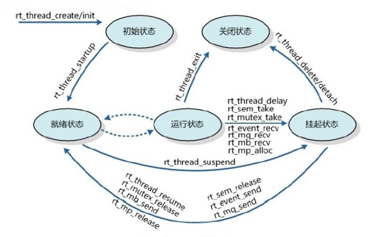
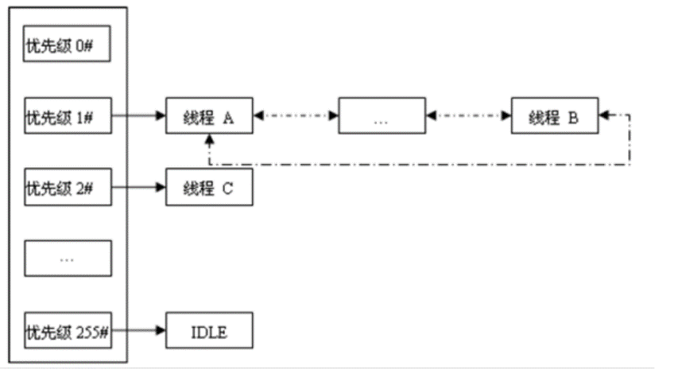
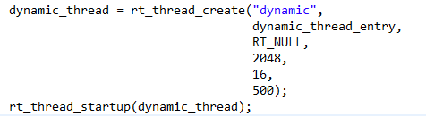
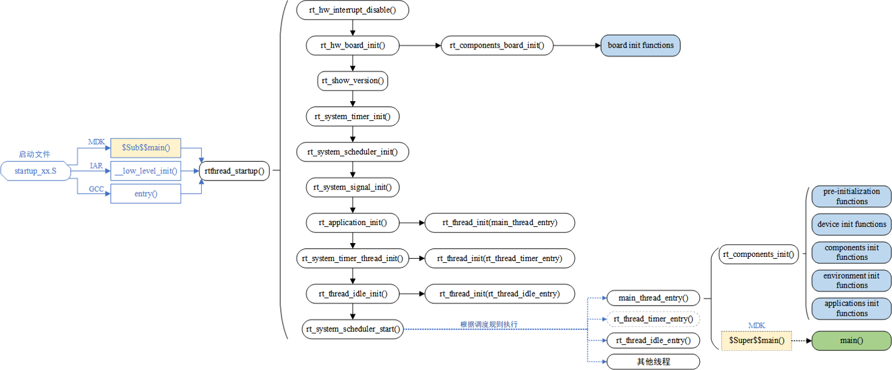
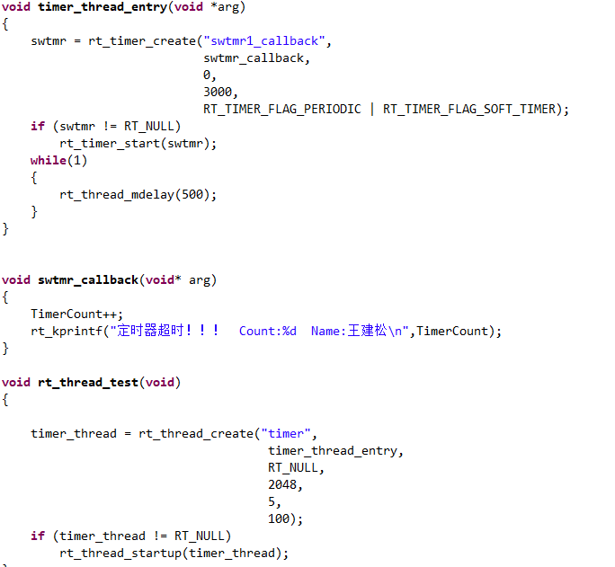
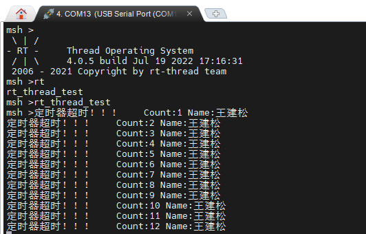

# 2 Days

- RT_Thread线程

  - 线程状态转换

    线程有初始、就绪、运行、挂起和关闭五种状态，系统启动后，在主程序创建若干线程，线程创建后就进入初始状态，在初始状态中的线程通过线程启动函数插入就绪列表进入就绪状态，然后等待系统调度切换线程，切换到的线程就进入了运行状态，在运行状态中线程会因为上述四种情况被挂起，让出cpu资源，让调度器去调度其他线程运行，挂起的线程进入挂起状态，待阻塞延时超时或其他线程释放信号再从挂起链表中删除插入回就绪链表，重新回到就绪状态等待被调度，当线程不再使用后可将该线程清除，清除后的线程就进入了关闭状态，内存管理系统会回收该部分内存

    

  - 线程调度

    

  - 线程创建

    线程创建分为内存静态分配创建与内存动态分配创建，静态创建需要事先划定一块内存区域供线程栈使用，而动态创建系统会根据指定的栈大小自动分配一块内存区域供使用

    - 静态创建

      

    - 动态创建

      

- RT_Thread启动过程

  

  rt_hw_board_init();板载资源初始化，堆内存分配

  rt_show_version(); 打印系统版本信息。

  rt_system_timer_init();系统定时器进行初始化。

  rt_system_scheduler_init();线程调度器初始化，其中包括线程的初始化。

  rt_application_init();应用线程初始化,并创建 main函数线程

  rt_system_timer_thread_init();定时器线程初始化。

  rt_thread_idle_init();空闲线程在此初始化。

  rt_system_scheduler_start();开启系统调度。

- RT_Thread定时器
  - 接受控制输入，到达设定时间值后芯片中断控制器产生时钟中断。硬件定时器的精度一般很高，可以达到纳秒级别，并且是中断触发方式。

  - 软件定时器，软件定时器是由操作系统提供的一类系统接口，它构建在硬件定时器基础之上，使系统能够提供不受硬件定时器资源限制的定时器服务，它实现的功能与硬件定时器也是类似的。

  - 使用硬件定时器时，每次在定时时间到达之后就会自动触发一个[中断](https://so.csdn.net/so/search?q=中断&spm=1001.2101.3001.7020)，用户在中断中处理信息；而使用软件定时器时，需要我们在创建软件定时器时指定时间到达后要调用的函数（也称超时函数/回调函数，为了统一，下文均用超时函数描述），在超时函数中处理信息。

  - 定时器创建函数

    rt_timer_t rt_timer_create(const char * name, 									//定时器名
    												void (* timeout)(void *parameter),		//超时函数指针
    												void *parameter,									  //超时函数形参
    												rt_tick_t time,											 //超时时间
    												rt_uint8_t flag)											//定时器创建参数

  - 定时器创建参数

     #define RT_TIMER_FLAG_DEACTIVATED 0x0 /* 计时器是无效的 */
     #define RT_TIMER_FLAG_ACTIVATED 0x1 / * 定时器是可用的 */
     #define RT_TIMER_FLAG_ONE_SHOT 0x0 / * 单次定时器 */
     #define RT_TIMER_FLAG_PERIODIC 0x2 / * 周期定时器 * /
    #define RT_TIMER_FLAG_HARD_TIMER 0x0 / * 硬定时器，定时器的超时函数将在 tick isr 中调用。* /
     #define RT_TIMER_FLAG_SOFT_TIMER 0x4 / * 软定时器，定时器的超时函数将在定时器线程中调用。* /

  - 编程与下载

    

    

- 学习收获

  通过重新一遍的RTThread线程与定时器的学习，巩固了以前学过的知识，并且对线程和定时器相关的函数有了进一步的认识，但对RTThread启动过程仍有许多没理解的地方，并且在上午的线程创建实验中遇到了如下问题：两个线程优先级相同，线程函数中不使用延时阻塞，利用rt_thread_test和命令行的方式创建与启动线程，系统启动后只会运行先starup的线程，未能进行时间片轮询，当把线程创建与启动放在main函数中时，系统启动后是可以进行时间片轮询的。

  

​			