# 3 Days

- ##### RT_Thread线程间通信

  线程间通信就是线程间进行资源（信息）共享。其最简单的通信方式就是使用全局变量来通信。
  举个简单点灯的例子，按键线程通过设置键值这个全局变量，LED线程通过读取键值判灯是否点亮，这里LED 线程和按键线程之间就是通过全局变量进行通信。
  但是使用全局变量通信是不够安全的，之所以不够安全是因为除了通信双方线程外，其它所有线程也能访问全局变量，很容易被其它线程篡改内容。
  此外，在线程间通信中还存在同步问题，还是这个点灯的例子，LED线程因为不知道键值何时会改变就需要定时的去读取判断，这样不仅会浪费CPU资源，当键值改变时也不能立刻做出响应，导致系统实时性缺失。
  因此在RT-Thread中我们需要既能保证通信间安全性又能保证系统实时性的通信方式。

  

  

  - ###### 信号量

    信号量（Semaphore）是一种实现线程间通信的机制，实现线程之间同步或临界资源的互斥访问。在系统中使用信号量的目的是为了给临界资源建立一个标志，信号量表示了该临界资源被占用情况，原理和裸机开发中尝使用的flag标记类似，当一个线程在访问临界资源的时候，就会先对这个资源信息进行查询，在了解资源被占用的情况之后，再做处理，从而使得临界资源得到有效的保护。
    同时当线程访问临界资源获取信号量时，如果资源被占满，则该线程会被挂起到该信号量的挂起列表中，待有信号量被释放线程可获取后，在恢复该线程，并使其可以立即参与到调度当中

    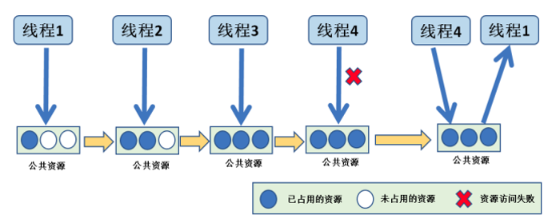

    信号量创建函数rt_sem_create()

    rt_sem_create("test_sem",/* 信号量名字 */ 
    							1, / * 信号量初始值，默认有一个信号量 */ 
    							RT_IPC_FLAG_FIFO); / * 信号量模式 FIFO(0x00)*/

    其中信号量模式分为 RT_IPC_FLAG_PRIO 和RT_IPC_FLAG_FIFO，使用 RT_IPC_FLAG_PRIO 优先级 flag 创建的 IPC 对象，在多个线程等待信号量资源时，将由优先级高的线程优先获得资源。而使用 RT_IPC_FLAG_FIFO 先进先出 flag 创建的 IPC 对象，在多个线程等信号量待资源时，将按照先来先得的顺序获得资源。

    然后通过信号量获取函数 rt_sem_take()和信号量释放函数 rt_sem_release()获取和释放信号量，获取时当没有可用信号量可获取则按照rt_sem_take()中等待时间的设定挂起线程。

    最后当信号量不再使用时可以使用信号量删除函数 rt_sem_delete()将信号量删除并释放内存。

    在rt_sem_take()源码中

    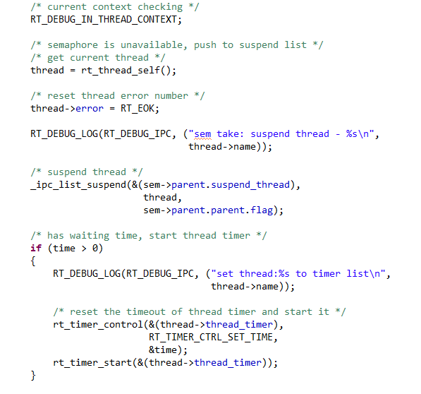

    如果用户设置了等待时间，那么在获取不到信号量的情况下，可以将获取信号量的线程挂起，进行等待，这首先获取到当前线程，调用 rt_thread_self()函数就是为了得到当前线程控制块。
    然后调用rt_ipc_list_suspend()函数将线程挂起到指定列表。IPC 对象（rt_ipc_object）结构体中包含一个挂起列表，此处将当前线程挂起到信号量的挂起列表中。
    如果有等待时间，那么需要计时，在时间到的时候恢复线程。调用 rt_timer_control()函数设置当前线程的挂起的时间，时间 time由用户设定。启动定时器开始计时。

    如何设定值为RT_WAITING_FOREVER(Value = -1)则一直等待有信号量释放为止。

    最后发起一次线程调度，因为当前线程已经被挂起了吗，需要进行线程的切换。

    而在rt_sem_release()源码中

    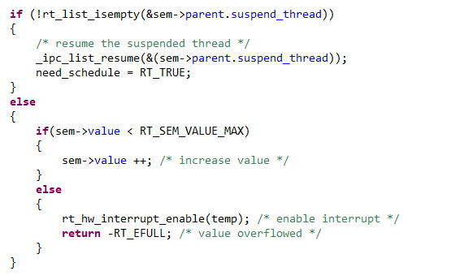

    当释放一个信号量后

    如果信号量的挂起列表非空，即代表有其他线程正在挂起等待该信号量，所以需要恢复阻塞线程。进行信号量释放的时候，将唤醒等待在该信号量线程队列中的第一个线程，由它获取信号量，并且将其从阻塞中恢复。恢复的过程是：将线程从阻塞列表中删除，添加到就绪列表中。恢复线程需要进行线程调度，所以此变量应该为真（RT_TRUE）。
    如果当前没有线程因为访问此信号量而进入阻塞，则不需要恢复线程，将该信号量的可用个数加一即可。此处应注意信号量的范围。
    最后如果需要进行调度，即need_schedule = RT_TRUE有线程被唤醒，则调用 rt_schedule()函数进行一次线程切换。

  - ###### 互斥量

    互斥量又称互斥型信号量，是一种特殊的二值信号量，它和信号量不同的是，它支持互斥量所有权、递归访问以及防止优先级翻转的特性。

    优先级反转

    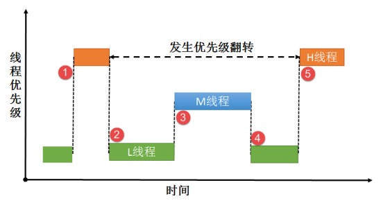

    现在有 3 个线程分别为 H 线程（High）、M 线程（Middle）、L 线程（Low），3 个线程的优先级顺序为 H 线程>M 线程>L 线程。正常运行的时候 H 线程可以打断 M 线程与 L 线程，M 线程可以打断 L 线程，假设系统中有一个资源被保护了，此时该资源被 L 线程正在使用中，某一刻，H 线程需要使用该资源，但是 L 线程还没使用完，H线程则因为申请不到资源而进入阻塞态，L 线程继续使用该资源，此时已经出现了“优先级翻转”现象，高优先级线程在等着低优先级的线程执行，如果在 L 线程执行的时候刚好M 线程被唤醒了，由于 M 线程优先级比 L 线程优先级高，那么会打断 L 线程，抢占了CPU 的使用权，直到 M 线程执行完，再把 CUP 使用权归还给 L 线程，L 线程继续执行，等到执行完毕之后释放该资源，H 线程此时才从阻塞态解除，使用该资源。

    而互斥量通过优先级继承的方法，即当高优先级H线程获取低优先级L线程正在使用的互斥量而被挂起后，低优先级L线程暂时继承H线程的优先级，这时当优先级处于L与H线程的M线程被唤醒后，就无法打断此时继承了高优先级的L线程，有效解决了优先级反转问题。

    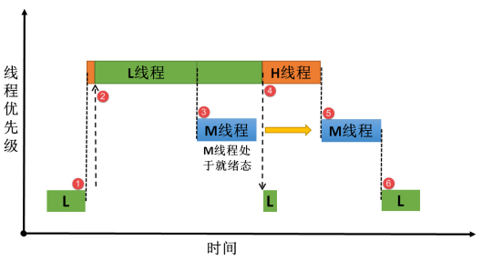

    在rt_mutex_take()源码中通过以下代码进行优先级继承

    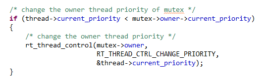

    当互斥量使用者的优先级高于申请获取互斥量线程时，则需要调用 rt_thread_control 函数设置互斥量持有线程的优先级。

    在 rt_mutex_release()源码中通过以下代码恢复原始优先级

    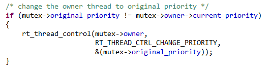

    如果当前线程初始设置的优先级与互斥量保存的优先级不一样，那么则要恢复线程初始化设定的优先级，调用 rt_thread_control 函数重置线程的优先级

  - ###### 邮箱

    邮箱在操作系统中是一种常用的 IPC (进程间)通信方式，邮箱可以在线程与线程之间、中断与线程之间进行消息的传递。线程能够从邮箱里面读取邮件消息，当邮箱中的邮件是空时，根据用户自定义的阻塞时间决定是否挂起读取线程；当邮箱中有新邮件时，挂起的读取线程被唤醒，邮箱也是一种异步的通信方式。
    邮箱中每封邮件只能容纳4个字节内容，在32位系统中一个指针的大小即4个字节恰好一封邮件的大小，因此邮箱特别适合线程间通信时仅传递地址，通过指针操作数据的情况。

    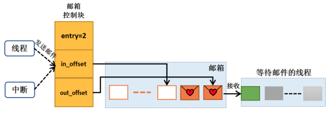

    

  - ###### 消息队列

    队列又称消息队列，是一种常用于线程间通信的数据结构，队列可以在线程与线程间、中断和线程间传送信息，实现了线程接收来自其他线程或中断的不固定长度的消息，并根据不同的接口选择传递消息是否存放在线程自己的空间。创建消息队列时先创建一个消息队列对象控制块，然后给消息队列分配一块内存空间，组织成空闲消息链表，这块内存的大小等于[消息大小+消息头（用于链表连接）]与消息队列容量的乘积，接着再初始化消息队列，此时消息队列为空。

    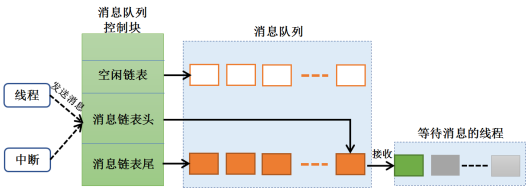

  - ###### 事件

    事件是一种实现线程间通信的机制，主要用于实现线程间的同步，但事件通信只能是事件类型的通信，无数据传输。与信号量不同的是，它可以实现一对多，多对多的同步。即一个线程可以等待多个事件的发生：可以是任意一个事件发生时唤醒线程进行事件处理；也可以是几个事件都发生后才唤醒线程进行事件处理。同样，事件也可以是多个线程同步多个事件。

    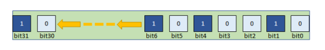

    在 RT-Thread 实现中，每个线程都拥有一个事件信息标记，它有三个属性，分别RT_EVENT_FLAG_AND( 逻 辑 与 ) ， RT_EVENT_FLAG_OR( 逻 辑 或 ） 以 及RT_EVENT_FLAG_CLEAR(清除标记）。当线程等待事件同步时，可以通过 32 个事件标志和这个事件信息标记来判断当前接收的事件是否满足同步条件。

    

- ##### RT_Thread内存管理

  - ###### 静态内存池

    内存池（Memory Pool）是一种用于分配大量大小相同的小内存对象的技术。它可以极大加快内存分配/释放的速度。

    内存池在创建时先向系统申请一大块内存，然后分成大小相等的多个小内存块，小内存块直接通过链表连接起来（此链表也称为空闲内存链表）。每次分配的时候，从空闲内存链表中取出表头上第一个内存块，提供给申请者。物理内存中允许存在多个大小不同的内存池，每一个内存池又由多个大小相同的空闲内存块组成。当一个内存池对象被创建时，内存池对象就被分配给了一个内存池控制块，内存控制块的参数包括内存池名，内存缓冲区，内存块大小，块数以及一个等待线程列表。
    内核负责给内存池分配内存池对象控制块，它同时也接收用户线程的分配内存块申请，当获得申请信息后，内核就可以从内存池中为线程分配内存块。内存池一旦初始化完成，内部的内存块大小将不能再做调整。

    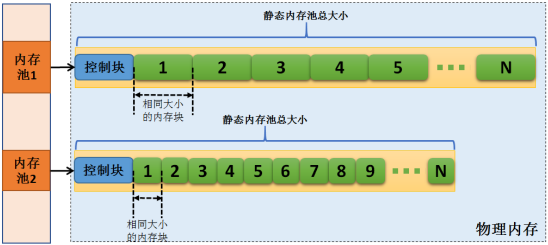

    /* 静态态创建一个静态内存池 */  

    rt_err_t rt_mp_init(struct rt_mempool *mp, 	//内存池对象句柄
    								 const char *name, 			   // 内存池名称
    								 void *start, 							// 内存池起始地址
    								 rt_size_t size, 					 	//化内存池总容量大小
    	 							rt_size_t block_size)			  //每个内存块的大小 

    

     /* 动态创建一个静态内存池 */ 
    test_mp = rt_mp_create("test_mp", 						//内存池名称
    											BLOCK_COUNT, 			  //内存块数量
    											BLOCK_SIZE); 				  //内存块大小

    内存池创建好后通过静态内存申请函数 rt_mp_alloc()和静态内存释放函数 rt_mp_free()即可申请和释放内存池

  - ###### 动态内存分配

    RT-Thread 系统为了满足不同的需求，提供了两套不同的动态内存管理算法，分别是小堆内存管理算法和 SLAB 内存管理算法。

    小内存管理算法是一个简单的内存分配算法。初始时，它是一块大的内存，其大小为（MEM_SIZE），当需要分配内存块时，将从这个大的内存块上分割出相匹配的内存块，然后把分割出来的空闲内存块还回给堆管理系统中。每个内存块都包含一个管理用的数据头，通过这个头把使用块与空闲块用双向链表的方式链接起来（内存块链表）

    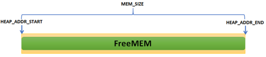

    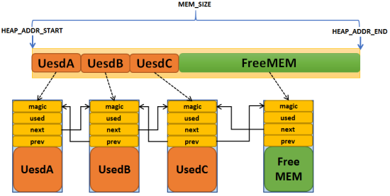

    RT-Thread 的 SLAB 分配器是在 DragonFly BSD 创始人 Matthew Dillon 实现的 SLAB 分
    配器基础上，针对嵌入式系统优化的内存分配算法。最原始的 SLAB 算法是 Jeff Bonwick为 Solaris 操作系统而引入的一种高效内核内存分配算法。
    RT-Thread 的 SLAB 分配器实现主要是去掉了其中的对象构造及析构过程，只保留了纯粹的缓冲型的内存池算法。SLAB 分配器会根据对象的类型（主要是大小）分成多个区（zone），也可以看成每类对象有一个内存池。

    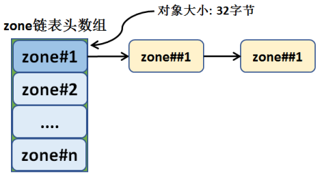

    一个 zone 的大小在 32k ～ 128k 字节之间，分配器会在堆初始化时根据堆的大小自动调整。系统中最多包括 72 种对象的 zone，最大能够分配 16k 的内存空间，如果超出了 16k那么直接从页分配器中分配。每个 zone 上分配的内存块大小是固定的，能够分配相同大小内存块的 zone 会链接在一个链表中，而 72 种对象的 zone 链表则放在一个数组（zone array）中统一管理。

    

    

    

  