# 4 Days

- ##### 优先级列表

  线程优先级表的数据类型为 rt_list，每个索引号对应线程的优先级，该索引下维护着一条双向链表，当线程就绪时，线程就会根据优先级插入到对应索引的链表，同一个优先级的线程都会被插入到同一条链表中，通过时间片的方式轮询。

  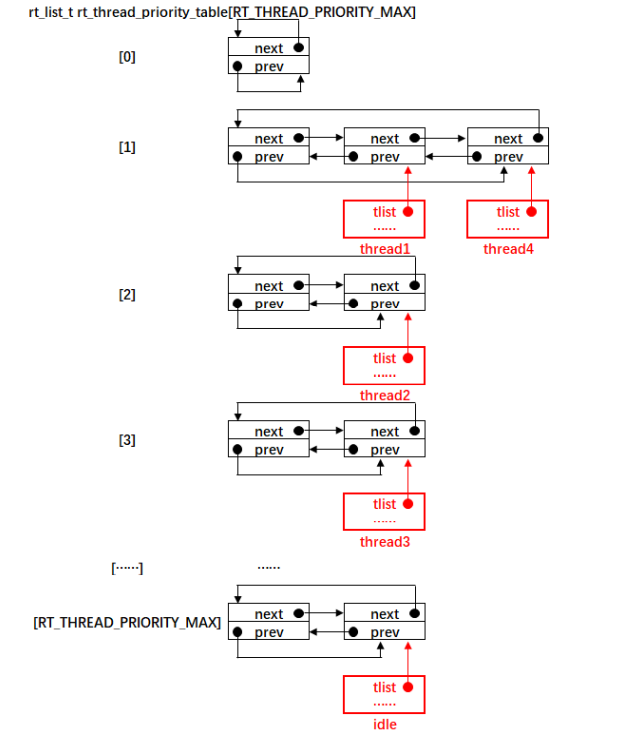

- ##### rt_list_entry()

  rt_list_entry()是一个已知一个结构体里面的成员的地址，反推出该结构体的首地址的宏

  #define rt_list_entry(node, type, member) \ 
  		rt_container_of(node, type, member)

  其中node 表示一个节点的地址，type 表示该节点所在的结构体的类型，member 表示该节点在该结构体中的成员名称。

  #define rt_container_of(ptr, type, member) \ 
  		((type *)((char *)(ptr) - (unsigned long)(&((type *)0)->member)))

  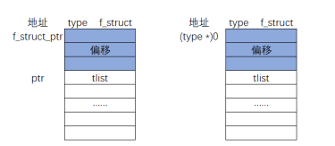

  我们知道了一个节点 tlist 的地址 ptr，现在要推算出该节点所在的 type 类型的结构体的起始地址	f_struct_ptr。我们可以将 ptr 的值减去图中灰色部分的偏移的大小就可以得到 f_struct_ptr 的地址，现在的关键是如何计算出灰色部分的偏移大小。这里取的做法是将 0 地址强制类型类型转换为 type，即(type *)0，然后通过指针访问结构体成员的方式获取到偏移的大小，即(&((type * )0)->member)，最后即可算出 f_struct_ptr = ptr -(&((type*)0)->member)。

- ##### 驱动开发

  - PIN

    相关接口如下

    | **函数**            | **描述**             |
    | ------------------- | -------------------- |
    | rt_pin_get()        | 获取引脚编号         |
    | rt_pin_mode()       | 设置引脚模式         |
    | rt_pin_write()      | 设置引脚电平         |
    | rt_pin_read()       | 读取引脚电平         |
    | rt_pin_attach_irq() | 绑定引脚中断回调函数 |
    | rt_pin_irq_enable() | 使能引脚中断         |
    | rt_pin_detach_irq() | 脱离引脚中断回调函数 |

    通过rt_pin_mode()可以对引脚初始化设定其模式

    #define PIN_MODE_OUTPUT 0x00         	  			 /* 输出 */
    #define PIN_MODE_INPUT 0x01           			 		 / * 输入 * /
    #define PIN_MODE_INPUT_PULLUP 0x02      		/ * 上拉输入 * /
    #define PIN_MODE_INPUT_PULLDOWN 0x03   	 / * 下拉输入 * /
    #define PIN_MODE_OUTPUT_OD 0x04         		/* 开漏输出 */

    通过使用rt_pin_mode()设定LED连接的引脚为输出模式，然后再通过rt_pin_write()对引脚写1和置0的方式就可以使LED灯闪烁

    ```c
    //-----------------------------led-----------------------------------
    
    static rt_thread_t led_thread = RT_NULL;
    
    void led_thread_entry(void arg);
    
    void led_test(void)
    {
        led_thread = rt_thread_create("led",
                                       led_thread_entry,
                                       RT_NULL,
                                       2048,
                                       5,
                                       100);
        if (led_thread != RT_NULL)
            rt_thread_startup(led_thread);
    }
    
    void led_thread_entry(void arg)
    {
        rt_pin_mode(IOC_PAD_PB20,PIN_MODE_OUTPUT );
        rt_pin_mode(IOC_PAD_PB19,PIN_MODE_OUTPUT );
        rt_pin_mode(IOC_PAD_PB18,PIN_MODE_OUTPUT );
        while(1)
        {
            rt_pin_write(IOC_PAD_PB20, PIN_HIGH );
            rt_pin_write(IOC_PAD_PB19, PIN_HIGH );
            rt_pin_write(IOC_PAD_PB18, PIN_HIGH );
            rt_kprintf("LED ON\n");
            rt_thread_mdelay(1000);
            rt_pin_write(IOC_PAD_PB20, PIN_LOW );
            rt_pin_write(IOC_PAD_PB19, PIN_LOW );
            rt_pin_write(IOC_PAD_PB18, PIN_LOW );
            rt_kprintf("LED OFF\n");
            rt_thread_mdelay(1000);
        }
    }
    
    MSH_CMD_EXPORT(led_test,led test sample);
    ```
    
    

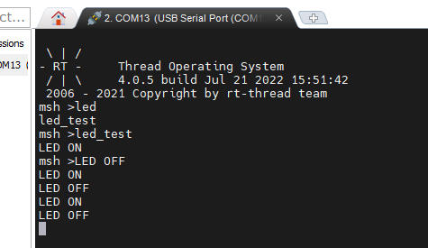

进一步的也可以使用rt_pin_read()结合开发板上的按键读取按键引脚的键值，控制LED的亮灭

  - I2C

    首先进入设置在硬件中开启I2C再在组建中勾选I2C设备驱动

    

    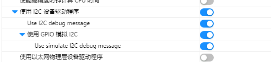

    设置完成后下载到板子上通过list_device指令查看系统设备情况，检查I2C设备是否已启动

    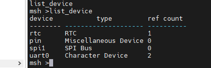

    (HPM6750板子似乎I2C接入遇到一些问题等待老师解决)
    
    经过老师的适配，通过将更新包中的以下文件复制到自己工程完成移植

​		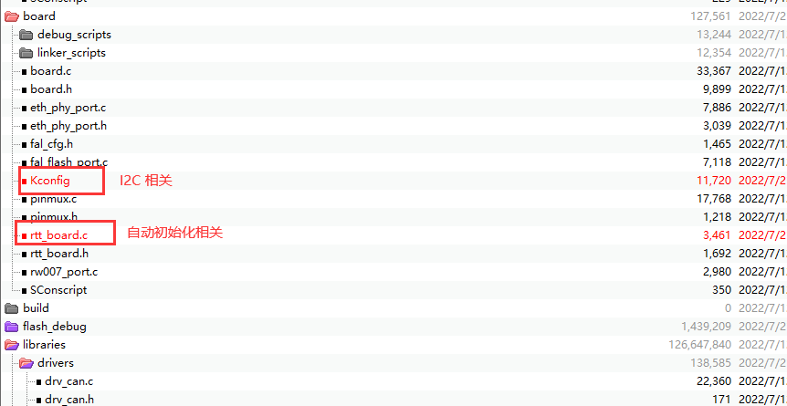

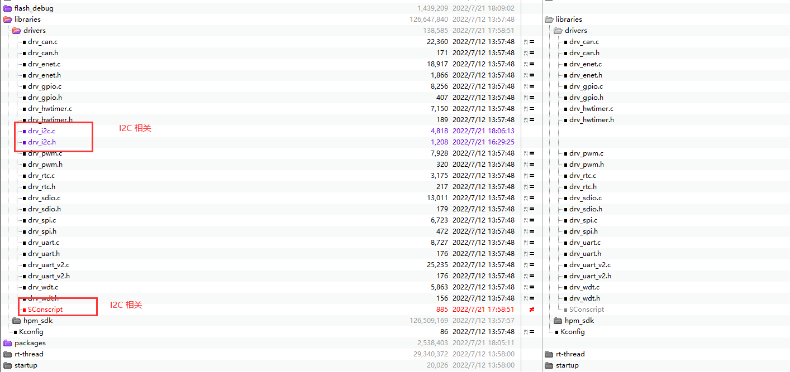

​		移植完成后将AHT10软件包的README文件中初始化程序复制到主函数

​		上机后先检查list_device设备是否加载成功

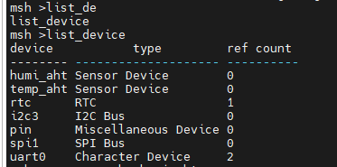

​		通过sensor probe载入i2c设备地址，在通过sensor read读取数据

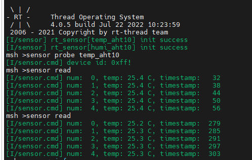

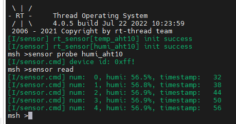

​		最后还可以通过sensor info查询传感器信息

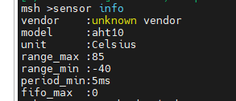

​		此外也可以调用rt_device_find()->rt_device_open->()->rt_device_read()的方式读取温湿度并打印

​		

```c
#include <stdio.h>
#include <sys/time.h>
#include "sensor_asair_aht10.h"

#define AHT10_I2C_BUS  "i2c3"

#define HUMI_DEVICE_NAME    "humi_aht"
#define TEMP_DEVICE_NAME    "temp_aht"

static rt_device_t _humi_dev = RT_NULL;
static rt_device_t _temp_dev = RT_NULL;
static rt_thread_t aht10_thread = RT_NULL;

void aht10_thread_entry(void *arg);

void aht10_test(void)
{
    aht10_thread = rt_thread_create("ath10",
                                   aht10_thread_entry,
                                   RT_NULL,
                                   2048,
                                   5,
                                   100);
    if (aht10_thread != RT_NULL)
        rt_thread_startup(aht10_thread);
}

void aht10_thread_entry(void *arg)
{
    struct rt_sensor_data data1;
    struct rt_sensor_data data2;

    _humi_dev = rt_device_find(HUMI_DEVICE_NAME);
    if(_humi_dev == RT_NULL)
        rt_kprintf("find %s device failed.\r\n", HUMI_DEVICE_NAME);
    else
        rt_device_open(_humi_dev, RT_DEVICE_FLAG_RDONLY);

    _temp_dev = rt_device_find(TEMP_DEVICE_NAME);
        if(_temp_dev == RT_NULL)
            rt_kprintf("find %s device failed.\r\n", TEMP_DEVICE_NAME);
        else
            rt_device_open(_temp_dev, RT_DEVICE_FLAG_RDONLY);

    while(1)
    {
        if ((_humi_dev == RT_NULL) && (_temp_dev == RT_NULL)) continue;
        if ((rt_device_read(_temp_dev, 0, &data1, 1) == 1) & (rt_device_read(_humi_dev, 0, &data2, 1) == 1))
        {
            printf("temp:%3d.%d°C humi:%3d.%d%%\r\n",data1.data.temp / 10,(rt_uint32_t)data1.data.temp % 10, data2.data.temp / 10,data2.data.humi % 10);
        }
        rt_thread_mdelay(100);
    }
}

MSH_CMD_EXPORT(aht10_test,aht10 test sample);

int rt_hw_aht10_port(void)
{
    struct rt_sensor_config cfg;
    cfg.intf.dev_name  = AHT10_I2C_BUS;
    cfg.intf.user_data = (void *)AHT10_I2C_ADDR;
    rt_hw_aht10_init("aht10", &cfg);
    return RT_EOK;
}

INIT_ENV_EXPORT(rt_hw_aht10_port);
```

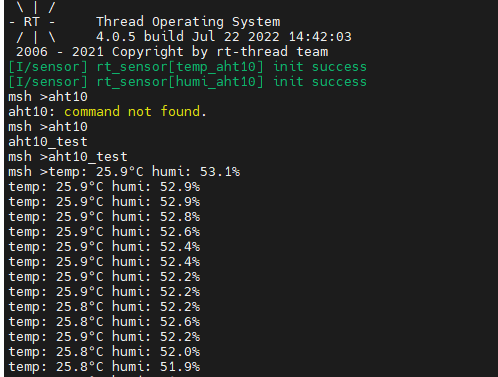

- ##### HPM6750

  HPM6750的每个GPIO接口有：

  DI 状态寄存器 

  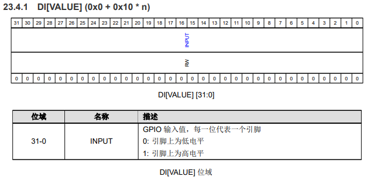

  DO 输出寄存器

  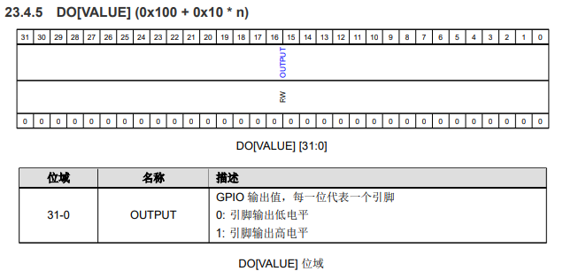

  OE 方向控制寄存器 

  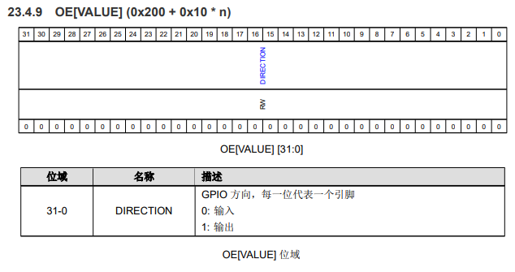

  IF 中断标志

  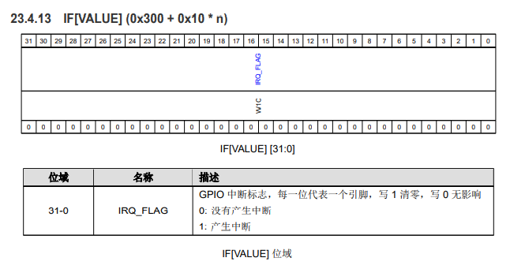

  IE 中断使能

  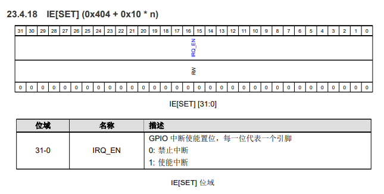

  PL中断极性 

  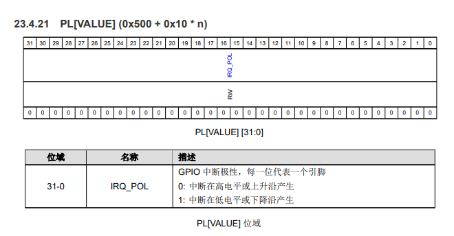

  TP中断类型

  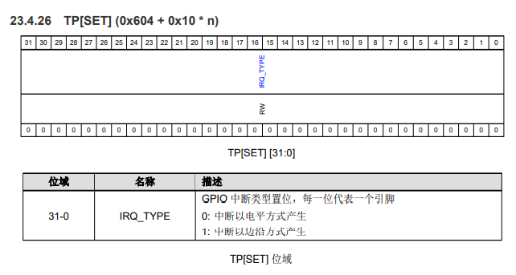

  AS 异步中断

  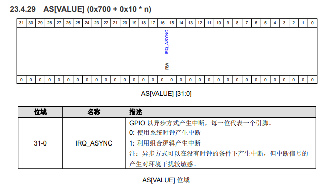

  