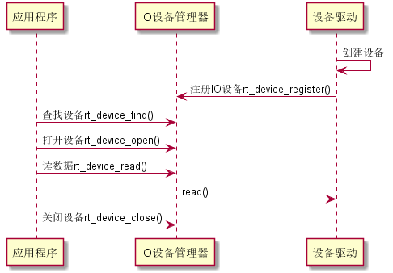
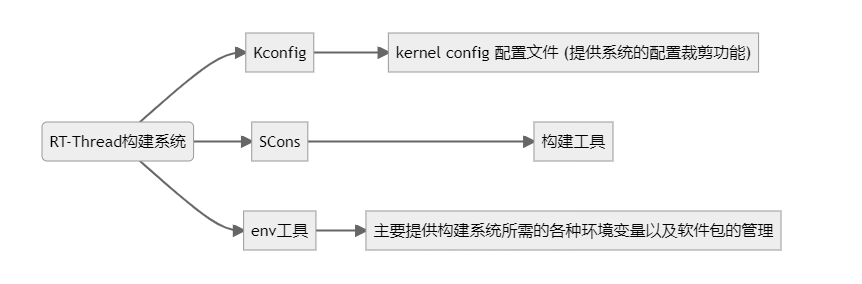
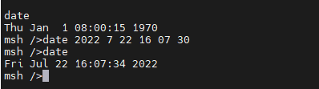
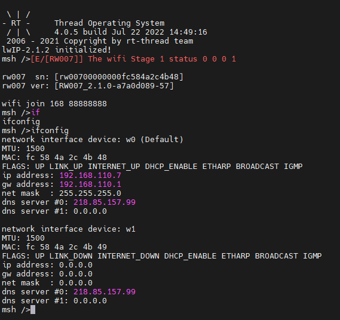
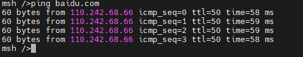
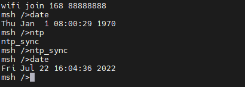
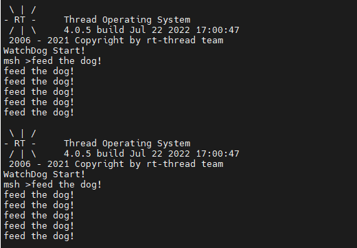

# 5 Days

- ##### IO设备模型

  应用程序通过 I/O 设备管理接口获得正确的设备驱动，然后通过这个设备驱动与底层 I/O 硬件设备进行数据（或控制）交互。

  I/O 设备管理层实现了对设备驱动程序的封装。应用程序通过 I/O 设备层提供的标准接口访问底层设备，设备驱动程序的升级、更替不会对上层应用产生影响。这种方式使得设备的硬件操作相关的代码能够独立于应用程序而存在，双方只需关注各自的功能实现，从而降低了代码的耦合性、复杂性，提高了系统的可靠性。

  设备驱动框架层是对同类硬件设备驱动的抽象，将不同厂家的同类硬件设备驱动中相同的部分抽取出来，将不同部分留出接口，由驱动程序实现。

  

- ##### RT-Thread工程构建

  - Kconfig

    Kconfig文件用于配置宏

    Kconfig机制包括了Kconfig文件和配置UI界面

    Kconfig文件中的配置项会映射至rtconfig.h中
    Kconfig文件可以随源码分散至各级子目录，便于灵活修改。

  - SConscript文件用于根据宏添加文件

    SCons 使用 SConscript 和 SConstruct 文件来组织源码结构并进行构建，SConstruct是scons构建的主脚本，SConscript存放在源代码的子目录下，通常放在项目的子目录，以达到分层构建的目的。一个项目 (BSP) 只有一 SConstruct，但是会有多个 SConscript。一般情况下，每个存放有源代码的子目录下都会放置一个 SConscript。



- ##### RTC

  应用程序通过 RTC 设备管理接口来访问 RTC 硬件，相关接口如下所示：

  | **函数**   | **描述**                         |
  | ---------- | -------------------------------- |
  | set_date() | 设置日期，年、月、日（当地时区） |
  | set_time() | 设置时间，时、分、秒（当地时区） |
  | time()     | 获取时间戳（格林威治时间）       |
  | stime()    | 设置时间戳（格林威治时间）       |

  输入 `date` 即可查看当前当地时区时间，大致效果如下：

  ```c
  msh />date
  Fri Feb 16 01:11:56 2018
  msh />
  ```

  同样使用 `date` 命令，在命令后面再依次输入 `年` `月` `日` `时` `分` `秒` （中间空格隔开, 24H 制），设置当前当地时区时间为 2018-02-16 01:15:30，大致效果如下：

  ```c
  msh />date 2018 02 16 01 15 30
  msh />
  ```

  

- ##### SPI

  SPI（Serial Peripheral Interface，串行外设接口）是一种高速、全双工、同步通信总线，常用于短距离通讯，主要应用于 EEPROM、FLASH、实时时钟、AD 转换器、还有数字信号处理器和数字信号解码器之间。SPI 一般使用 4 根线通信，如下图所示：

  

  MOSI –主机输出 / 从机输入数据线（SPI Bus Master Output/Slave Input）。

  MISO –主机输入 / 从机输出数据线（SPI Bus Master Input/Slave Output)。

  SCLK –串行时钟线（Serial Clock），主设备输出时钟信号至从设备。

  CS –从设备选择线 (Chip select)。也叫 SS、CSB、CSN、EN 等，主设备输出片选信号至从设备。

  - ###### RW007

    通过RW007例程将wifi模块使用起来

    

    通过wifi连接百度

    

    并且可以通过ntp_sysc自动同步RTC时间

    

- ##### WDT

  硬件看门狗（watchdog timer）是一个定时器，其定时输出连接到电路的复位端。在产品化的嵌入式系统中，为了使系统在异常情况下能自动复位，一般都需要引入看门狗。

  当看门狗启动后，计数器开始自动计数，在计数器溢出前如果没有被复位，计数器溢出就会对 CPU 产生一个复位信号使系统重启（俗称 “被狗咬”）。系统正常运行时，需要在看门狗允许的时间间隔内对看门狗计数器清零（俗称“喂狗“），不让复位信号产生。如果系统不出问题，程序能够按时“喂狗”。一旦程序跑飞，没有“喂狗”，系统“被咬” 复位。

  应用程序通过 RT-Thread 提供的 I/O 设备管理接口来访问看门狗硬件，相关接口如下所示：

  | **函数**            | **描述**                                   |
  | ------------------- | ------------------------------------------ |
  | rt_device_find()    | 根据看门狗设备设备名称查找设备获取设备句柄 |
  | rt_device_init()    | 初始化看门狗设备                           |
  | rt_device_control() | 控制看门狗设备                             |
  | rt_device_close()   | 关闭看门狗设备                             |

```c
int main(void)
{

    int count = 0;
    rt_device_t wdt = RT_NULL;
    rt_uint32_t time_count = 3;

    wdt = rt_device_find("wdt0");

    rt_device_init(wdt);

    rt_device_control(wdt, RT_DEVICE_CTRL_WDT_SET_TIMEOUT,&time_count);

    rt_device_control(wdt, RT_DEVICE_CTRL_WDT_START , RT_NULL);

    rt_kprintf("WatchDog Start!\n");

    while(count++ < 6)
    {
        rt_thread_mdelay(2000);
        rt_device_control(wdt, RT_DEVICE_CTRL_WDT_KEEPALIVE, RT_NULL);
        rt_kprintf("feed the dog!\n");
    }
}
```

看门狗设置超时时间为3秒，前6次每2秒为一次狗，超过6次不喂狗时3秒后系统完成复位

