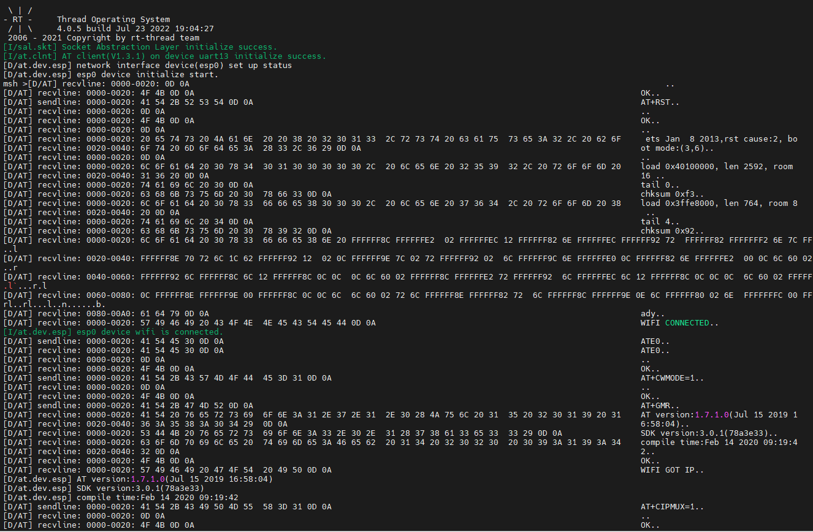
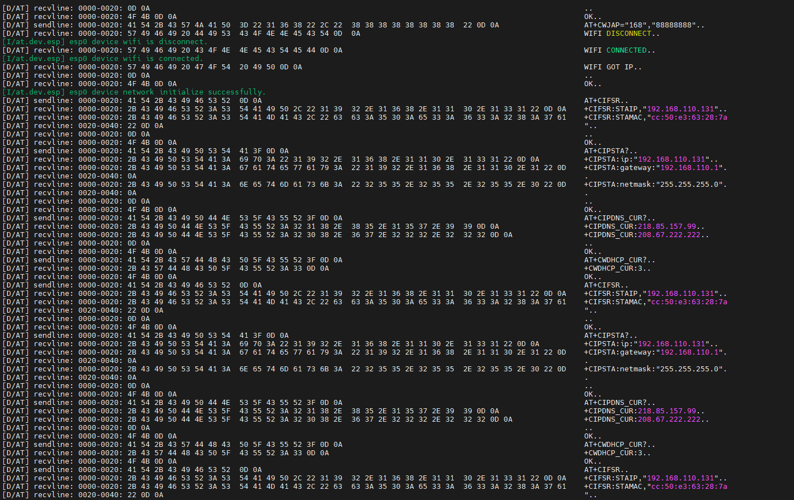
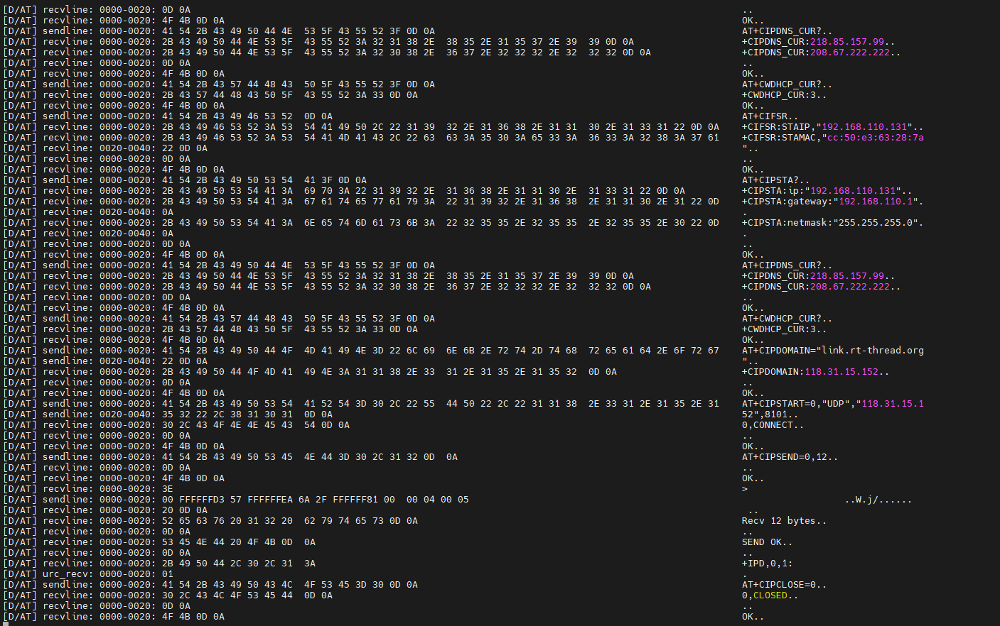
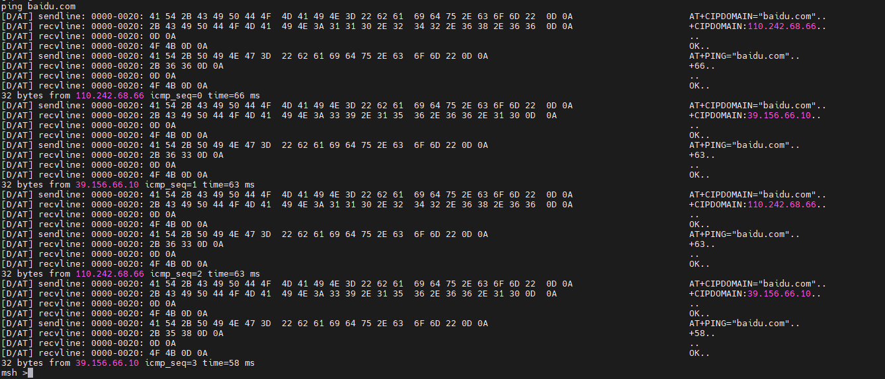
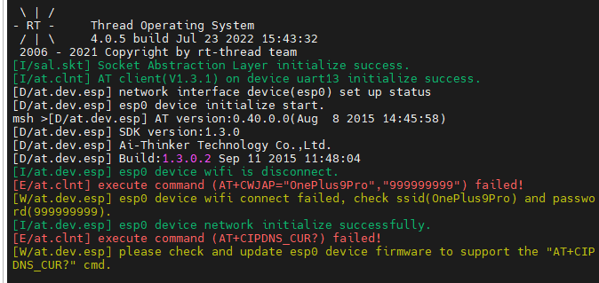
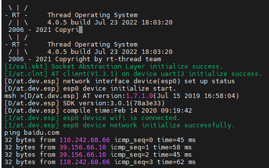
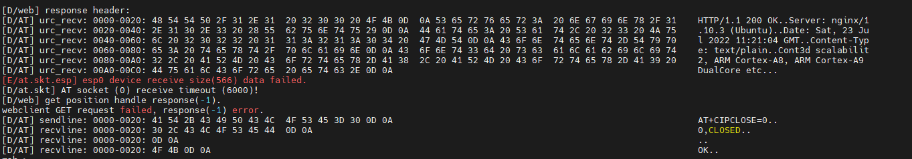
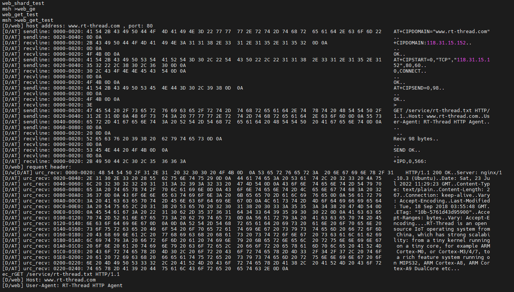
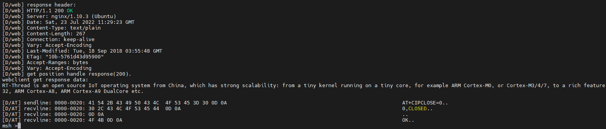

# 6 Days

- #### RT_Thread网络组件

  RT-Thread 的 网络框架结构如下所示：

  

  最顶层是网络应用层，提供一套标准 BSD Socket API ，如 socket、connect 等函数，用于系统中大部分网络开发应用。

  往下第二部分为 SAL 套接字抽象层，通过它 RT-Thread 系统能够适配下层不同的网络协议栈，并提供给上层统一的网络编程接口，方便不同协议栈的接入。套接字抽象层为上层应用层提供接口有：accept、connect、send、recv 等。

  第三部分为 netdev 网卡层，主要作用是解决多网卡情况设备网络连接和网络管理相关问题，通过 netdev 网卡层用户可以统一管理各个网卡信息和网络连接状态，并且可以使用统一的网卡调试命令接口。

  第四部分为协议栈层，该层包括几种常用的 TCP/IP 协议栈，例如嵌入式开发中常用的轻型 TCP/IP 协议栈 lwIP 以及 RT-Thread 自主研发的 AT Socket 网络功能实现等。这些协议栈或网络功能实现直接和硬件接触，完成数据从网络层到传输层的转化。

  RT-Thread 的网络应用层提供的接口主要以标准 BSD Socket API 为主，这样能确保程序可以在 PC 上编写、调试，然后再移植到 RT-Thread 操作系统上。

  - ##### SAL 套接字抽象层

    - ###### 初始化

      配置开启 SAL 选项之后，需要在启动时对它进行初始化，开启 SAL 功能，如果程序中已经使用了组件自动初始化，则不再需要额外进行单独的初始化，否则需要在初始化任务中调用如下函数：

      ```c
      int sal_init(void);
      ```

    - ###### BSD Socket API

      

      创建套接字（socket）

      ```c
      int socket(int domain, int type, int protocol);复制错误复制成功
      ```

      | **参数** | **描述**                             |
      | -------- | ------------------------------------ |
      | domain   | 协议族类型                           |
      | type     | 协议类型                             |
      | protocol | 实际使用的运输层协议                 |
      | **返回** | --                                   |
      | >=0      | 成功，返回一个代表套接字描述符的整数 |
      | -1       | 失败                                 |

      绑定套接字（bind）

      ```c
      int bind(int s, const struct sockaddr *name, socklen_t namelen);
      ```

      | **参数** | **描述**                                     |
      | -------- | -------------------------------------------- |
      | s        | 套接字描述符                                 |
      | name     | 指向 sockaddr 结构体的指针，代表要绑定的地址 |
      | namelen  | sockaddr 结构体的长度                        |
      | **返回** | --                                           |
      | 0        | 成功                                         |
      | -1       | 失败                                         |

      监听套接字（listen）

      ```c
      int listen(int s, int backlog);复制错误复制成功
      ```

      | **参数** | **描述**                       |
      | -------- | ------------------------------ |
      | s        | 套接字描述符                   |
      | backlog  | 表示一次能够等待的最大连接数目 |
      | **返回** | --                             |
      | 0        | 成功                           |
      | -1       | 失败                           |

      接收连接（accept）

      ```c
      int accept(int s, struct sockaddr *addr, socklen_t *addrlen);复制错误复制成功
      ```

      | **参数** | **描述**                       |
      | -------- | ------------------------------ |
      | s        | 套接字描述符                   |
      | addr     | 表示一次能够等待的最大连接数目 |
      | addrlen  | 客户端设备地址结构体的长度     |
      | **返回** | --                             |
      | 0        | 成功，返回新创建的套接字描述符 |
      | -1       | 失败                           |

      建立连接（connect）

      ```c
      int connect(int s, const struct sockaddr *name, socklen_t namelen);复制错误复制成功
      ```

      | **参数** | **描述**                       |
      | -------- | ------------------------------ |
      | s        | 套接字描述符                   |
      | name     | 服务器地址信息                 |
      | namelen  | 服务器地址结构体的长度         |
      | **返回** | --                             |
      | 0        | 成功，返回新创建的套接字描述符 |
      | -1       | 失败                           |

      TCP 数据发送（send）

      ```c
      int send(int s, const void *dataptr, size_t size, int flags);复制错误复制成功
      ```

      | **参数** | **描述**                   |
      | -------- | -------------------------- |
      | s        | 套接字描述符               |
      | dataptr  | 发送的数据指针             |
      | size     | 发送的数据长度             |
      | flags    | 标志，一般为 0             |
      | **返回** | --                         |
      | >0       | 成功，返回发送的数据的长度 |
      | <=0      | 失败                       |

      TCP 数据接收（recv）

      ```c
      int recv(int s, void *mem, size_t len, int flags);复制错误复制成功
      ```

      | **参数** | **描述**                   |
      | -------- | -------------------------- |
      | s        | 套接字描述符               |
      | mem      | 接收的数据指针             |
      | len      | 接收的数据长度             |
      | flags    | 标志，一般为 0             |
      | **返回** | --                         |
      | >0       | 成功，返回接收的数据的长度 |
      | =0       | 目标地址已传输完并关闭连接 |
      | <0       | 失败                       |

      UDP 数据发送（sendto）

      ```c
      int sendto(int s, const void *dataptr, size_t size, int flags, const struct sockaddr *to, socklen_t tolen);复制错误复制成功
      ```

      | **参数** | **描述**                   |
      | -------- | -------------------------- |
      | s        | 套接字描述符               |
      | dataptr  | 发送的数据指针             |
      | size     | 发送的数据长度             |
      | flags    | 标志，一般为 0             |
      | to       | 目标地址结构体指针         |
      | tolen    | 目标地址结构体长度         |
      | **返回** | --                         |
      | >0       | 成功，返回发送的数据的长度 |
      | <=0      | 失败                       |

      UDP 数据接收（recvfrom）

      ```c
      int recvfrom(int s, void *mem, size_t len, int flags, struct sockaddr *from, socklen_t *fromlen);复制错误复制成功
      ```

      | **参数** | **描述**                   |
      | -------- | -------------------------- |
      | s        | 套接字描述符               |
      | mem      | 接收的数据指针             |
      | len      | 接收的数据长度             |
      | flags    | 标志，一般为 0             |
      | from     | 接收地址结构体指针         |
      | fromlen  | 接收地址结构体长度         |
      | **返回** | --                         |
      | >0       | 成功，返回接收的数据的长度 |
      | =0       | 接收地址已传输完并关闭连接 |
      | <0       | 失败                       |

      关闭套接字（closesocket）

      ```c
      int closesocket(int s);复制错误复制成功
      ```

      | **参数** | **描述**     |
      | -------- | ------------ |
      | s        | 套接字描述符 |
      | **返回** | --           |
      | 0        | 成功         |
      | -1       | 失败         |

  - ##### AT 命令

    系统初始化时使用的AT命令

    

    

    

    ping baidu.com时使用的AT命令

    

  - ##### ESP8266使用

    将8266连上开发板对应串口，下载上机

    一开始提示AT指令不支持

    

    经过一系列的折腾最后终于刷上最新固件

    刷好固件后成功连接上wifi，并顺利ping baidu.com

    

  - TCP/IP

    

    TCP/IP 协议族按照层次由上到下，层层包装。

    最上面的一层是应用层，这里面有 http，ftp, 等等我们熟悉的协议。

    第二层是传输层，著名的 TCP 和 UDP 协议就在这个层次。

    第三层是网络层，IP 协议就在这里，它负责对数据加上 IP 地址和其他的数据以确定传输的目标。

    第四层是网络接口层，对实际的网络媒体的管理，定义如何使用实际网络（如Ethernet、Serial Line等）来传送数据。

    发送协议的主机从上自下将数据按照协议封装，而接收数据的主机则按照协议将得到的数据包解开，最后拿到需要的数据。这种结构非常有栈的味道，所以 tcp/ip 协议族也被称为 tcp/ip 协议栈。

    web_get_test一开始无法打印完整的http报文，并且会报错

    

    因为接收数据大于一开始默认的128的缓冲区，导致数据打印不完全，会丢包

    将对应串口uart13缓冲区改为1024后解决

    

    

    

