# 7 Days

- #### MQTT

  MQTT（Message Queuing Telemetry Transport，消息队列遥测传输协议），是一种基于发布/订阅（publish/subscribe）模式的“轻量级”通讯协议，该协议构建于 TCP/IP 协议上，由 IBM 在 1999 年发布。

  MQTT 最大优点在于，可以以极少的代码和有限的带宽，为连接远程设备提供实时可靠的消息服务。作为一种低开销、低带宽占用的即时通讯协议，使其在物联网、小型设备、移动应用等方面有较广泛的应用。

  MQTT 是一个基于客户端-服务器的消息发布/订阅传输协议。MQTT 协议是轻量、简单、开放和易于实现的，这些特点使它适用范围非常广泛。在很多情况下，包括受限的环境中，如：机器与机器（M2M）通信和物联网（IoT）。其在，通过卫星链路通信传感器、偶尔拨号的医疗设备、智能家居、及一些小型化设备中已广泛使用。

  - ##### QoS（Quality of Service levels）

    服务质量是 MQTT 的一个重要特性。当我们使用 TCP/IP 时，连接已经在一定程度上受到保护。但是在无线网络中，中断和干扰很频繁，MQTT 在这里帮助避免信息丢失及其服务质量水平。这些级别在发布时使用。如果客户端发布到 MQTT 服务器，则客户端将是发送者，MQTT 服务器将是接收者。当MQTT服务器向客户端发布消息时，服务器是发送者，客户端是接收者。

    - QoS 0

      这一级别会发生消息丢失或重复，消息发布依赖于底层TCP/IP网络。即：<=1

      最小的等级就是 0。并且它保证一次信息尽力交付。一个消息不会被接收端应答，也不会被发送者存储并再发送。这个也被叫做 “即发即弃” 。并且在TCP协议下也是会有相同的担保。

      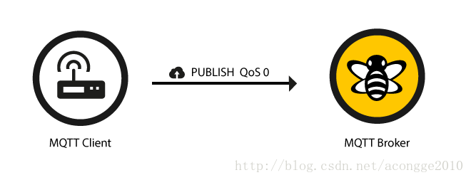

    - QoS 1

      QoS 1 承诺消息将至少传送一次给订阅者。

      当使用QoS 等级1 时， 它保证信息将会被至少发送一次给接受者。 但是消息也可能被发送两次甚至更多 。

      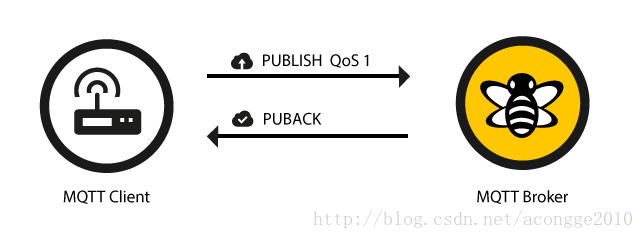

      发送者将会存储发送的信息直到发送者收到一次来自接收者的PUBACK格式的应答。

      PUBLISH 与PUBACK的关联是通过比较数据包中的 packet identifier完成的。如果在特定的时间内（timeout）发送端没有收到PUBACK应答，那么发送者会重新发送PUBLISH消息。如果接受者接收到QoS为1 的消息，它会立即处理这里消息，比如把这个包发送给订阅该主题的接收端，并回复PUBACK包。

    - QoS 2

      最高的QoS就是2，它会确保每个消息都只被接收到的一次，他是最安全也是最慢的服务等级。

      使用 QoS 2，我们保证消息仅传送到目的地一次。为此，带有唯一消息 ID 的消息会存储两次，首先来自发送者，然后是接收者。QoS 级别 2 在网络中具有最高的开销，因为在发送方和接收方之间需要两个流。

      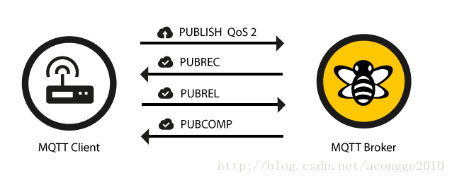

      如果接收端接收到了一个QoS 的PUBLISH消息，它将相应地处理 PUBLISH消息，并通过PUBREC消息向发送方确认。

      直到他发出一个PUBCOMP包为止，接收端都保存这个包packet identifier。这一点很重要，因为它避免了二次处理同一个PUBLISH包。 当发送者接收到PUBREC的时候，它可以放弃最开始的publish了，因为它已经知道另一端已经接收到消息，他将保存PUBREC并且回复PUBREL。

      当接收端接收到PUBREL，它就可以丢弃所有该包的存储状态并回复PUBCOMP。当发送端接收到PUBCOMP时也会做同样的处理。

      当整个流程结束的时候，所有的参与者都确定消息被正确的发送和送达了。

      无论什么时候，一个包丢失了，发送端有责任在特定时间后重新发送最后一次发送的消息。接收端有责任响应每一个指令消息。

- #### ONENET

  **在RT-Thread Setting中添加ONENET组件**

  

  添加完成后编译会报错缺失uint8_t,uint32_t，在对应的报错文件中添加#include <stdint.h>或#include "board.h"头文件

  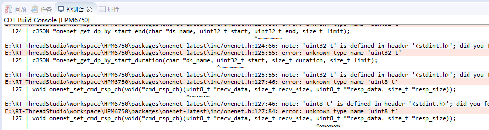

  **此外还可能遇到的一些问题**

  **1.对于警告**

  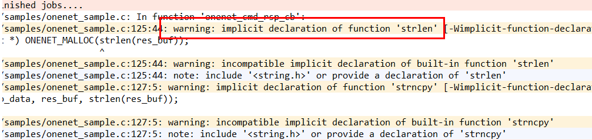        

  也是添加头文件include <string.h>（在对应的警告处）

  **2.对于出现fatal error: dfs_posix.h: No such file or directory，建议更换BSP版本为1.0.2的**

  ​        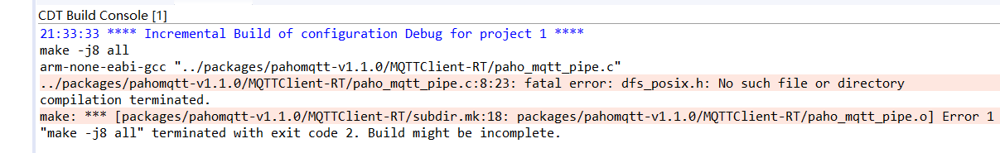        

  原因是在下面的这个目录下没有dfs_posix.h生成，而1.0.2版本的有，试着将它复制过去，然后出现更多错误了。。。

  ​                 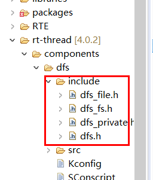        

  **3.关于使用onenet_upload_entry线程函数上传数据到onenet平台的问题**

  问题：上传两个数据流到onenet平台却只显示一个数据流的的变化

  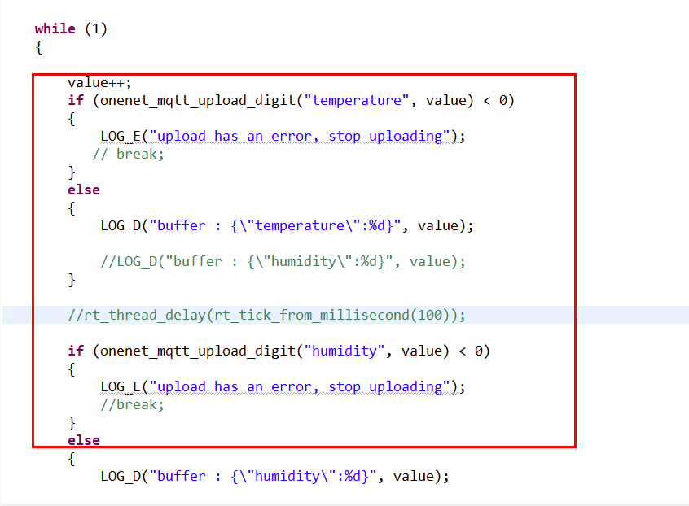        

  问题解决：原因是太快了，可能数据流被吞没了，要在两个onenet_mqtt_upload_digit中间添加一个 rt_thread_delay函数。实测延迟  rt_thread_delay(rt_tick_from_millisecond(10));都是可以运行的。

  ​              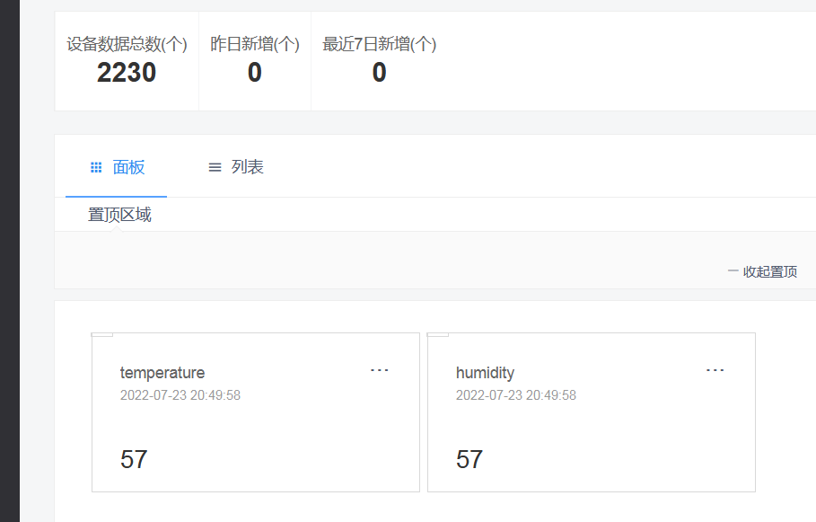        

  **4.onenet上云报错<RT-Thread 的版本为 4.1.0 及以上>**

  问题描述：

  ​                 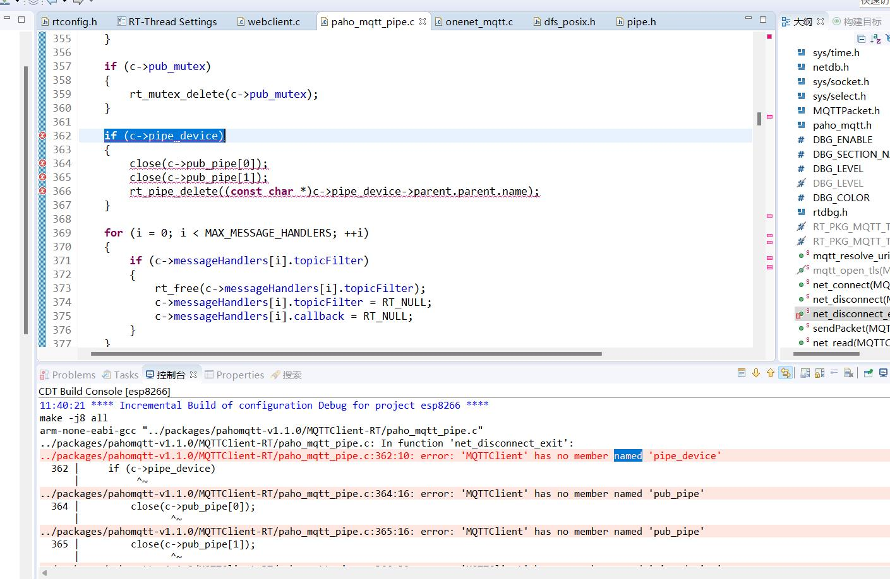        

  这里点击paho_mqtt_pipe.c中的#include <dfs_posix.h>跳转到该函数，然后将该函数封装的所有头文件声明复制到paho_mqtt_pipe.c中，并将`#include <dfs_posix.h>注释，另外还有一个函数报错同样如此。

  此时编译发现仍会报错

  ​                 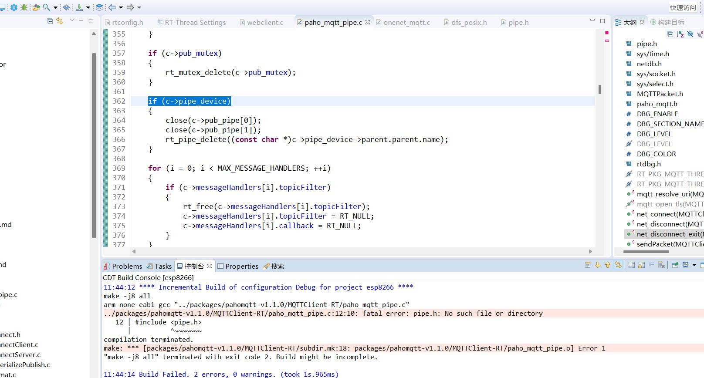        

  解决：

  1. 我们需要修改刚刚复制的#include <pipe.h>为#include <ipc/pipe.h>
  2. 打开RT-Thread Setting，使能 components -> C/C++ -> posix -> IPC -> pipe(进程间通信管道)
  3. 查看paho_mqtt.h 内的  MQTTClient 结构体的代码，将94 行改为 #if defined(RT_USING_DFS_NET) || defined(SAL_USING_POSIX)；也就是去掉关于 RT_USING_POSIX 的内容。

  

  **进入ONENET官网注册账号**

  账号注册登录成功后，点击控制台进入管理界面；

  点击多协议接入，创建一个产品，其中接入协议选择MQTT协议；

  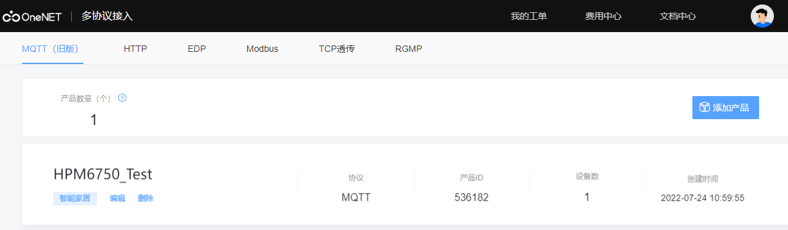

  创建好产品后，进入产品中添加一个新设备，其中鉴权信息与之后RT-Thread Setting中的身份验证信息相对应，可用密码生成器随机生成

  

  设备创建完成后进入详情，创建APIKey

  然后将产品与设备相关信息填入RT-Thread Setting中

  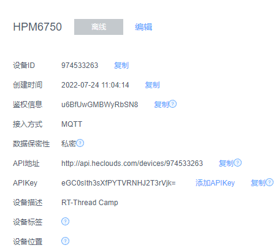

  

  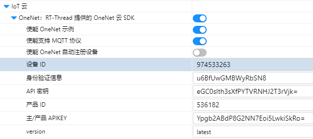

  设置完成后上机测试

  使用onenet_mqtt_init初始化，连接onenet

  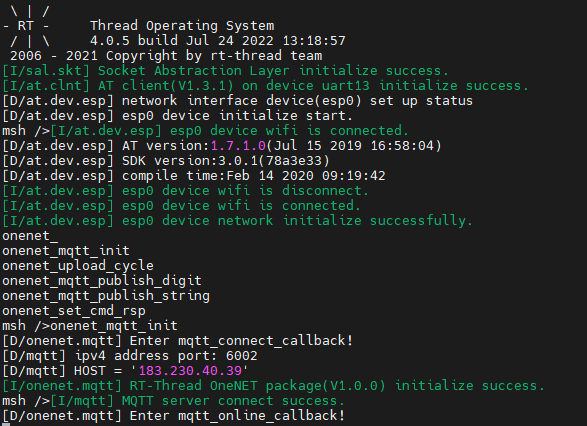

  查看ONENET看设备是否正常连接

  

  通过onenet_unload_cycle测试设备发送信息到ONENET

  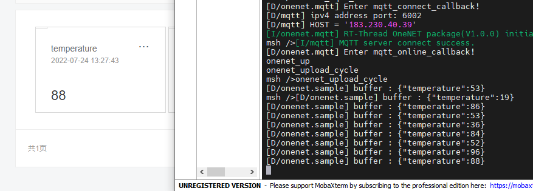

  也可以通过onenet_mqtt_publish_string发送特定字符到ONENET

  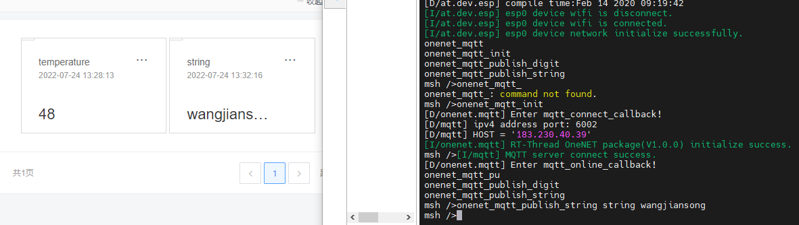

​		通过onenet_set_cmd_rsp接收ONENET下发命令

​		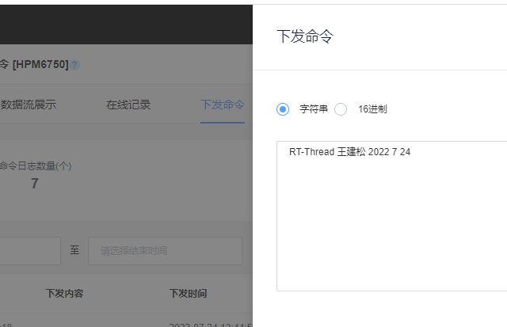

​		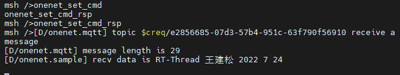