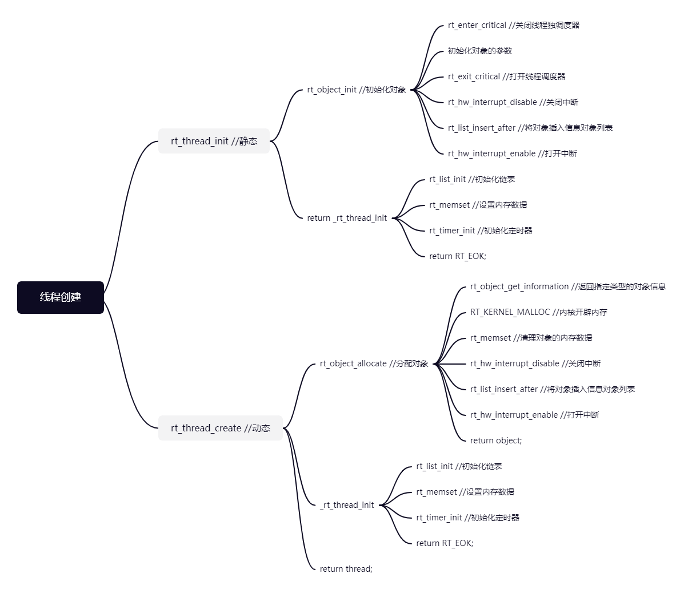

### 1

```c
/* DAY2作业 */
ALIGN(8);
rt_timer_t timer = RT_NULL;

void timerout(void)
{
    rt_kprintf("timer1启动");
}

void thread_dynamic(void)
{
    rt_kprintf("thread_dynamic启动");

    /* creat timer */
    timer = rt_timer_create("timer", timerout, RT_NULL, 30, RT_TIMER_FLAG_PERIODIC);
    while(1)
    {
        /* start timer */
        rt_timer_start(timer);
        rt_thread_delay(100);
    }
}

void thread_test(void)
{
    rt_thread_t dynamic_thread = RT_NULL;

    /* creat thread */
    dynamic_thread = rt_thread_create("dynamic", thread_dynamic, RT_NULL, 2048, 16, 500);
    /* start thread */
    rt_thread_startup(dynamic_thread);
    rt_thread_delay(100);
}
MSH_CMD_EXPORT(thread_test,  static Day2 homework start dynamic_thread);
```

>   rt_timer_t timer = RT_NULL;必须定义为管局变量，否则函数结束之后，句柄被关闭，无法继续使用

## 2线程创建



## 3.定时器

不懂。。。

## 4.启动顺序图

