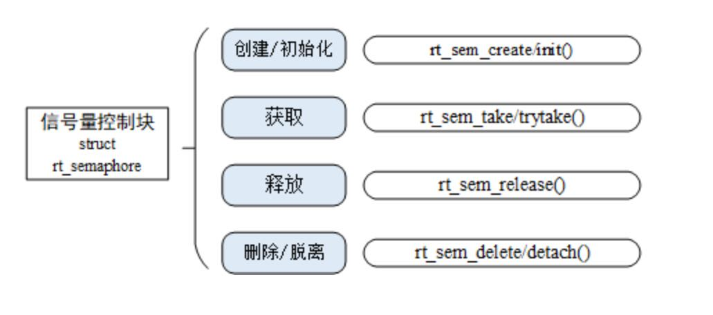
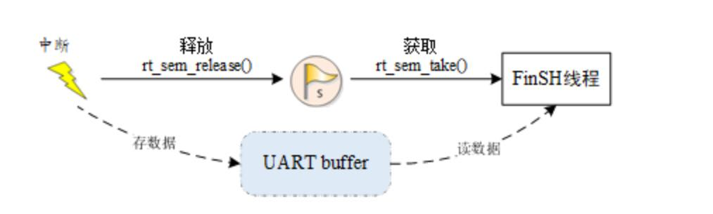
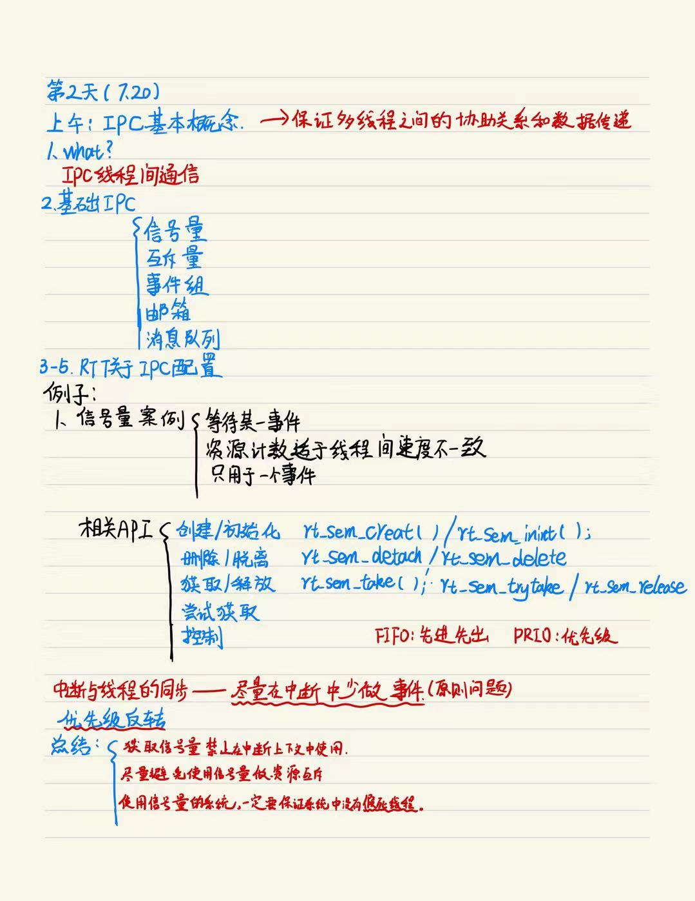

# DAY2 （7.20）刘道鑫

## 线程间同步

同步是指按预定的先后次序进行运行，线程同步是指多个线程通过特定的机制（如互斥量，事件对象，临界区）来控制线程之间的执行顺序，也可以说是在线程之间通过同步建立起执行顺序的关系，如果没有同步，那线程之间将是无序的。

多个线程操作 / 访问同一块区域（代码），这块代码就称为临界区,线程互斥是指对于临界区资源访问的排它性。当多个线程都要使用临界区资源时，任何时刻最多只允许一个线程去使用，其它要使用该资源的线程必须等待，直到占用资源者释放该资源。线程互斥可以看成是一种特殊的线程同步。

**线程的同步方式有很多种，其核心思想都是：在访问临界区的时候只允许一个 (或一类) 线程运行。**

### 信号量

信号量是一种轻型的用于解决线程间同步问题的内核对象，线程可以获取或释放它，从而达到同步或互斥的目的。

#include <rtthread.h>

#define THREAD_PRIORITY         25
#define THREAD_TIMESLICE        5

/* 指向信号量的指针 */
static rt_sem_t dynamic_sem = RT_NULL;

ALIGN(RT_ALIGN_SIZE)
static char thread1_stack[1024];
static struct rt_thread thread1;
static void rt_thread1_entry(void *parameter)
{
    static rt_uint8_t count = 0;

    while(1)
    {
        if(count <= 100)
        {
            count++;
        }
        else
            return;
    
        /* count 每计数 10 次，就释放一次信号量 */
         if(0 == (count % 10))
        {
            rt_kprintf("t1 release a dynamic semaphore.\n");
            rt_sem_release(dynamic_sem);
        }
    }
}

ALIGN(RT_ALIGN_SIZE)
static char thread2_stack[1024];
static struct rt_thread thread2;
static void rt_thread2_entry(void *parameter)
{
    static rt_err_t result;
    static rt_uint8_t number = 0;
    while(1)
    {
        /* 永久方式等待信号量，获取到信号量，则执行 number 自加的操作 */
        result = rt_sem_take(dynamic_sem, RT_WAITING_FOREVER);
        if (result != RT_EOK)
        {
            rt_kprintf("t2 take a dynamic semaphore, failed.\n");
            rt_sem_delete(dynamic_sem);
            return;
        }
        else
        {
            number++;
            rt_kprintf("t2 take a dynamic semaphore. number = %d\n" ,number);
        }
    }
}

/* 信号量示例的初始化 */
int semaphore_sample(void)
{
    /* 创建一个动态信号量，初始值是 0 */
    dynamic_sem = rt_sem_create("dsem", 0, RT_IPC_FLAG_PRIO);
    if (dynamic_sem == RT_NULL)
    {
        rt_kprintf("create dynamic semaphore failed.\n");
        return -1;
    }
    else
    {
        rt_kprintf("create done. dynamic semaphore value = 0.\n");
    }

    rt_thread_init(&thread1,
                   "thread1",
                   rt_thread1_entry,
                   RT_NULL,
                   &thread1_stack[0],
                   sizeof(thread1_stack),
                   THREAD_PRIORITY, THREAD_TIMESLICE);
    rt_thread_startup(&thread1);
    
    rt_thread_init(&thread2,
                   "thread2",
                   rt_thread2_entry,
                   RT_NULL,
                   &thread2_stack[0],
                   sizeof(thread2_stack),
                   THREAD_PRIORITY-1, THREAD_TIMESLICE);
    rt_thread_startup(&thread2);
    
    return 0;
}
/* 导出到 msh 命令列表中 */
MSH_CMD_EXPORT(semaphore_sample, semaphore sample);

#### 中断与线程的同步

信号量也能够方便地应用于中断与线程间的同步，例如一个中断触发，中断服务例程需要通知线程进行相应的数据处理。这个时候可以设置信号量的初始值是 0，线程在试图持有这个信号量时，由于信号量的初始值是 0，线程直接在这个信号量上挂起直到信号量被释放。当中断触发时，先进行与硬件相关的动作，例如从硬件的 I/O 口中读取相应的数据，并确认中断以清除中断源，而后释放一个信号量来唤醒相应的线程以做后续的数据处理。例如 FinSH 线程的处理方式，如下图所示。

### 互斥量

互斥量又叫相互排斥的信号量，是一种特殊的二值信号量。互斥量类似于只有一个车位的停车场：当有一辆车进入的时候，将停车场大门锁住，其他车辆在外面等候。当里面的车出来时，将停车场大门打开，下一辆车才可以进入。

在 RT-Thread 操作系统中，互斥量可以解决优先级翻转问题，实现的是优先级继承协议 (Sha, 1990)。优先级继承是通过在线程 A 尝试获取共享资源而被挂起的期间内，将线程 C 的优先级提升到线程 A 的优先级别，从而解决优先级翻转引起的问题。这样能够防止 C（间接地防止 A）被 B 抢占，如下图所示。优先级继承是指，提高某个占有某种资源的低优先级线程的优先级，使之与所有等待该资源的线程中优先级最高的那个线程的优先级相等，然后执行，而当这个低优先级线程释放该资源时，优先级重新回到初始设定。因此，继承优先级的线程避免了系统资源被任何中间优先级的线程抢占。

互斥量相关接口如下图所示

#### 互斥量的使用场合

互斥量的使用比较单一，因为它是信号量的一种，并且它是以锁的形式存在。在初始化的时候，互斥量永远都处于开锁的状态，而被线程持有的时候则立刻转为闭锁的状态。互斥量更适合于：

（1）线程多次持有互斥量的情况下。这样可以避免同一线程多次递归持有而造成死锁的问题。

（2）可能会由于多线程同步而造成优先级翻转的情况。

### 事件集

事件集主要用于线程间的同步，与信号量不同，它的特点是可以实现一对多，多对多的同步。即一个线程与多个事件的关系可设置为：其中任意一个事件唤醒线程，或几个事件都到达后才唤醒线程进行后续的处理；同样，事件也可以是多个线程同步多个事件。这种多个事件的集合可以用一个 32 位无符号整型变量来表示，变量的每一位代表一个事件，线程通过 “逻辑与” 或“逻辑或”将一个或多个事件关联起来，形成事件组合。事件的 “逻辑或” 也称为是独立型同步，指的是线程与任何事件之一发生同步；事件 “逻辑与” 也称为是关联型同步，指的是线程与若干事件都发生同步。

事件集相关接口

事件集可使用于多种场合，它能够在一定程度上替代信号量，用于线程间同步。一个线程或中断服务例程发送一个事件给事件集对象，而后等待的线程被唤醒并对相应的事件进行处理。但是它与信号量不同的是，事件的发送操作在事件未清除前，是不可累计的，而信号量的释放动作是累计的。事件的另一个特性是，接收线程可等待多种事件，即多个事件对应一个线程或多个线程。同时按照线程等待的参数，可选择是 “逻辑或” 触发还是 “逻辑与” 触发。这个特性也是信号量等所不具备的，信号量只能识别单一的释放动作，而不能同时等待多种类型的释放。

### 线程间通信

#### 邮箱

邮箱服务是实时操作系统中一种典型的线程间通信方法。举一个简单的例子，有两个线程，线程 1 检测按键状态并发送，线程 2 读取按键状态并根据按键的状态相应地改变 LED 的亮灭。这里就可以使用邮箱的方式进行通信，线程 1 将按键的状态作为邮件发送到邮箱，线程 2 在邮箱中读取邮件获得按键状态并对 LED 执行亮灭操作。

**<u>非阻塞方式的邮件发送过程能够安全的应用于中断服务中，是线程、中断服务、定时器向线程发送消息的有效手段。</u>**

邮箱的相关接口

#### 消息队列

消息队列是另一种常用的线程间通讯方式，是邮箱的扩展。可以应用在多种场合：**线程间的消息交换、使用串口接收不定长数据等**。

程或中断服务例程可以将一条或多条消息放入消息队列中。同样，一个或多个线程也可以从消息队列中获得消息。当有多个消息发送到消息队列时，通常将先进入消息队列的消息先传给线程，也就是说，线程先得到的是最先进入消息队列的消息，即**<u>先进先出原则 (FIFO)</u>**。

##### 消息队列的相关接口

### 信号

信号（又称为软中断信号），在软件层次上是对中断机制的一种模拟，在原理上，一个线程收到一个信号与处理器收到一个中断请求可以说是类似的。

## 内存管理

在计算系统中，通常存储空间可以分为两种：内部存储空间和外部存储空间。内部存储空间通常访问速度比较快，能够按照变量地址随机地访问，也就是我们通常所说的 RAM（随机存储器），可以把它理解为电脑的内存；而外部存储空间内所保存的内容相对来说比较固定，即使掉电后数据也不会丢失，这就是通常所讲的 ROM（只读存储器），可以把它理解为电脑的硬盘。

计算机系统中，**<u>变量、中间数据一般存放在 RAM</u>** 中，只有在实际使用时才将它们从 RAM 调入到 CPU 中进行运算。一些数据需要的内存大小需要在程序运行过程中根据实际情况确定，这就要求系统具有对内存空间进行动态管理的能力，在用户需要一段内存空间时，向系统申请，系统选择一段合适的内存空间分配给用户，用户使用完毕后，再释放回系统，以便系统将该段内存空间回收再利用。

RT-Thread 操作系统在内存管理上，根据上层应用及系统资源的不同，有针对性地提供了不同的内存分配管理算法。总体上可分为两类：内存堆管理与内存池管理，而内存堆管理又根据具体内存设备划分为三种情况：

第一种是针对小内存块的分配管理（小内存管理算法）；

第二种是针对大内存块的分配管理（slab 管理算法）；

第三种是针对多内存堆的分配情况（memheap 管理算法）

**<u>因为内存堆管理器要满足多线程情况下的安全分配，会考虑多线程间的互斥问题，所以请不要在中断服务例程中分配或释放动态内存块。因为它可能会引起当前上下文被挂起等待。</u>**

##### 内存堆的管理方式

#### 总结

**动态内存使用总结：**

**检查从 rt_malloc 函数返回的指针是否为 NULL**
**不要访问动态分配内存之外的内存**
**不要向 rt_free 传递一个并非由 rt_malloc 函数返回的指针**
**在释放动态内存之后不要再访问它**
**使用 sizeof 计算数据类型的长度，提高程序的可移植性**
**常见的动态内存错误：**

**对 NULL 指针进行解引用**
**对分配的内存进行操作时越过边界**
**释放并非动态分配的内存**
**释放一块动态分配的内存的一部分 (rt_free(ptr + 4))**
**动态内存被释放后继续使用**
**内存碎片：频繁的调用内存分配和释放接口会导致内存碎片，一个避免内存碎片的策略是使用 内存池 + 内存堆 混用的方法。**

### 内存池

内存堆管理器可以分配任意大小的内存块，非常灵活和方便。但其也存在明显的缺点：一是分配效率不高，在每次分配时，都要空闲内存块查找；二是容易产生内存碎片。为了提高内存分配的效率，并且避免内存碎片，RT-Thread 提供了另外一种内存管理方法：内存池（Memory Pool）。

内存池是一种内存分配方式，用于分配大量大小相同的小内存块，它可以极大地加快内存分配与释放的速度，且能尽量避免内存碎片化。此外，RT-Thread 的内存池支持线程挂起功能，当内存池中无空闲内存块时，申请线程会被挂起，直到内存池中有新的可用内存块，再将挂起的申请线程唤醒。

内存池控制块是一个结构体，其中含有内存池相关的重要参数，在内存池各种状态间起到纽带的作用。内存池的相关接口如下图所示，对内存池的操作包含：创建 / 初始化内存池、申请内存块、释放内存块、删除 / 脱离内存池，但不是所有的内存池都会被删除，这与设计者的需求相关，但是使用完的内存块都应该被释放。

