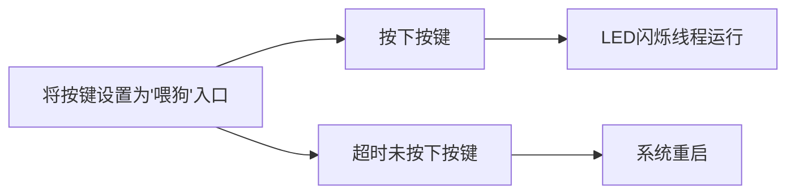

# RTT 夏令营第五天总结

## WDT 看门狗

硬件看门狗（watchdog timer）是一个**定时器**，其定时输出**连接到电路的复位端**。在产品化的嵌入式系统中，为了使系统在**异常情况下能自动复位**，一般都需要引入看门狗。

### 相关 API

* 查找看门狗

  ```c
  /* 查找看门狗 */
  rt_device_t rt_device_find(const char* name);				//看门狗设备名称
  ```

  

* 初始化看门狗

  ```c
  /* 初始化看门狗 */
  rt_err_t rt_device_init(rt_device_t dev);					//看门狗设备句柄
  ```

  使用看门狗设备前需要使用该函数接口进行看门狗设备的初始化。

* 控制看门狗

  ```c
  /* 控制看门狗 */
  rt_err_t rt_device_control(rt_device_t dev, 				//看门狗设备句柄
                             rt_uint8_t cmd, 					//命令控制字
                             void* arg);						//控制的参数
  ```

  

  ```c
  #define RT_DEVICE_CTRL_WDT_GET_TIMEOUT    (1) /* 获取溢出时间 */
  #define RT_DEVICE_CTRL_WDT_SET_TIMEOUT    (2) /* 设置溢出时间 */
  #define RT_DEVICE_CTRL_WDT_GET_TIMELEFT   (3) /* 获取剩余时间 */
  #define RT_DEVICE_CTRL_WDT_KEEPALIVE      (4) /* 喂狗 */
  #define RT_DEVICE_CTRL_WDT_START          (5) /* 启动看门狗 */
  #define RT_DEVICE_CTRL_WDT_STOP           (6) /* 停止看门狗 */
  ```
  
* 关闭看门狗

  ```c
  /* 关闭看门狗 */
  rt_err_t rt_device_close(rt_device_t dev);					//看门狗设备句柄
  ```

  当应用程序完成看门狗操作后，可以关闭看门狗设备。

  值得注意的是：关闭设备接口和打开设备接口需配对使用，打开一次设备对应要关闭一次设备，这样设备才会被完全关闭，否则设备仍处于未关闭状态。


程序思路及效果：




## RTC 使用

RTC （Real-Time Clock）实时时钟可以提供精确的实时时间，它可以用于产生年、月、日、时、分、秒等信息。目前实时时钟芯片大多采用精度较高的晶体振荡器作为时钟源。

### 相关 API

* 设置日期

  ```c
  /* 设置日期 */
  rt_err_t set_date(rt_uint32_t year,						//待设置生效的年份 
                    rt_uint32_t month, 					//待设置生效的月份
                    rt_uint32_t day)						//待设置生效的日
  ```

* 设置时间

  ```c
  /* 设置时间 */
  rt_err_t set_time(rt_uint32_t hour,						//待设置生效的时 
                    rt_uint32_t minute, 					//待设置生效的分
                    rt_uint32_t second)					//待设置生效的秒
  ```

* 获取当前时间

  ```c
  /* 获取当前时间 */
  time_t time(time_t *t)									//时间数据指针
  ```


## 串口驱动对接

串口设备驱动框架可浅析为三个层：设备管理层、设备驱动框架层、设备驱动层。

以 CH32V307 为例：

* 设备管理层（**device.c**）：**rt_device_find、rt_device_open、rt_device_read等**。

* 设备驱动框架层(**serial.c**)：**rt_serial_init、rt_serial_control、rt_serial_open等**。

* 设备驱动层(**drv_usart.c**)：**ch32_configure、ch32_control、ch32_putc、ch32_getc等**。

  

设备管理层的作用为：

* **通过设备管理接口获得正确的设备驱动，然后通过这个设备驱动与底层硬件设备进行交互**。

* **为用户提供标准操作接口**。

  

设备驱动框架层的作用为：

* **向下为设备驱动层提供：需要被实现的操作硬件的基本函数、设备注册函数、中断处理调用函数和需要被实现的结构体等**。

* **在内部调用操作底层硬件的基本函数实现更为复杂的驱动功能**。

* **向上提供标准的驱动接口**。

  

设备驱动层的作用为：

* **提供硬件层的驱动，如引脚初始化等**。


**由此可见：RT-Thread 利用设备驱动框架层将驱动层的底层代码封装成一个又一个标准的驱动接口，再由设备管理层进行进一步的封装，形成应用所用到的标准设备接口函数，从而实现应用层和底层驱动的解耦合，再利用设备驱动框架层提供的接口实现硬件层的控制，实现驱动对接**。

