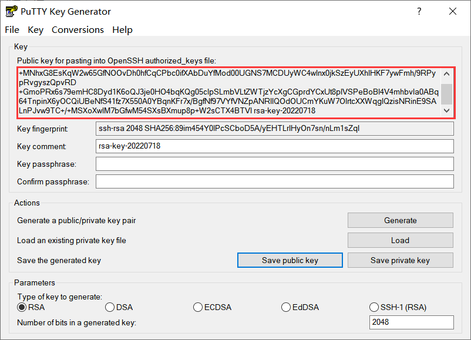
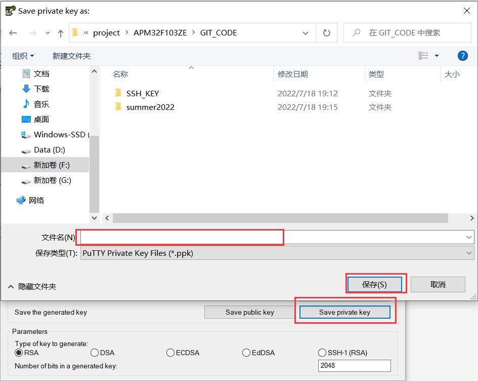
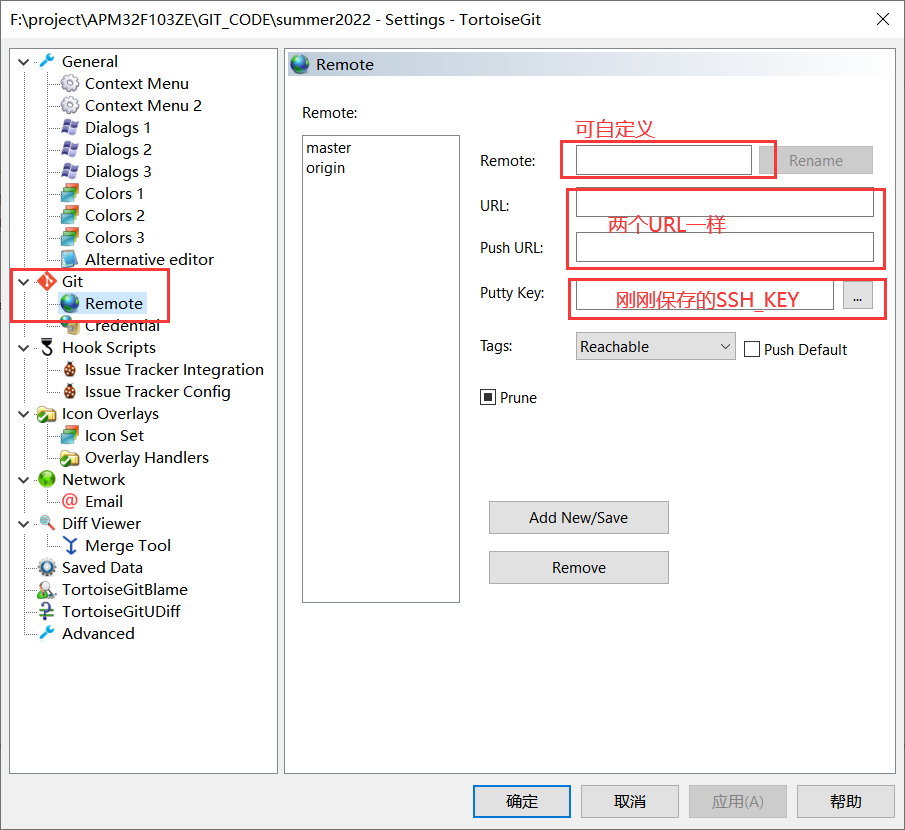
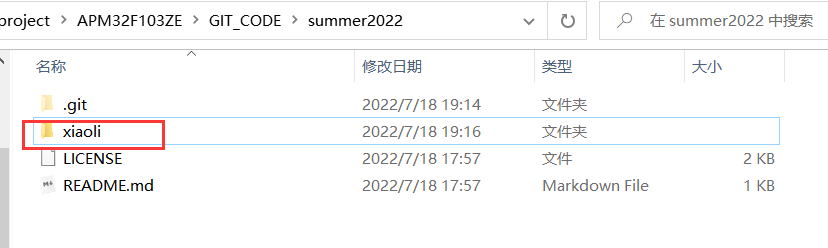
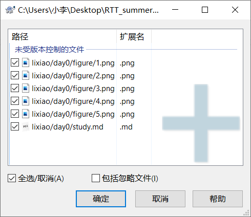
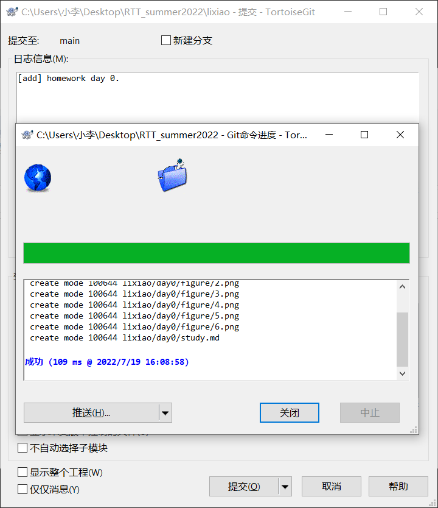

**Makedowm 文本**

1、RT-Thread Studio_APM32F103环境搭建、新建工程、下载编译。
		DAPLINK连接----下载pyocd 0.1.4

​		LED2、LED3不能同时工作

2、GIT的使用

​		GIThub远端添加

​		GIThub提交

使用Puttygen生成SSH_KEY

将这个复制到github--个人头像--shttings--SSH and GPG keys--NEW SSH KEY页面下的KEY,Title自定义。

将生成的ssh码保存为私码--文件名自定义（保存为ppk格式）

在clone的summer2022文件夹右键打开TortoiseGIT--setting--git--remote

自己在summer2022文件夹中新建自己的文件夹，然后新建.md文件，填写内容。

内容填写完成后，右键打开TortoiseGIT--添加--确定。

右键GIT提交

最后推送