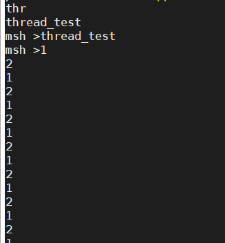
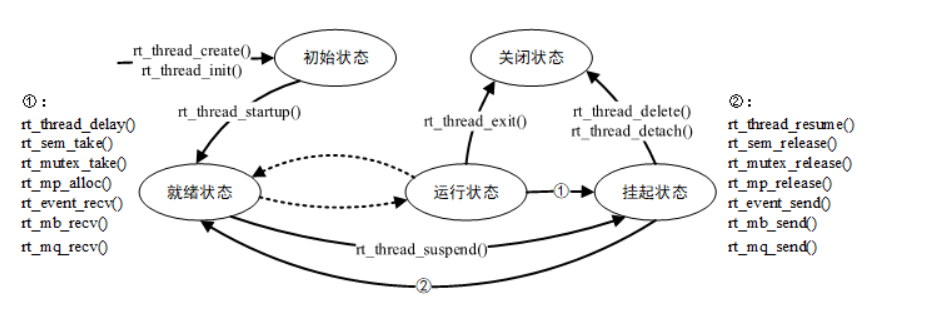
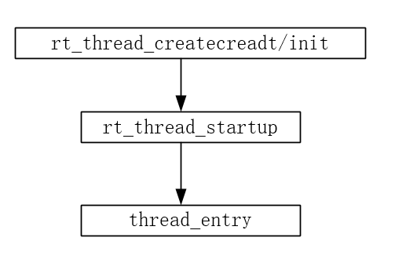
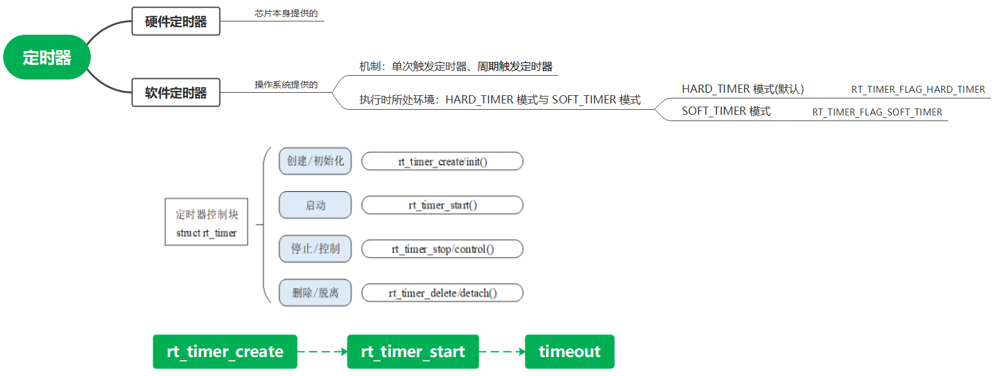
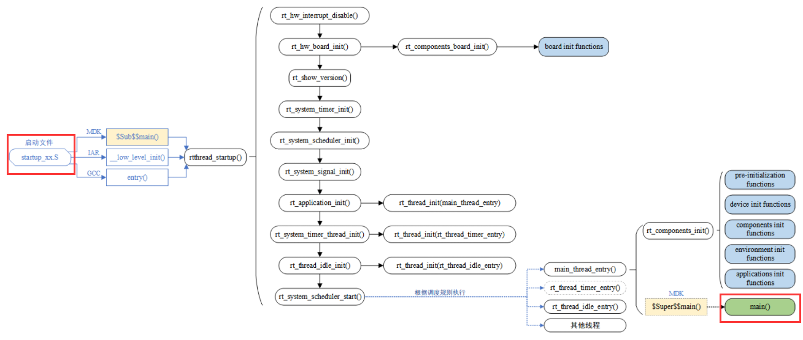

# 线程的理解

1. **创建一个线程，该线程中启动一个定时器。定时器回调中输出自己的信息。**

   ```
   /* 定时器的控制块 */
   static rt_timer_t timer1;
   static rt_timer_t timer2;
   static int cnt = 0;
   
   /* 定时器1超时函数 */
   static void timeout1(void *parameter)
   {
       rt_kprintf("periodic timer is timeout %d\n", cnt);
   
       /* 运行第10次，停止周期定时器 */
       if (cnt++ >= 9)
       {
           rt_timer_stop(timer1);
           rt_kprintf("periodic timer was stopped! \n");
       }
   }
   
   /* 定时器2超时函数 */
   static void timeout2(void *parameter)
   {
       rt_kprintf("one shot timer is timeout\n");
   }
   
   int timer_sample(void)
   {
       /* 创建定时器1  周期定时器 */
       timer1 = rt_timer_create("timer1", timeout1,
                                RT_NULL, 10,
                                RT_TIMER_FLAG_PERIODIC);
   
       /* 启动定时器1 */
       if (timer1 != RT_NULL)
           rt_timer_start(timer1);
   
       /* 创建定时器2 单次定时器 */
       timer2 = rt_timer_create("timer2", timeout2,
                                RT_NULL,  30,
                                RT_TIMER_FLAG_ONE_SHOT);
   
       /* 启动定时器2 */
       if (timer2 != RT_NULL)
           rt_timer_start(timer2);
   
       return 0;
   }
   
   /* 导出到 msh 命令列表中 */
   MSH_CMD_EXPORT(timer_sample, timer sample);
   ```

   运行情况：

   

2. **静态线程/动态线程创建的函数调用关系图。**

   线程函数：

   ```
   /* static */
   ALIGN(8)
   struct rt_thread static_thread;
   rt_uint8_t static_stack[2048];
   
   void thread_static(void)
   {
       while(1)
       {
           rt_thread_mdelay(1000);
           rt_kprintf("1\n");
       }
   }
   
   void thread_dynamic(void)
   {
       while(1)
       {
           rt_thread_mdelay(1000);
           rt_kprintf("2\n");
       }
   }
   
   void thread_test(void)
   {
       /* init thread 初始化线程*/
       rt_thread_init(&static_thread, "static", thread_static, RT_NULL, 			&static_stack[0], 2048, 16, 100);
       /*  startup thread */
       rt_thread_startup(&static_thread);
   
       rt_thread_t dynamic_thread = RT_NULL;
   
       /* create thread 创建线程*/
       dynamic_thread = rt_thread_create("dynamic", thread_dynamic, RT_NULL, 2048, 	16, 500);
       rt_thread_startup(dynamic_thread);
   
   //    rt_thread_create(name, entry, parameter, stack_size, priority, tick);
   }
   MSH_CMD_EXPORT(thread_test, static thread / dynamic thread test sample);
   ```

   运行情况：

   

   调用关系图：

   

   

3. **软/硬定时器调用关系图。**

   

4. **< 可选 > RT-Thread 的启动顺序图，从上电到 main 函数启动。**

   

5. **今天的学习收获，整理发送到 Github 仓库。**