# 1.线程间同步

## 1.1信号量

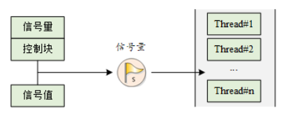

每个信号量对象都有一个信号量值和一个线程等待队列，信号量的值对应了信号量对象的实例数目、资源数目，假如信号量值为 5，则表示共有 5 个信号量实例（资源）可以被使用，当信号量实例数目为零时，再申请该信号量的线程就会被挂起在该信号量的等待队列上，等待可用的信号量实例（资源）。

comprehension:

当线程需要信号量才能启动时，只有当信号量值不为零时，线程启动，该线程执行一次，信号量的值-1，当信号量的值为0时，线程挂起，直到系统中有信号量释放信号量的值不为0后，线程再次执行。

当多个线程都需要同一个信号量时，按照优先级或者时间片顺序执行。

## 1.2互斥量

特殊的二值信号量

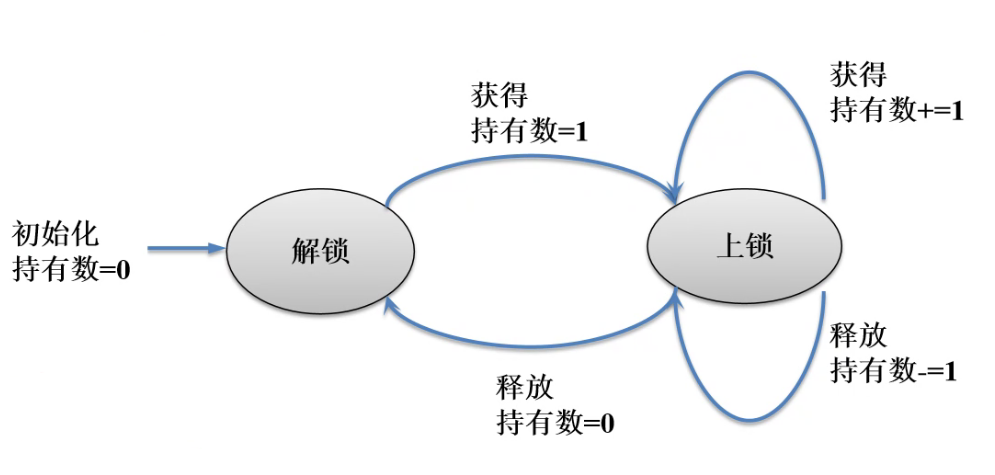

在获得互斥量后，请尽快释放互斥量，并且在持有互斥量的过程中，不得再行更改持有互斥量线程的优先级，否则可能人为引入无界优先级反转的问题。

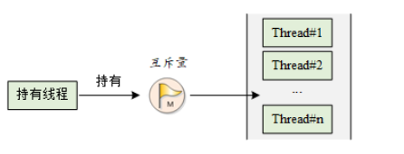

互斥量的状态只有两种，开锁或闭锁（两种状态值）。当有线程持有它时，互斥量处于闭锁状态，由这个线程获得它的所有权。相反，当这个线程释放它时，将对互斥量进行开锁，失去它的所有权。当一个线程持有互斥量时，其他线程将不能够对它进行开锁或持有它，持有该互斥量的线程也能够再次获得这个锁而不被挂起。


线程优先级翻转问题

通过在线程 A 尝试获取共享资源而被挂起的期间内，将线程 C 的优先级提升到线程 A 的优先级别，从而解决优先级翻转引起的问题。

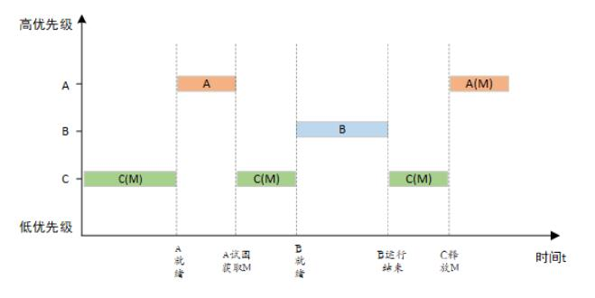

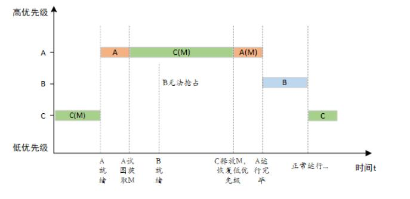

## 1.3事件集

在 RT-Thread 中，每个线程都拥有一个事件信息标记，它有三个属性，分别是 RT_EVENT_FLAG_AND(逻辑与)，RT_EVENT_FLAG_OR(逻辑或）以及 RT_EVENT_FLAG_CLEAR(清除标记）。当线程等待事件同步时，可以通过 32 个事件标志和这个事件信息标记来判断当前接收的事件是否满足同步条件。

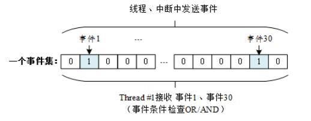

线程 #1 的事件标志中第 1 位和第 30 位被置位，如果事件信息标记位设为逻辑与，则表示线程 #1 只有在事件 1 和事件 30 都发生以后才会被触发唤醒，如果事件信息标记位设为逻辑或，则事件 1 或事件 30 中的任意一个发生都会触发唤醒线程 #1。如果信息标记同时设置了清除标记位，则当线程 #1 唤醒后将主动把事件 1 和事件 30 清为零，否则事件标志将依然存在（即置 1）。

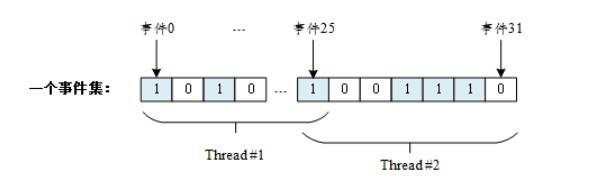

一个事件集中包含 32 个事件，特定线程只等待、接收它关注的事件。可以是一个线程等待多个事件的到来（线程 1、2 均等待多个事件，事件间可以使用 “与” 或者 “或” 逻辑触发线程），也可以是多个线程等待一个事件的到来（事件 25）。当有它们关注的事件发生时，线程将被唤醒并进行后续的处理动作。

# 2.线程间通信

## 2.1邮箱

线程或中断服务例程把一封 4 字节长度的邮件发送到邮箱中，而一个或多个线程可以从邮箱中接收这些邮件并进行处理。

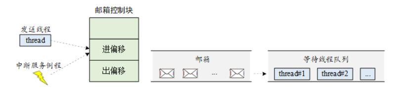

当一个线程向邮箱发送邮件时，如果邮箱没满，将把邮件复制到邮箱中。如果邮箱已经满了，发送线程可以设置超时时间，选择等待挂起或直接返回 - RT_EFULL。如果发送线程选择挂起等待，那么当邮箱中的邮件被收取而空出空间来时，等待挂起的发送线程将被唤醒继续发送。

当一个线程从邮箱中接收邮件时，如果邮箱是空的，接收线程可以选择是否等待挂起直到收到新的邮件而唤醒，或可以设置超时时间。当达到设置的超时时间，邮箱依然未收到邮件时，这个选择超时等待的线程将被唤醒并返回 - RT_ETIMEOUT。如果邮箱中存在邮件，那么接收线程将复制邮箱中的 4 个字节邮件到接收缓存中。

**当发送紧急邮件时，邮件被直接插队放入了邮件队首，这样，接收者就能够优先接收到紧急邮件，从而及时进行处理。**

## 2.2消息队列

线程或中断服务例程可以将一条或多条消息放入消息队列中。同样，一个或多个线程也可以从消息队列中获得消息。当有多个消息发送到消息队列时，通常将先进入消息队列的消息先传给线程，也就是说，线程先得到的是最先进入消息队列的消息，即先进先出原则 (FIFO)。

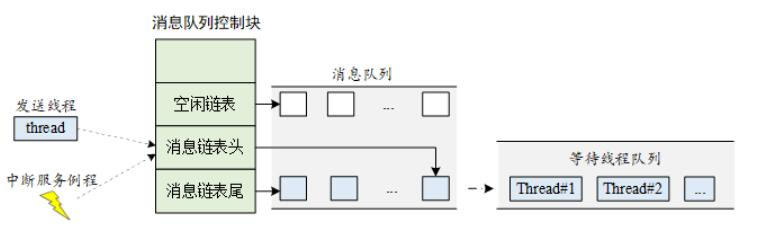

**同步消息**

在一般的系统设计中会经常遇到要发送同步消息的问题，这个时候就可以根据当时状态的不同选择相应的实现：两个线程间可以采用 **[消息队列 + 信号量或邮箱]** 的形式实现

根据消息确认的不同，可以把消息结构体定义成：

```
struct msg
{
    /* 消息结构其他成员 */
    struct rt_mailbox ack;
};
/* 或者 */
struct msg
{
    /* 消息结构其他成员 */
    struct rt_semaphore ack;
};
```

第一种类型的消息使用了邮箱来作为确认标志，邮箱作为确认标志，代表着接收线程能够通知一些状态值给发送线程；

第二种类型的消息采用了信号量来作为确认标志，信号量作为确认标志只能够单一的通知发送线程，消息已经确认接收。


### IPC的使用

semaphore_sample.c

```
/*
 * 程序清单：信号量例程
 *
 * 该例程创建了一个动态信号量，初始化两个线程，线程1在count每计数10次时，
 * 发送一个信号量，线程2在接收信号量后，对number进行加1操作
 */
#include <rtthread.h>

#define THREAD_PRIORITY         25
#define THREAD_TIMESLICE        5

/* 指向信号量的指针 */
static rt_sem_t dynamic_sem = RT_NULL;

ALIGN(RT_ALIGN_SIZE)
static char thread1_stack[1024];
static struct rt_thread thread1;
static void rt_thread1_entry(void *parameter)
{
    static rt_uint8_t count = 0;

    while (1)
    {
        if (count <= 100)
        {
            count++;
        }
        else
            return;

        /* count每计数10次，就释放一次信号量 */
        if (0 == (count % 10))
        {
            rt_kprintf("thread1 release a dynamic semaphore.\n");
            rt_sem_release(dynamic_sem);
        }
    }
}

ALIGN(RT_ALIGN_SIZE)
static char thread2_stack[1024];
static struct rt_thread thread2;
static void rt_thread2_entry(void *parameter)
{
    static rt_err_t result;
    static rt_uint8_t number = 0;
    while (1)
    {
        /* 永久方式等待信号量，获取到信号量，则执行number自加的操作 */
        result = rt_sem_take(dynamic_sem, RT_WAITING_FOREVER);
        if (result != RT_EOK)
        {
            rt_kprintf("thread2 take a dynamic semaphore, failed.\n");
            rt_sem_delete(dynamic_sem);
            return;
        }
        else
        {
            number++;
            rt_kprintf("thread2 take a dynamic semaphore. number = %d\n", number);
        }
    }
}

/* 信号量示例的初始化 */
int semaphore_sample()
{
    /* 创建一个动态信号量，初始值是0 */
    dynamic_sem = rt_sem_create("dsem", 0, RT_IPC_FLAG_PRIO);
    if (dynamic_sem == RT_NULL)
    {
        rt_kprintf("create dynamic semaphore failed.\n");
        return -1;
    }
    else
    {
        rt_kprintf("create done. dynamic semaphore value = 0.\n");
    }

    rt_thread_init(&thread1,
                   "thread1",
                   rt_thread1_entry,
                   RT_NULL,
                   &thread1_stack[0],
                   sizeof(thread1_stack),
                   THREAD_PRIORITY, THREAD_TIMESLICE);
#ifdef RT_USING_SMP
    /* 绑定线程到同一个核上，避免启用多核时的输出混乱 */
    rt_thread_control(&thread1, RT_THREAD_CTRL_BIND_CPU, (void*)0);
#endif
    rt_thread_startup(&thread1);

    rt_thread_init(&thread2,
                   "thread2",
                   rt_thread2_entry,
                   RT_NULL,
                   &thread2_stack[0],
                   sizeof(thread2_stack),
                   THREAD_PRIORITY - 1, THREAD_TIMESLICE);
#ifdef RT_USING_SMP
    /* 绑定线程到同一个核上，避免启用多核时的输出混乱 */
    rt_thread_control(&thread2, RT_THREAD_CTRL_BIND_CPU, (void*)0);
#endif
    rt_thread_startup(&thread2);

    return 0;
}

/* 导出到 msh 命令列表中 */
MSH_CMD_EXPORT(semaphore_sample, semaphore sample);
```

运行现象：

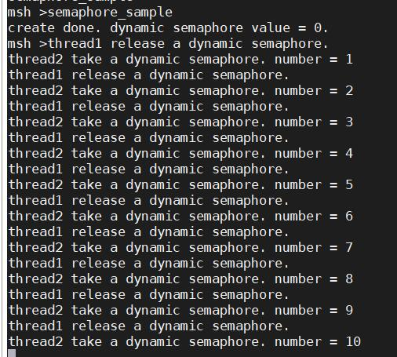

线程 1 在 count 计数为 10 的倍数时（count 计数为 100 之后线程退出），发送一个信号量，线程 2 在接收信号量后，对 number 进行加 1 操作。

mutex_sample.c

```
/*
 * 程序清单：互斥锁例程
 *
 * 互斥锁是一种保护共享资源的方法。当一个线程拥有互斥锁的时候，
 * 可以保护共享资源不被其他线程破坏。线程1对2个number分别进行加1操作
 * 线程2也会对2个number分别进行加1操作。使用互斥量保证2个number值保持一致
 */
#include <rtthread.h>

#define THREAD_PRIORITY         8
#define THREAD_TIMESLICE        5

/* 指向互斥量的指针 */
static rt_mutex_t dynamic_mutex = RT_NULL;
static rt_uint8_t number1, number2 = 0;

ALIGN(RT_ALIGN_SIZE)
static char thread1_stack[1024];
static struct rt_thread thread1;
static void rt_thread_entry1(void *parameter)
{
    while (1)
    {
        /* 线程1获取到互斥量后，先后对number1、number2进行加1操作，然后释放互斥量 */
        rt_mutex_take(dynamic_mutex, RT_WAITING_FOREVER);
        number1++;
        rt_thread_mdelay(10);
        number2++;
        rt_mutex_release(dynamic_mutex);
    }
}

ALIGN(RT_ALIGN_SIZE)
static char thread2_stack[1024];
static struct rt_thread thread2;
static void rt_thread_entry2(void *parameter)
{
    while (1)
    {
        /* 线程2获取到互斥量后，检查number1、number2的值是否相同，相同则表示mutex起到了锁的作用 */
        rt_mutex_take(dynamic_mutex, RT_WAITING_FOREVER);
        if (number1 != number2)
        {
            rt_kprintf("not protect.number1 = %d, mumber2 = %d \n", number1, number2);
        }
        else
        {
            rt_kprintf("mutex protect ,number1 = mumber2 is %d\n", number1);
        }

        number1++;
        number2++;
        rt_mutex_release(dynamic_mutex);

        if (number1 >= 50)
            return;
    }
}

/* 互斥量示例的初始化 */
int mutex_sample(void)
{
    /* 创建一个动态互斥量 */
    dynamic_mutex = rt_mutex_create("dmutex", RT_IPC_FLAG_PRIO);
    if (dynamic_mutex == RT_NULL)
    {
        rt_kprintf("create dynamic mutex failed.\n");
        return -1;
    }

    rt_thread_init(&thread1,
                   "thread1",
                   rt_thread_entry1,
                   RT_NULL,
                   &thread1_stack[0],
                   sizeof(thread1_stack),
                   THREAD_PRIORITY, THREAD_TIMESLICE);
#ifdef RT_USING_SMP
    /* 绑定线程到同一个核上，避免启用多核时的输出混乱 */
    rt_thread_control(&thread1, RT_THREAD_CTRL_BIND_CPU, (void*)0);
#endif
    rt_thread_startup(&thread1);

    rt_thread_init(&thread2,
                   "thread2",
                   rt_thread_entry2,
                   RT_NULL,
                   &thread2_stack[0],
                   sizeof(thread2_stack),
                   THREAD_PRIORITY - 1, THREAD_TIMESLICE);
#ifdef RT_USING_SMP
    /* 绑定线程到同一个核上，避免启用多核时的输出混乱 */
    rt_thread_control(&thread2, RT_THREAD_CTRL_BIND_CPU, (void*)0);
#endif
    rt_thread_startup(&thread2);
    return 0;
}

/* 导出到 msh 命令列表中 */
MSH_CMD_EXPORT(mutex_sample, mutex sample);
```

运行现象：

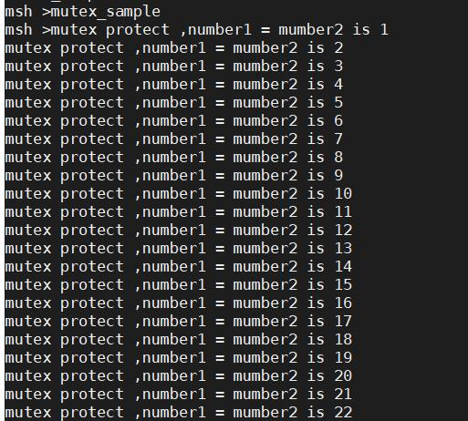

线程 1 与线程 2 中均使用互斥量保护对 2 个 number 的操作，使 number 值保持一致。

### 事件集

event_sample.c

```
/*
 * 程序清单：事件例程
 *
 * 程序会初始化2个线程及初始化一个静态事件对象
 * 一个线程等待于事件对象上，以接收事件；
 * 一个线程发送事件 (事件3/事件5)
*/
#include <rtthread.h>

#define THREAD_PRIORITY      9
#define THREAD_TIMESLICE     5

#define EVENT_FLAG3 (1 << 3)
#define EVENT_FLAG5 (1 << 5)

/* 事件控制块 */
static struct rt_event event;

ALIGN(RT_ALIGN_SIZE)
static char thread1_stack[1024];
static struct rt_thread thread1;

/* 线程1入口函数 */
static void thread1_recv_event(void *param)
{
    rt_uint32_t e;

    /* 第一次接收事件，事件3或事件5任意一个可以触发线程1，接收完后清除事件标志 */
    if (rt_event_recv(&event, (EVENT_FLAG3 | EVENT_FLAG5),
                      RT_EVENT_FLAG_OR | RT_EVENT_FLAG_CLEAR,
                      RT_WAITING_FOREVER, &e) == RT_EOK)
    {
        rt_kprintf("thread1: OR recv event 0x%x\n", e);
    }

    rt_kprintf("thread1: delay 1s to prepare the second event\n");
    rt_thread_mdelay(1000);

    /* 第二次接收事件，事件3和事件5均发生时才可以触发线程1，接收完后清除事件标志 */
    if (rt_event_recv(&event, (EVENT_FLAG3 | EVENT_FLAG5),
                      RT_EVENT_FLAG_AND | RT_EVENT_FLAG_CLEAR,
                      RT_WAITING_FOREVER, &e) == RT_EOK)
    {
        rt_kprintf("thread1: AND recv event 0x%x\n", e);
    }
    rt_kprintf("thread1 leave.\n");
}

ALIGN(RT_ALIGN_SIZE)
static char thread2_stack[1024];
static struct rt_thread thread2;

/* 线程2入口 */
static void thread2_send_event(void *param)
{
    rt_kprintf("thread2: send event3\n");
    rt_event_send(&event, EVENT_FLAG3);
    rt_thread_mdelay(200);

    rt_kprintf("thread2: send event5\n");
    rt_event_send(&event, EVENT_FLAG5);
    rt_thread_mdelay(200);

    rt_kprintf("thread2: send event3\n");
    rt_event_send(&event, EVENT_FLAG3);
    rt_kprintf("thread2 leave.\n");
}

int event_sample(void)
{
    rt_err_t result;

    /* 初始化事件对象 */
    result = rt_event_init(&event, "event", RT_IPC_FLAG_PRIO);
    if (result != RT_EOK)
    {
        rt_kprintf("init event failed.\n");
        return -1;
    }

    rt_thread_init(&thread1,
                   "thread1",
                   thread1_recv_event,
                   RT_NULL,
                   &thread1_stack[0],
                   sizeof(thread1_stack),
                   THREAD_PRIORITY - 1, THREAD_TIMESLICE);
#ifdef RT_USING_SMP
    /* 绑定线程到同一个核上，避免启用多核时的输出混乱 */
    rt_thread_control(&thread1, RT_THREAD_CTRL_BIND_CPU, (void*)0);
#endif
    rt_thread_startup(&thread1);

    rt_thread_init(&thread2,
                   "thread2",
                   thread2_send_event,
                   RT_NULL,
                   &thread2_stack[0],
                   sizeof(thread2_stack),
                   THREAD_PRIORITY, THREAD_TIMESLICE);
#ifdef RT_USING_SMP
    /* 绑定线程到同一个核上，避免启用多核时的输出混乱 */
    rt_thread_control(&thread2, RT_THREAD_CTRL_BIND_CPU, (void*)0);
#endif
    rt_thread_startup(&thread2);

    return 0;
}

/* 导出到 msh 命令列表中 */
MSH_CMD_EXPORT(event_sample, event sample);

```

运行现象：

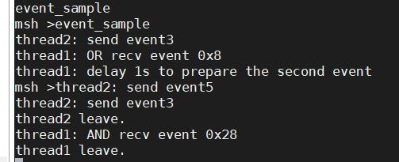

线程2发送事件3和事件5，线程 1 前后两次接收事件，分别使用了 “逻辑或” 与“逻辑与”的方法。

### 邮箱

mailbox_sample.c

```
/*
 * 程序清单：邮箱例程
 *
 * 这个程序会创建2个动态线程，一个静态的邮箱对象，其中一个线程往邮箱中发送邮件，
 * 一个线程往邮箱中收取邮件。
 */
#include <rtthread.h>

#define THREAD_PRIORITY      10
#define THREAD_TIMESLICE     5

/* 邮箱控制块 */
static struct rt_mailbox mb;
/* 用于放邮件的内存池 */
static char mb_pool[128];

static char mb_str1[] = "I'm a mail!";
static char mb_str2[] = "this is another mail!";
static char mb_str3[] = "over";

ALIGN(RT_ALIGN_SIZE)
static char thread1_stack[1024];
static struct rt_thread thread1;

/* 线程1入口 */
static void thread1_entry(void *parameter)
{
    char *str;

    while (1)
    {
        rt_kprintf("thread1: try to recv a mail\n");

        /* 从邮箱中收取邮件 */
        if (rt_mb_recv(&mb, (rt_ubase_t *)&str, RT_WAITING_FOREVER) == RT_EOK)
        {
            rt_kprintf("thread1: get a mail from mailbox, the content:%s\n", str);
            if (str == mb_str3)
                break;

            /* 延时100ms */
            rt_thread_mdelay(100);
        }
    }
    /* 执行邮箱对象脱离 */
    rt_mb_detach(&mb);
}

ALIGN(RT_ALIGN_SIZE)
static char thread2_stack[1024];
static struct rt_thread thread2;

/* 线程2入口 */
static void thread2_entry(void *parameter)
{
    rt_uint8_t count;

    count = 0;
    while (count < 10)
    {
        count ++;
        if (count & 0x1)
        {
            /* 发送mb_str1地址到邮箱中 */
            rt_mb_send(&mb, (rt_uint32_t)&mb_str1);
        }
        else
        {
            /* 发送mb_str2地址到邮箱中 */
            rt_mb_send(&mb, (rt_uint32_t)&mb_str2);
        }

        /* 延时200ms */
        rt_thread_mdelay(200);
    }

    /* 发送邮件告诉线程1，线程2已经运行结束 */
    rt_mb_send(&mb, (rt_uint32_t)&mb_str3);
}

int mailbox_sample(void)
{
    rt_err_t result;

    /* 初始化一个mailbox */
    result = rt_mb_init(&mb,
                        "mbt",                      /* 名称是mbt */
                        &mb_pool[0],                /* 邮箱用到的内存池是mb_pool */
                        sizeof(mb_pool) / sizeof(rt_ubase_t), /* 邮箱中的邮件数目,sizeof(rt_ubase_t)表示指针大小 */
                        RT_IPC_FLAG_PRIO);          /* 采用PRIO方式进行线程等待 */
    if (result != RT_EOK)
    {
        rt_kprintf("init mailbox failed.\n");
        return -1;
    }

    rt_thread_init(&thread1,
                   "thread1",
                   thread1_entry,
                   RT_NULL,
                   &thread1_stack[0],
                   sizeof(thread1_stack),
                   THREAD_PRIORITY, THREAD_TIMESLICE);
#ifdef RT_USING_SMP
    /* 绑定线程到同一个核上，避免启用多核时的输出混乱 */
    rt_thread_control(&thread1, RT_THREAD_CTRL_BIND_CPU, (void*)0);
#endif
    rt_thread_startup(&thread1);

    rt_thread_init(&thread2,
                   "thread2",
                   thread2_entry,
                   RT_NULL,
                   &thread2_stack[0],
                   sizeof(thread2_stack),
                   THREAD_PRIORITY, THREAD_TIMESLICE);
#ifdef RT_USING_SMP
    /* 绑定线程到同一个核上，避免启用多核时的输出混乱 */
    rt_thread_control(&thread2, RT_THREAD_CTRL_BIND_CPU, (void*)0);
#endif
    rt_thread_startup(&thread2);
    return 0;
}

/* 导出到 msh 命令列表中 */
MSH_CMD_EXPORT(mailbox_sample, mailbox sample);

```

运行现象：

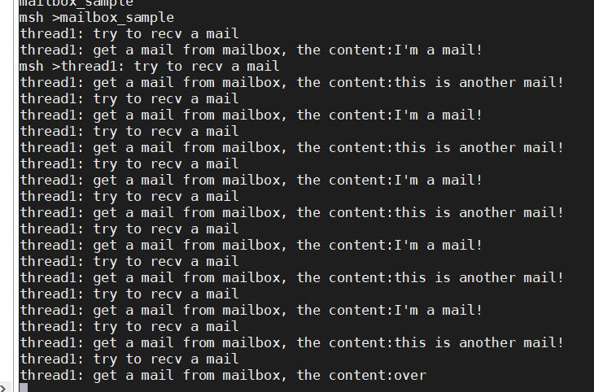

### 消息队列

​	msgq_sample.c

```
/*
 * 程序清单：消息队列例程
 *
 * 这个程序会创建2个动态线程，一个线程会从消息队列中收取消息；一个线程会定时给消
 * 息队列发送 普通消息和紧急消息。
 */
#include <rtthread.h>

#define THREAD_PRIORITY      25
#define THREAD_TIMESLICE     5

/* 消息队列控制块 */
static struct rt_messagequeue mq;
/* 消息队列中用到的放置消息的内存池 */
static rt_uint8_t msg_pool[2048];

ALIGN(RT_ALIGN_SIZE)
static char thread1_stack[1024];
static struct rt_thread thread1;

/* 线程1入口函数 */
static void thread1_entry(void *parameter)
{
    char buf = 0;
    rt_uint8_t cnt = 0;

    while (1)
    {
        /* 从消息队列中接收消息 */
        if (rt_mq_recv(&mq, &buf, sizeof(buf), RT_WAITING_FOREVER) == RT_EOK)
        {
            rt_kprintf("thread1: recv msg from msg queue, the content:%c\n", buf);
            if (cnt == 19)
            {
                break;
            }
        }
        /* 延时50ms */
        cnt++;
        rt_thread_mdelay(50);
    }
    rt_kprintf("thread1: detach mq \n");
    rt_mq_detach(&mq);
}

ALIGN(RT_ALIGN_SIZE)
static char thread2_stack[1024];
static struct rt_thread thread2;

/* 线程2入口 */
static void thread2_entry(void *parameter)
{
    int result;
    char buf = 'A';
    rt_uint8_t cnt = 0;

    while (1)
    {
        if (cnt == 8)
        {
            /* 发送紧急消息到消息队列中 */
            result = rt_mq_urgent(&mq, &buf, 1);
            if (result != RT_EOK)
            {
                rt_kprintf("rt_mq_urgent ERR\n");
            }
            else
            {
                rt_kprintf("thread2: send urgent message - %c\n", buf);
            }
        }
        else if (cnt >= 20)/* 发送20次消息之后退出 */
        {
            rt_kprintf("message queue stop send, thread2 quit\n");
            break;
        }
        else
        {
            /* 发送消息到消息队列中 */
            result = rt_mq_send(&mq, &buf, 1);
            if (result != RT_EOK)
            {
                rt_kprintf("rt_mq_send ERR\n");
            }

            rt_kprintf("thread2: send message - %c\n", buf);
        }
        buf++;
        cnt++;
        /* 延时5ms */
        rt_thread_mdelay(5);
    }
}

/* 消息队列示例的初始化 */
int msgq_sample(void)
{
    rt_err_t result;

    /* 初始化消息队列 */
    result = rt_mq_init(&mq,
                        "mqt",
                        &msg_pool[0],               /* 内存池指向msg_pool */
                        1,                          /* 每个消息的大小是 1 字节 */
                        sizeof(msg_pool),           /* 内存池的大小是msg_pool的大小 */
                        RT_IPC_FLAG_PRIO);          /* 如果有多个线程等待，按照先来先得到的方法分配消息 */

    if (result != RT_EOK)
    {
        rt_kprintf("init message queue failed.\n");
        return -1;
    }

    rt_thread_init(&thread1,
                   "thread1",
                   thread1_entry,
                   RT_NULL,
                   &thread1_stack[0],
                   sizeof(thread1_stack),
                   THREAD_PRIORITY, THREAD_TIMESLICE);
#ifdef RT_USING_SMP
    /* 绑定线程到同一个核上，避免启用多核时的输出混乱 */
    rt_thread_control(&thread1, RT_THREAD_CTRL_BIND_CPU, (void*)0);
#endif
    rt_thread_startup(&thread1);

    rt_thread_init(&thread2,
                   "thread2",
                   thread2_entry,
                   RT_NULL,
                   &thread2_stack[0],
                   sizeof(thread2_stack),
                   THREAD_PRIORITY, THREAD_TIMESLICE);
#ifdef RT_USING_SMP
    /* 绑定线程到同一个核上，避免启用多核时的输出混乱 */
    rt_thread_control(&thread2, RT_THREAD_CTRL_BIND_CPU, (void*)0);
#endif
    rt_thread_startup(&thread2);

    return 0;
}

/* 导出到 msh 命令列表中 */
MSH_CMD_EXPORT(msgq_sample, msgq sample);
```

运行现象

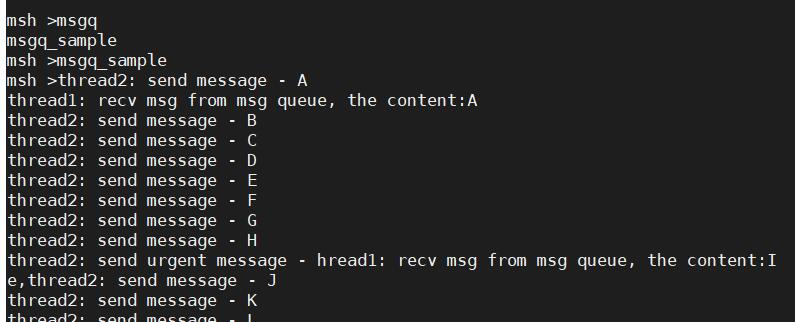

