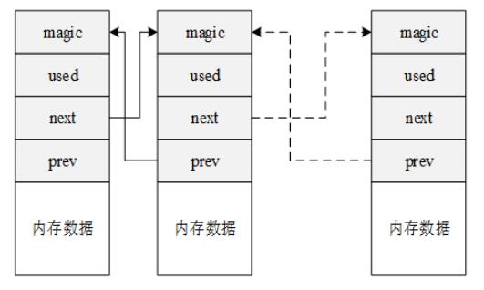
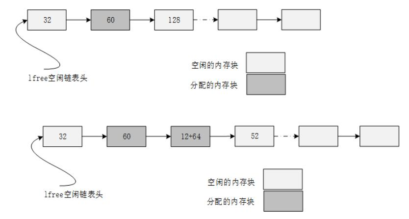
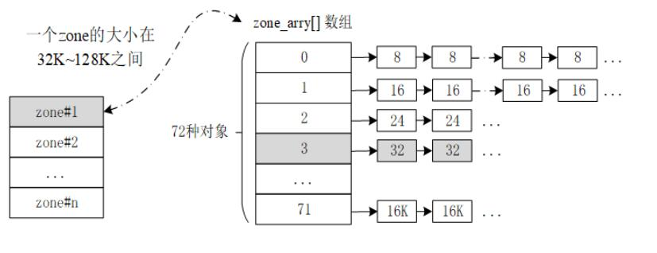
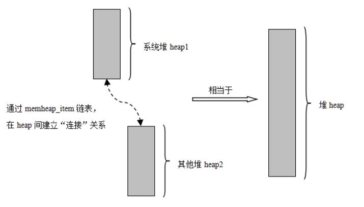
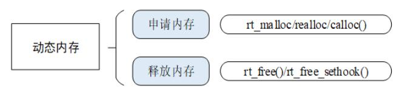
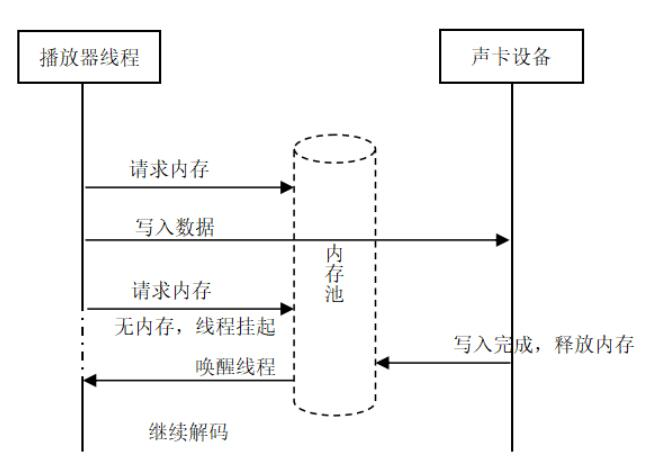
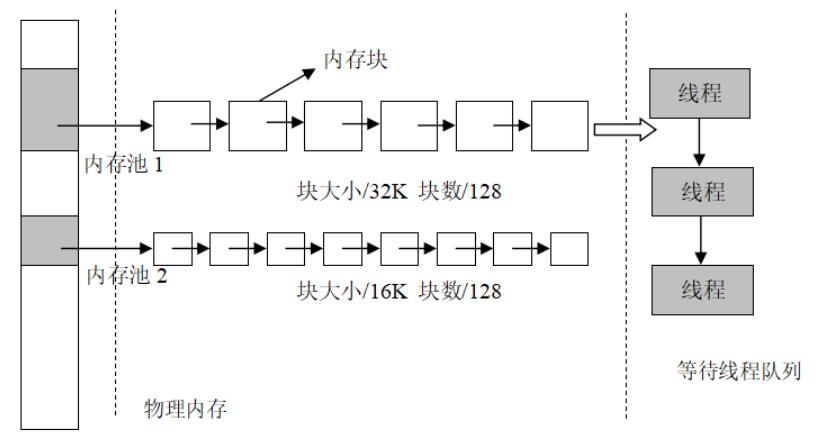
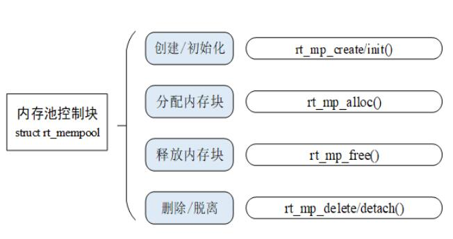

# 一、内存管理

分配内存的时间必须是确定的。实时系统必须要保证内存块的分配过程在可预测的确定时间内完成，否则实时任务对外部事件的响应也将变得不可确定。

随着内存不断被分配和释放，整个内存区域会产生越来越多的碎片，系统中还有足够的空闲内存，但因为它们地址并非连续，不能组成一块连续的完整内存块，会使得程序不能申请到大的内存。

为系统资源（内存大小）不同的系统，选择适合它们的高效率的内存分配算法，就将变得复杂化。

**内存管理的表现主要体现在内存的分配与释放上。**

## 二、RT-Thread 操作系统的内存管理

## 2.1动态内存堆（管理一段连续的内存空间）

内存堆管理器可以分配任意大小的内存块，非常灵活和方便。

但其也存在明显的缺点：一是分配效率不高，在每次分配时，都要空闲内存块查找；二是容易产生内存碎片。

### 2.1.1针对小内存块的分配管理（小内存管理算法）

​			针对系统资源比较少，一般用于小于 2MB 内存空间的系统。当需要分配内存块时，将一块大的内存分割出相匹配的内存块，然后把分割出来的空闲内存块还回给堆管理系统中。每个内存块都包含一个管理用的数据头，通过这个头把使用块与空闲块用双向链表的方式链接起来。

### 2.1.2针对大内存块的分配管理（slab 管理算法）

​			系统资源比较丰富时，提供了一种近似多内存池管理算法的快速算法

slab 分配器会根据对象的大小分成多个区（zone）

内存分配：

内存释放：

### 2.1.3针对多内存堆的分配情况（memheap 管理算法）

​			适用于系统存在多个内存堆的情况，它可以将多个内存 “粘贴” 在一起，形成一个大的内存堆。

​			在开启 memheap 之后原来的 heap 功能将被关闭，两者只可以通过打开或关闭 RT_USING_MEMHEAP_AS_HEAP 来选择其一

将多块内存加入 memheap_item 链表进行粘合。当分配内存块时，会先从默认内存堆去分配内存，当分配不到时会查找 memheap_item 链表，尝试从其他的内存堆上分配内存块。应用程序不用关心当前分配的内存块位于哪个内存堆上，就像是在操作一个内存堆。

## 2.1.4 内存堆的管理方式

包含：初始化、申请内存块、释放内存，所有使用完成后的动态内存都应该被释放，以供其他程序的申请使用。

rt_malloc 函数会从系统堆空间中找到合适大小的内存块，然后把内存块可用地址返回给用户。

rt_realloc在已分配内存块的基础上重新分配内存块的大小。1、在进行重新分配内存块时，原来的内存块数据保持不变（缩小的情况下，后面的数据被自动截断）。2、如果原先的内存块无法改变大小，rt_realloc 将分配另一块正确大小的内存，并把原先那块内存的内容复制到新的块上。3、在使用 rt_realloc 之后，不能再使用指向旧内存块的指针，而是应该改用 rt_realloc 所返回的新指针。如果 rt_realloc 的第一个参数为 NULL, 那么它的行为就和 rt_malloc 一样。

rt_calloc从内存堆中分配连续内存地址的多个内存块

### 总结

- 检查从 rt_malloc 函数返回的指针是否为 NULL

- 不要访问动态分配内存之外的内存

- 不要向 rt_free 传递一个并非由 rt_malloc 函数返回的指针

- 在释放动态内存之后不要再访问它

- 使用 sizeof 计算数据类型的长度，提高程序的可移植性

  常见错误：

  - 对 NULL 指针进行解引用

  - 对分配的内存进行操作时越过边界

  - 释放并非动态分配的内存

  - 释放一块动态分配的内存的一部分 (rt_free(ptr + 4))

  - 动态内存被释放后继续使用

    内存碎片：频繁的调用内存分配和释放接口会导致内存碎片，一个避免内存碎片的策略是使用 `内存池 + 内存堆` 混用的方法。

## 2.2 静态内存池

用于分配大量大小相同的小内存块，它可以极大地加快内存分配与释放的速度，且能尽量避免内存碎片化。

RT-Thread 的内存池支持线程挂起功能，当内存池中无空闲内存块时，申请线程会被挂起，直到内存池中有新的可用内存块，再将挂起的申请线程唤醒。

内存池在创建时先向系统申请一大块内存，然后分成同样大小的多个小内存块，小内存块直接通过链表连接起来（此链表也称为空闲链表）。每次分配的时候，从空闲链表中取出链头上第一个内存块，提供给申请者。

内核负责给内存池分配内存池控制块，它同时也接收用户线程的分配内存块申请，当获得这些信息后，内核就可以从内存池中为内存池分配内存。内存池一旦初始化完成，内部的内存块大小将不能再做调整。

### 2.2.1内存池的管理方式

内存池的操作包含：创建 / 初始化内存池、申请内存块、释放内存块、删除 / 脱离内存池，但不是所有的内存池都会被删除，这与设计者的需求相关，但是使用完的内存块都应该被释放。

