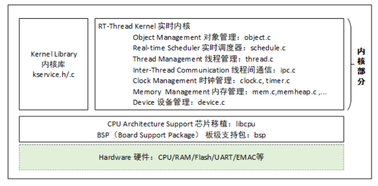
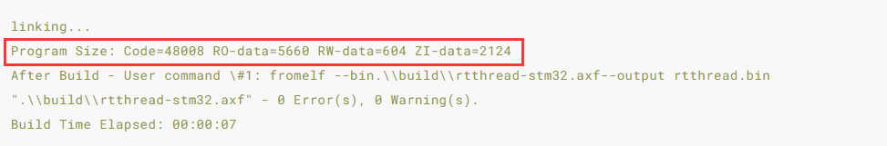

# RT-Thread 内核

**内核架构图**(内核处于硬件层之上，内核部分包括内核库、实时内核实现)



**RT-Thread启动流程**


系统启动后先从汇编代码 startup_xx.s 开始运行，然后跳转到 C 代码，进行 RT-Thread 系统启动，最后进入用户程序入口函数 main()。

$Sub$$main函数调用了 rtthread_startup() 函数，函数中大致分为四个部分

```
int rtthread_startup(void)
{
    rt_hw_interrupt_disable();

    /* 板级初始化：需在该函数内部进行系统堆的初始化 */
    rt_hw_board_init();

    /* 打印 RT-Thread 版本信息 */
    rt_show_version();

    /* 定时器初始化 */
    rt_system_timer_init();

    /* 调度器初始化 */
    rt_system_scheduler_init();

#ifdef RT_USING_SIGNALS
    /* 信号初始化 */
    rt_system_signal_init();
#endif

    /* 由此创建一个用户 main 线程 */
    rt_application_init();

    /* 定时器线程初始化 */
    rt_system_timer_thread_init();

    /* 空闲线程初始化 */
    rt_thread_idle_init();

    /* 启动调度器 */
    rt_system_scheduler_start();

    /* 不会执行至此 */
    return 0;
}

```

（1）初始化与系统相关的硬件；

（2）初始化系统内核对象，例如定时器、调度器、信号；

（3）创建 main 线程，在 main 线程中对各类模块依次进行初始化；

（4）初始化定时器线程、空闲线程，并启动调度器。

启动调度器之前，系统所创建的线程在执行 rt_thread_startup() 后并不会立马运行，它们会处于就绪状态等待系统调度；待启动调度器之后，系统才转入第一个线程开始运行，根据调度规则，选择的是就绪队列中优先级最高的线程。

**RT-Thread程序内存分布**

工程在编译完之后，会有相应的程序所占用的空间提示信息

