# 设备模型框架

RT-Thread 提供了一套简单的 I/O 设备模型框架，它位于硬件和应用程序之间，共分成三层，从上到下分别是 I/O 设备管理层、设备驱动框架层、设备驱动层。

应用程序通过 **I/O 设备层**提供的标准接口访问底层设备，设备驱动程序的升级、更替不会对上层应用产生影响。这种方式使得设备的硬件操作相关的代码能够独立于应用程序而存在，双方只需关注各自的功能实现，从而降低了代码的耦合性、复杂性，提高了系统的可靠性。

**设备驱动框架层**是对同类硬件设备驱动的抽象，将不同厂家的同类硬件设备驱动中相同的部分抽取出来，将不同部分留出接口，由驱动程序实现。

**设备驱动层**是一组驱使硬件设备工作的程序，实现访问硬件设备的功能，它负责创建和注册 I/O 设备。

I/O设备时序图：

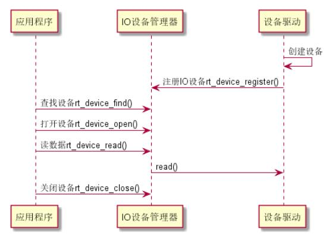

## I/O设备模型

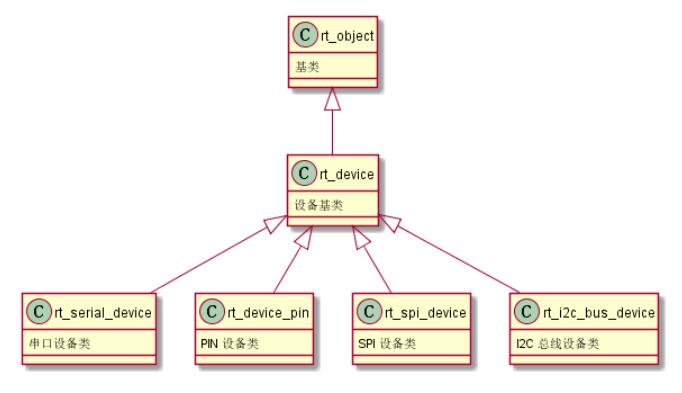

每个设备对象都是由基对象派生而来，每个具体设备都可以继承其父类对象的属性，并派生出其私有属性。

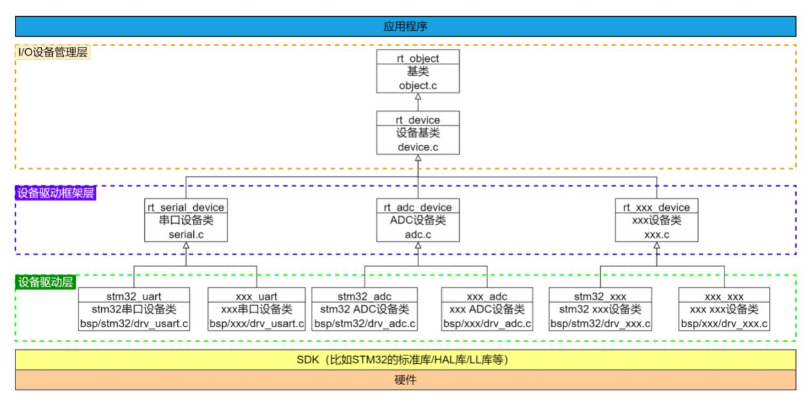

该图横向看是分层思想，纵向看是各类派生继承关系。从下到上不断抽象、屏蔽下层差异，体现了面向对象的抽象的思想。

### I2C总线设备

RT-Thread内核已经完成设备的创建和注册函数的驱动，只需通过RT-Thread Studio启用相应设备，即可完成设备的创建和注册。

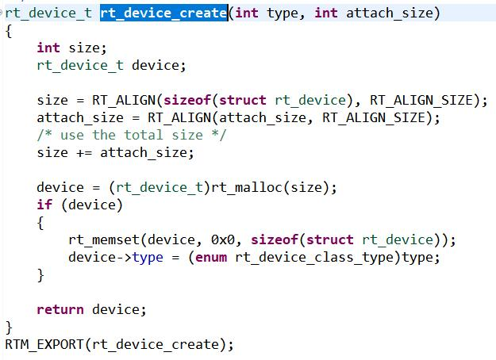

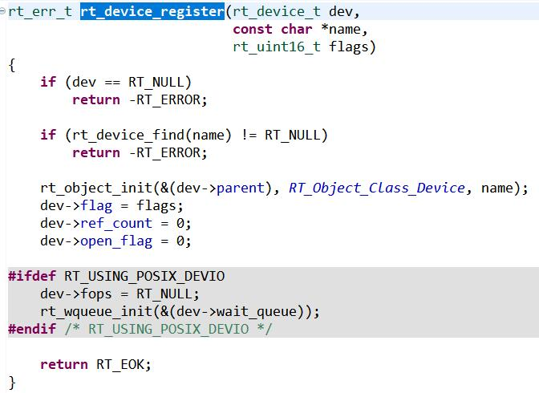

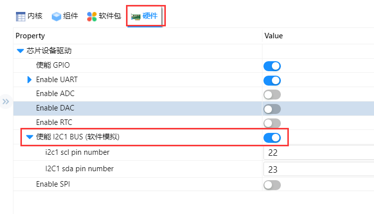

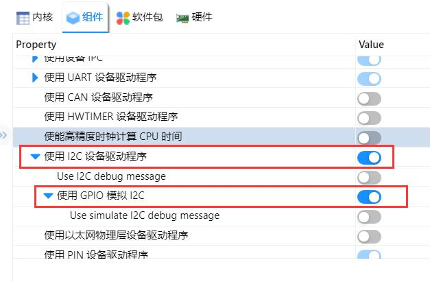

在串口软件中可以看到设备注册成功。

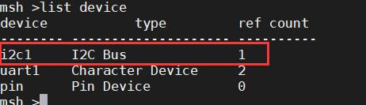

在aht10软件包中，自动初始化（查找）对应的 AHT10 设备，并实现读写的设备的数据，通过互斥量进行线程间同步，确保数据完整性。

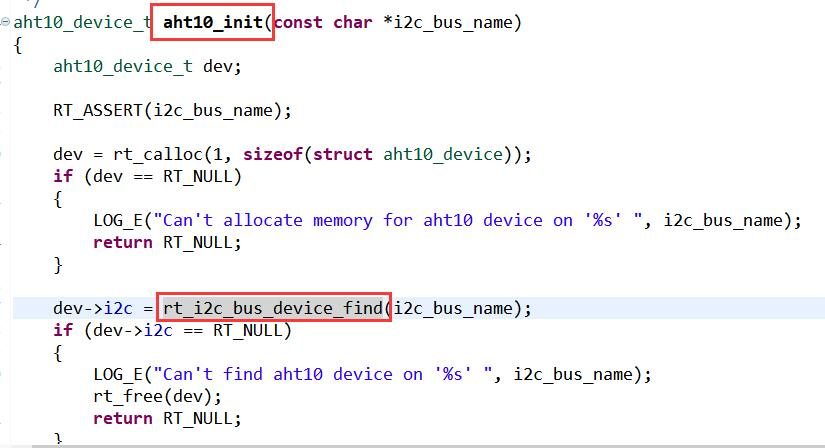

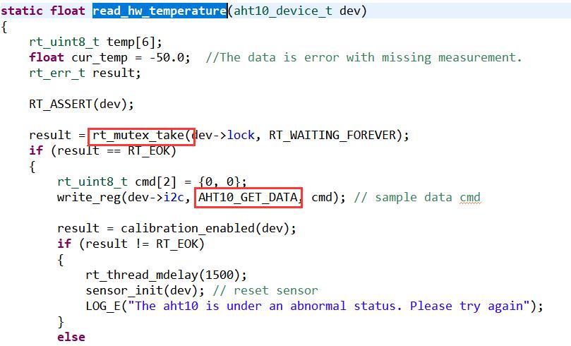

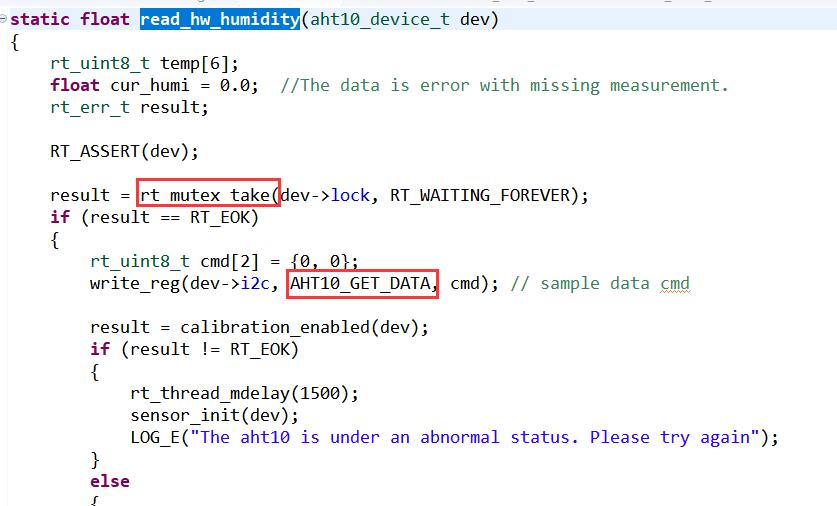

最后在main.c中调用aht10 软件包初始化函数。

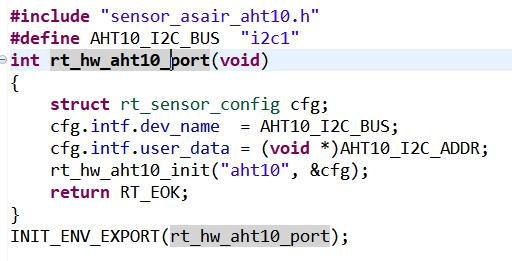

最后在串口中输入指令即可：

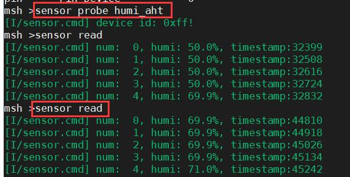

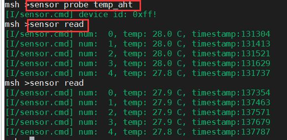

very good.全程不需要自己写一行代码！但需要理解函数之间的链接关系。