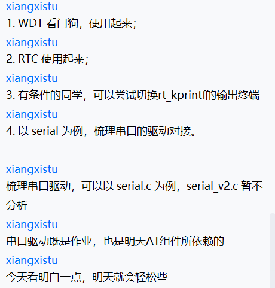

# 1.WDT看门狗

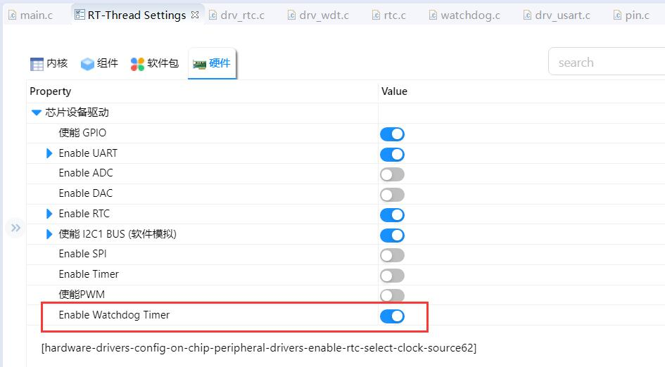

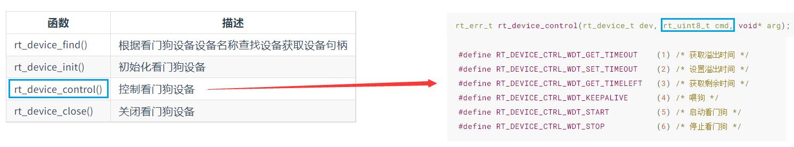

在函数中调用指令：

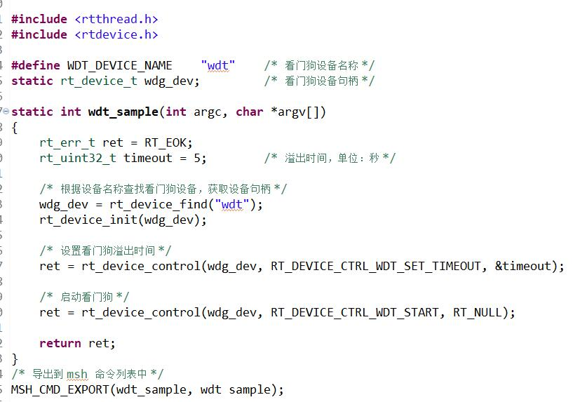

程序自动重启：

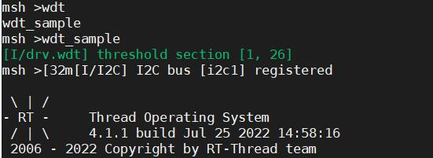

# 2.RTC的使用

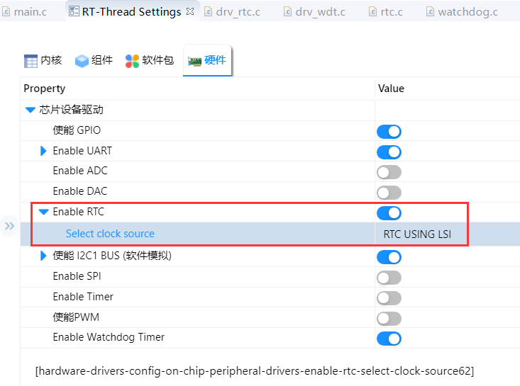

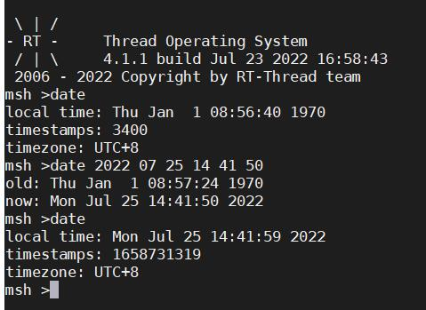

# 3.尝试切换rt_kprintf的输出终端

# 4.以serial为例，梳理串口的驱动对接（以serial.c为例）

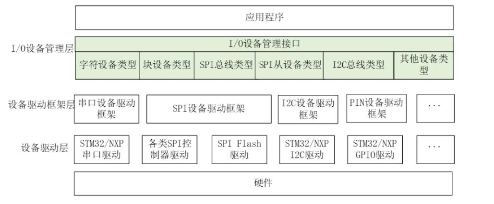

应用程序既可以通过**I/O设备管理层**访问**设备驱动框架层**再访问**设备驱动层**，也可以直接通过**设备驱动框架层**再访问**设备驱动层**；以此实现对底层硬件的驱动。

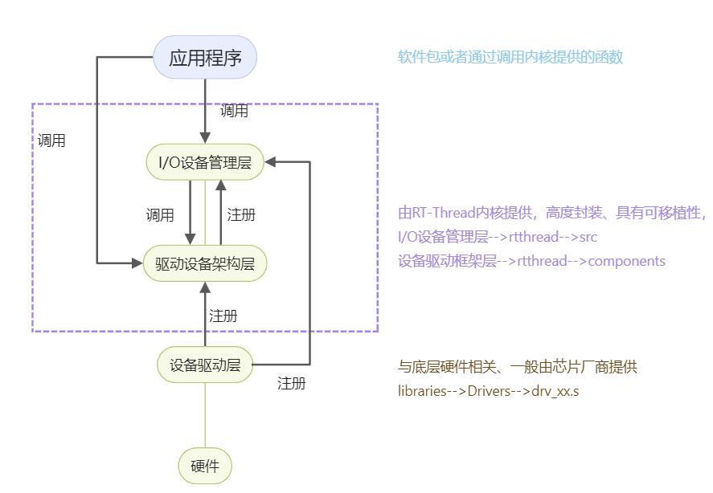

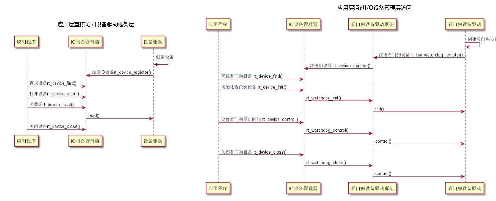

最简单的电灯程序，就是通过直接访问**设备驱动框架层**实现的；而对i2c、spi的调用，则需要通过**I/O设备管理层**访问**设备驱动框架层**再访问**设备驱动层**来实现。

在工程中；I/O设备管理层、设备驱动框架层、设备驱动层文件所处位置。I/O设备管理层、设备驱动框架层由rtthread提供，所以位于rtthread源码包内，驱动层与底层硬件相关、一般由芯片厂家提供。

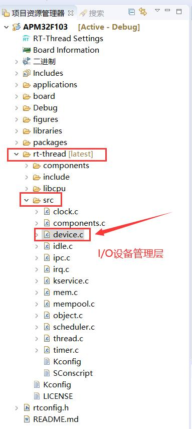

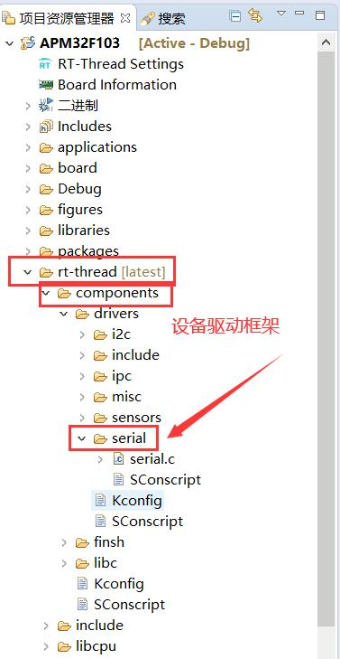

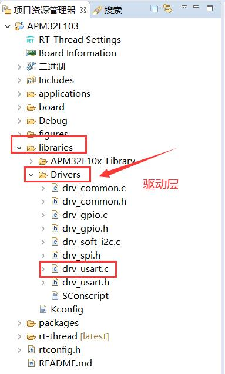

若RT-Thread Studio的硬件-->芯片设备驱动中没有相关设备、但在drv_usart.c（或者其他的drv_xx.c）中有，

uart设备使用流程：则可以在board-->Kconfig中配置相应接口。

如下：一开始没有uart2，配置完成后可在RT-Thread Studio的硬件-->芯片设备驱动中添加UART2。

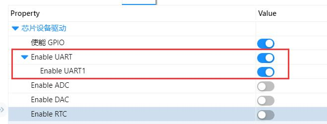

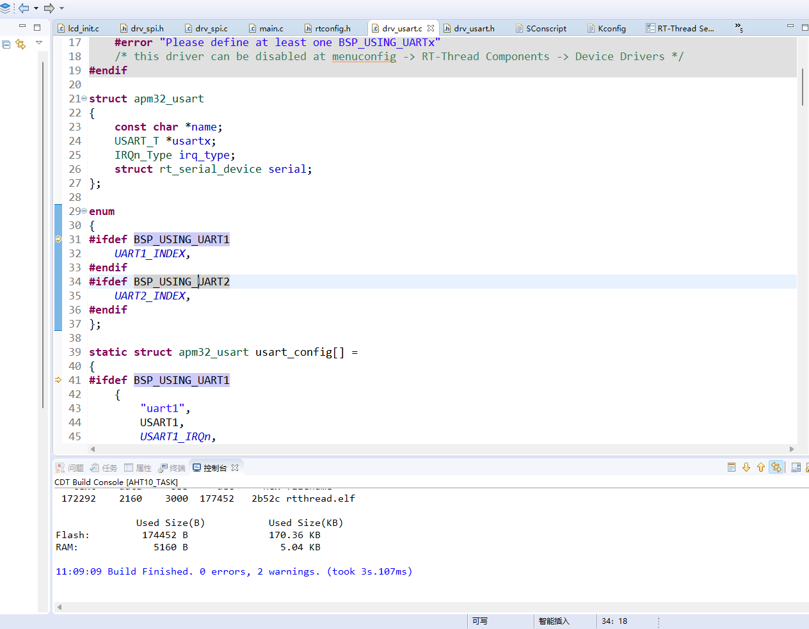

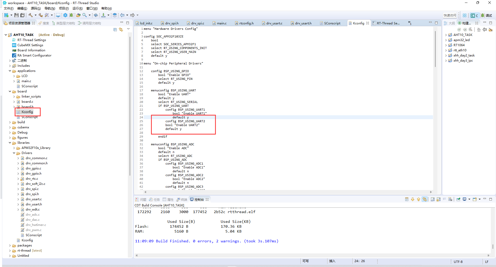

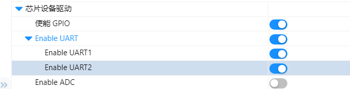

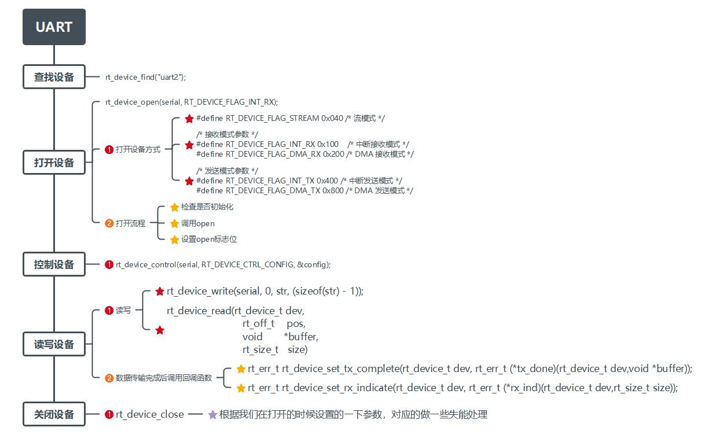

