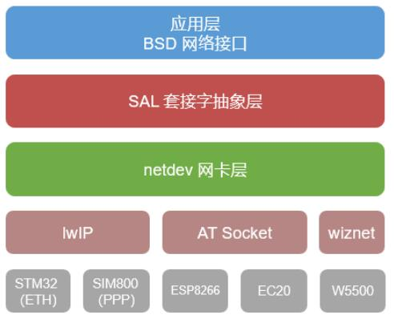
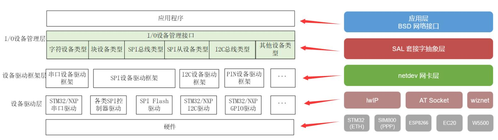
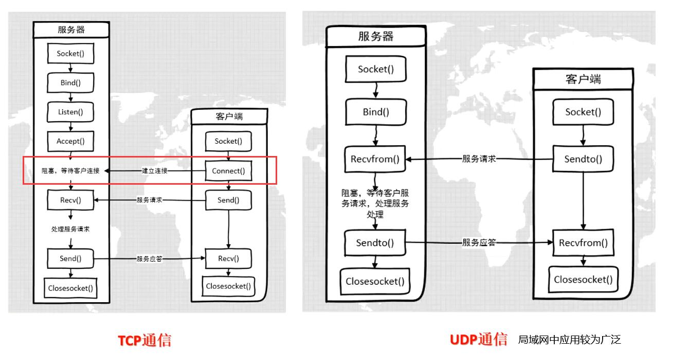
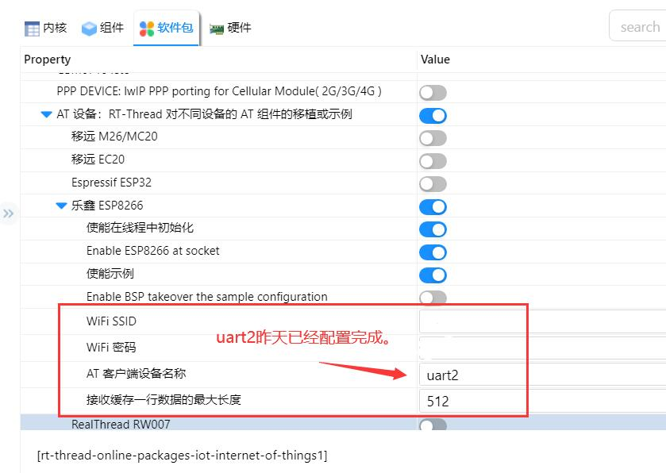
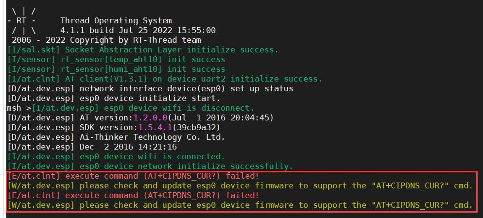
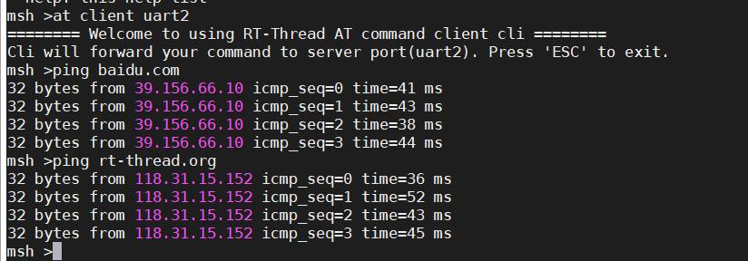
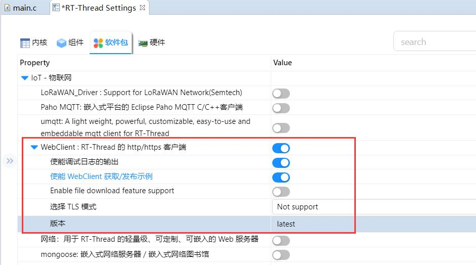
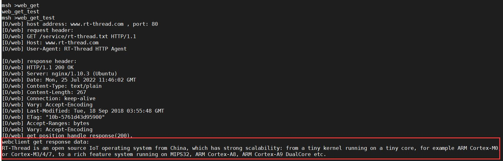

# 网络框架

网络框架与I/O设备框架类似。

最顶层是网络应用层，提供一套标准 BSD Socket API ，如 socket、connect 等函数，用于系统中大部分网络开发应用。

往下第二部分为 SAL 套接字抽象层，通过它 RT-Thread 系统能够适配下层不同的网络协议栈，并提供给上层统一的网络编程接口，方便不同协议栈的接入。套接字抽象层为上层应用层提供接口有：accept、connect、send、recv 等。

第三部分为 netdev 网卡层，主要作用是解决多网卡情况设备网络连接和网络管理相关问题，通过 netdev 网卡层用户可以统一管理各个网卡信息和网络连接状态，并且可以使用统一的网卡调试命令接口。

第四部分为协议栈层，该层包括几种常用的 TCP/IP 协议栈，例如嵌入式开发中常用的轻型 TCP/IP 协议栈 lwIP 以及 RT-Thread 自主研发的 AT Socket 网络功能实现等。这些协议栈或网络功能实现直接和硬件接触，完成数据从网络层到传输层的转化。

RT-Thread 的网络应用层提供的接口主要以标准 BSD Socket API 为主，这样能确保程序可以在 PC 上编写、调试，然后再移植到 RT-Thread 操作系统上。

BSD Socket编程模型

ESP8266联网：

  添加AT_Device软件包

RT-Thread Studio-->软件包-->IoT-物联网-->AT设备-->ESP8266

配置完成后编译下载

这个错误不用管、是ESP8266固件版本过低。实际也能联网成功。

网络相关软件包

Web Client

获取信息成功：

