# MQTT

基于**发布/订阅**模式的轻量级通讯协议

构建与TCP/IP协议上

几乎所有的云端都支持MQTT协议

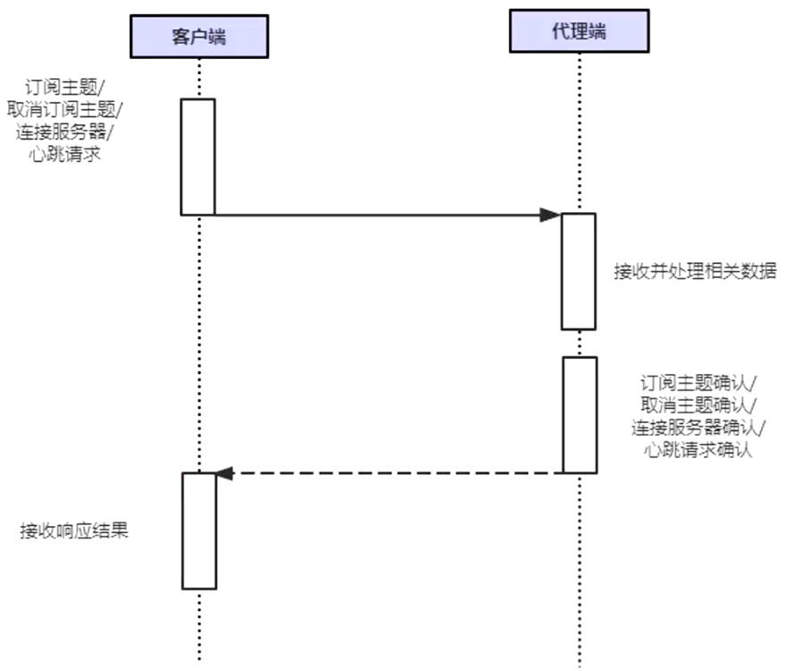

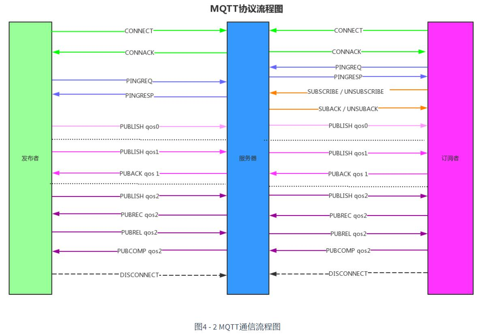

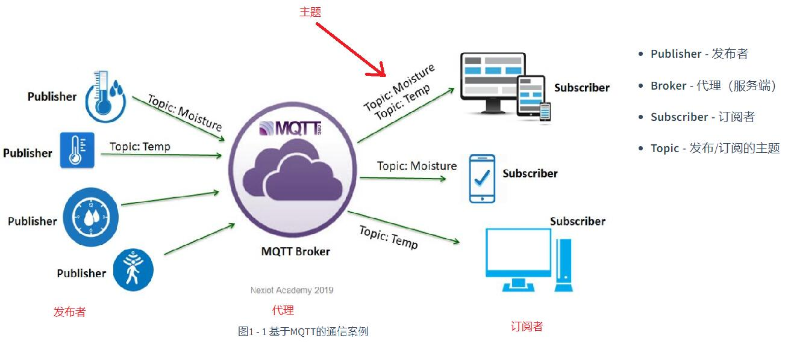

发布者和订阅者的角色并非是固定的，而是相对的。发布者也可以同时从Broker订阅主题，同理，订阅者也可以向Broker发布主题；即发布者可以是订阅者，订阅者也可以是发布者。

Broker可以是在线的云服务器，也可以是本地搭建的局域网客户端；按照需求，实际上Broker自身也会包含一些订阅/发布主题的功能。

## Onenet云

需要现在onenet云上创建自己的账户。然后创建自己的产品，添加设备。

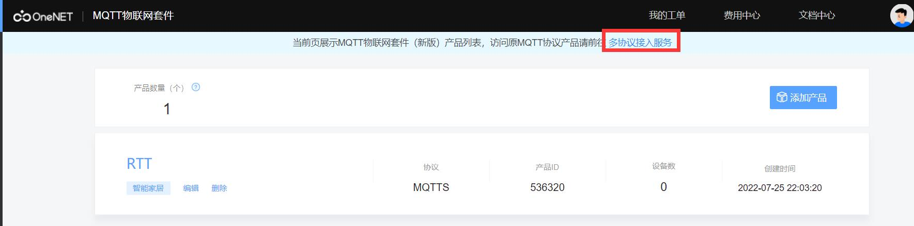

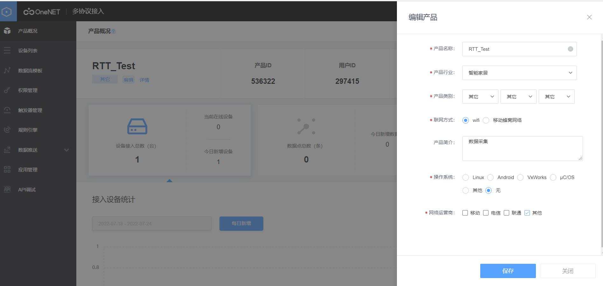

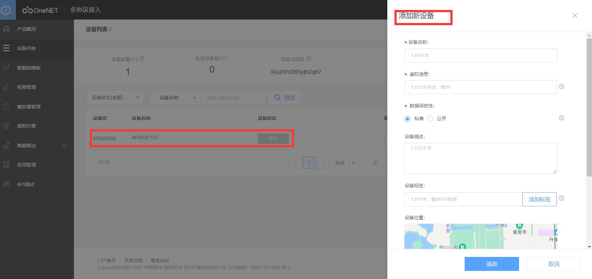

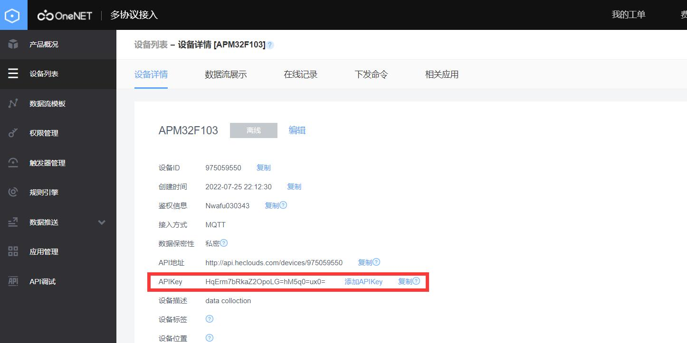

onenet云配置完成。

进入RT-Thread Studio添加软件包，选择OneNet会自动添加这3个。

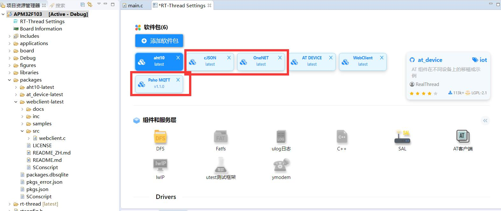

编译报错：

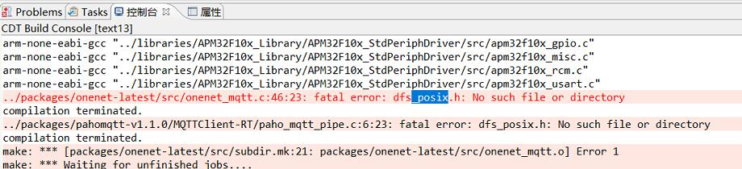

解决方法一：使用ENV工具配置后继续报错

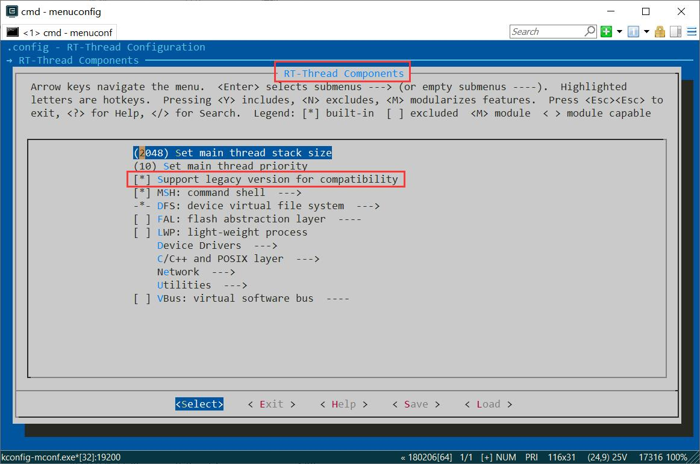

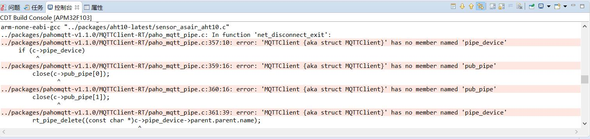

然后：

将该函数\#include <dfs_posix.h>封装的所有头文件声明复制到paho_mqtt_pipe.c中，并将#include <dfs_posix.h>注释，添加\#include <ipc/pipe.h>。

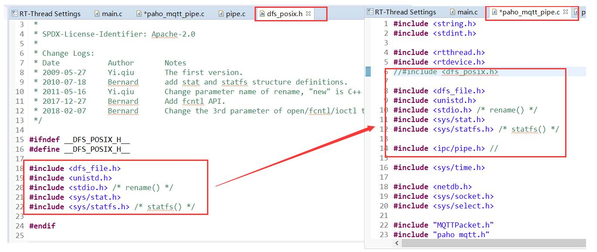

打开RT-Thread Setting，使能 components -> C/C++ -> posix -> IPC -> pipe(进程间通信管道）

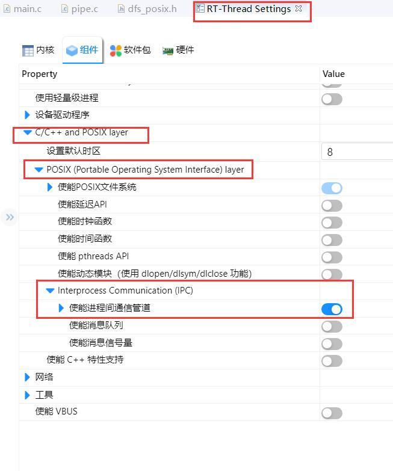

查看paho_mqtt.h 内的  MQTTClient 结构体的代码，将94 行改为 #if defined(RT_USING_DFS_NET) || defined(SAL_USING_POSIX)；也就是去掉关于 RT_USING_POSIX 的内容。

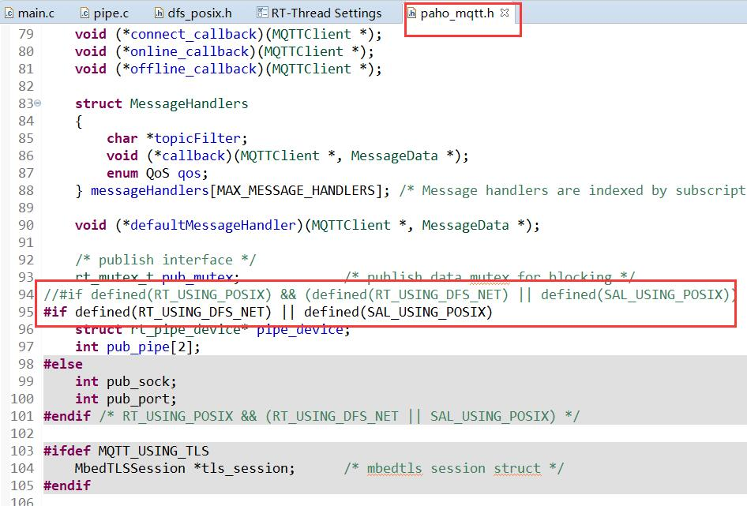

添加 PIPE_BUFSZ定义。

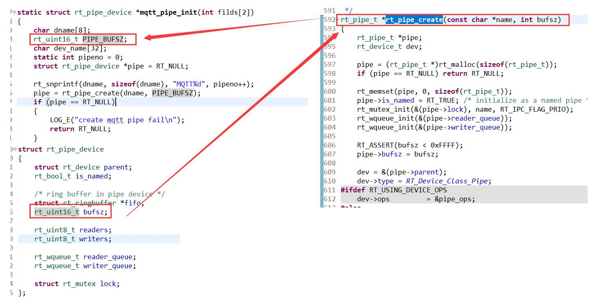

编译通过。

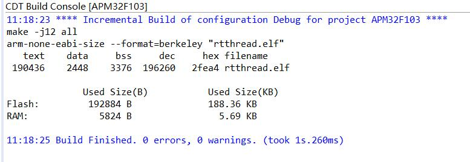

注册成功，数据发送成功。

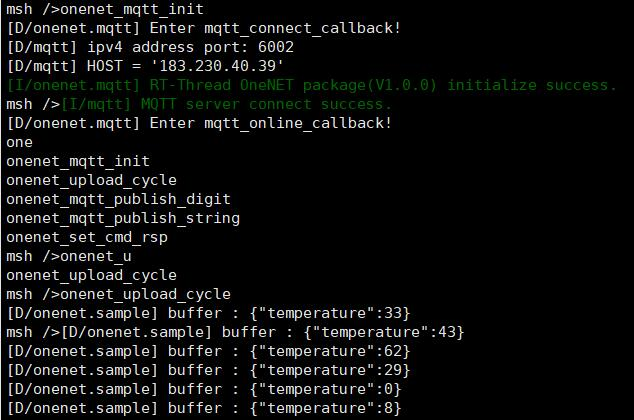

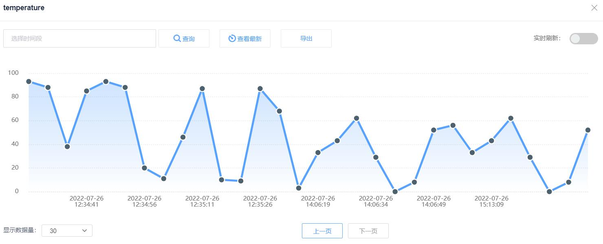

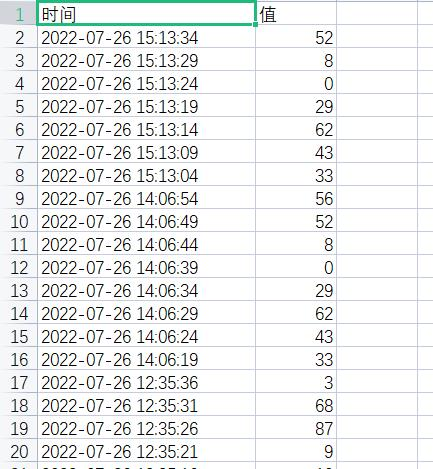

目前传输的数据不正常。

onenet数据传输流程：

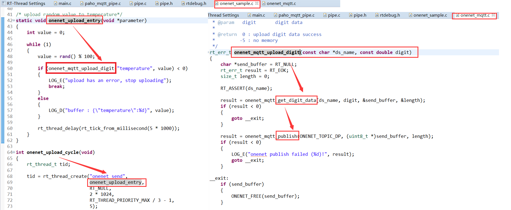

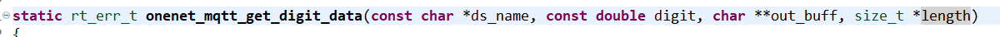