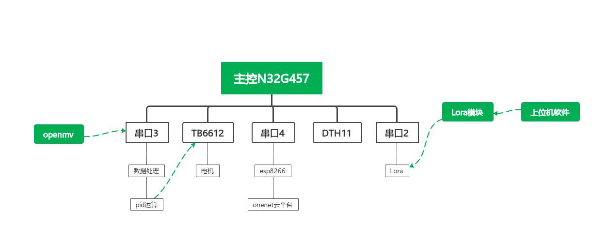
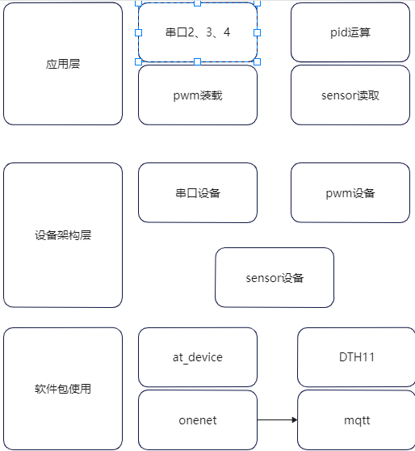

### 1. 应用场景

该车主要功能为根据用户下发的路径信息进行定向行走，到达目标地点后采集目标地点的温度信息，并上传至onenet平台供使用者查看，该车可以应用于在养殖业对各个养殖场所沿线环境温度的检测或者农业上对种植基地沿线环境温度的检测，可以查看是否是某一点的温度导致整体温度升高，增加了测量温度的准确性。

### 2. 软硬件架构图

### 3. 硬件情况

1. 主控板输出pwm波到TB6612模块，TB6612模块控制电机的转速。
2. openmv用于识别路径信息（巡线以及识别到路口转弯）。
3. DTH11采用单总线的形式读取周围的环境温度。
4. esp8266连接wifi并借助mqtt协议连接至onenet平台将数据以JSON流的形式上传到onenet平台。
5. Lora模块使用户端的命令以无线的形式发送，摆脱有线的形式，实现无线控制。

### 4.软件说明

1. 主程序主要采用5个线程：

   ###### 线程1： 串口3接收openmv发送过来的坐标数据并进行处理

###### 线程2：pid运算线程，将openmv传过来的坐标数据与设定数据进行比对处理，进行运算后加载到tb6612模块控制电机的停转

###### 线程3：onnet__mqtt,mqtt需要定时发送心跳包告知云平台自身的状态信息（与否仍然保持连接）

###### 线程4：DTH11模块读取环境温度，并上传到onenet平台

###### 线程5：红外模块通过上升沿中断的方式告知主控板停止条件是否已经达到

2. 线程1、2之间引入了互斥量来保护openmv传过来的坐标信息经过处理后才进行pid运算，在数据读取和处理阶段是不会进行pid运算的。
3. 线程4与线程5之间引入了完成量来判断是否达到了发送数据至云平台的条件。

#### 软件包使用

1. at_device:用于esp8266AT命令联网支持
2. OneNET：用于支持esp8266连接至onenet平台，里面包含了使用哪种协议连接至onenet云平台，本工程采用mqtt协议
3. dht11：用于支持dht11传感器读取周围的环境温度
4. cJSON：将dth传感器读取出的温度值封装成cSJON数据流上传至云平台

#### [演示视频](https://www.bilibili.com/video/BV1nB4y1r7G1?spm_id_from=333.1007.top_right_bar_window_history.content.click&vd_source=1030fc49793ffea59949728ba8e460ec)

