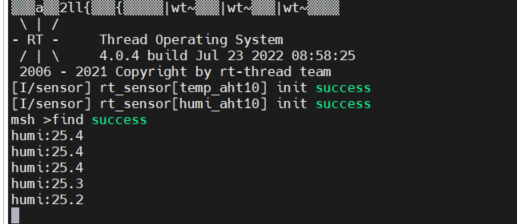
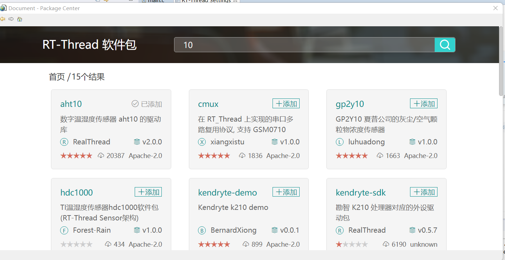

# 第3天作业

###### aht10软件包的使用




使用方法：

1. 首先在rt-thread settings里打开传感器设备


2. 下载aht10软件包



3. 可以利用msh命令 sensor probe i2c1查看传感器
4. 可以利用temp_aht10 read读取温度，也可以通过

```
 temp = rt_device_find("temp_aht10");
    if(temp!=RT_NULL)
      rt_kprintf("find success\r\n");
    rt_device_open(temp, RT_DEVICE_FLAG_RDWR);
    while (1)
    {
        if (rt_device_read(temp, 0, &data, 1) == 1)
         {
             rt_kprintf("humi:%d.%d\n",data.data.temp/10,data.data.temp%10 );
             rt_thread_delay(1000);
         }
    }
```

先查找设备，然后打开设备，然后将读出来的数据保存到

```
struct rt_sensor_data data;
```

结构体中，最后通过rt_kprintf打印出来