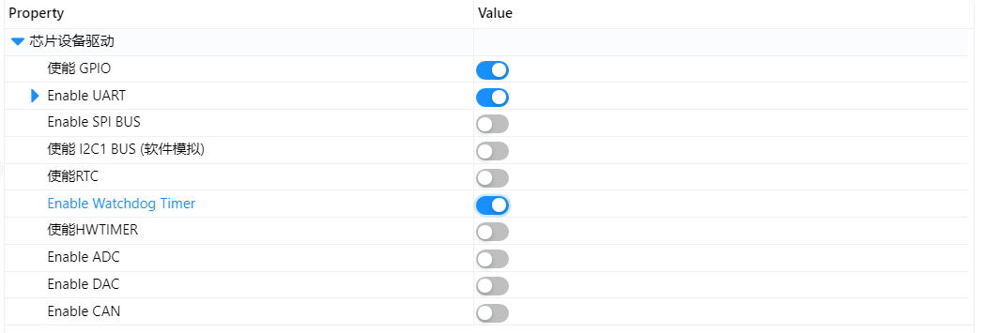
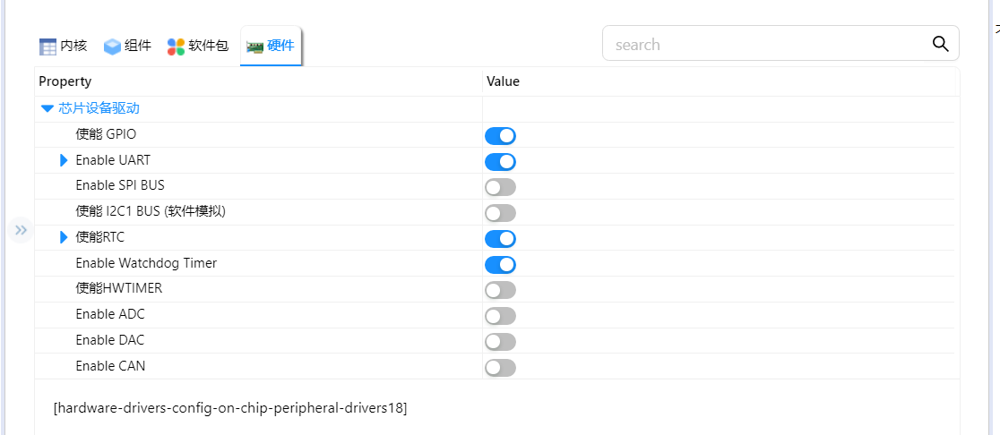
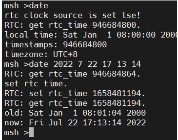
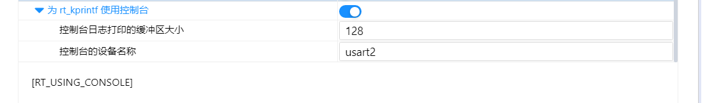
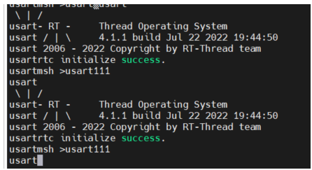

# 第四天心得

## 看门狗的使用

1. 首先打开rt-thread settings里面看门狗的使能

   

2. 看门狗代码的编写分为一下部分

1. 查找看门狗设备

```
test_wdt = rt_device_find("wdt");
```

查找之前需要先定义设备句柄

```
rt_device_t test_wdt  = RT_NULL;
```

2. 设置看门狗时间

```
rt_device_control(test_wdt, RT_DEVICE_CTRL_WDT_SET_TIMEOUT,(void *)timeout);
```

同样需要先定义时间类型

```
rt_uint32_t timeout = 1;
```

此处时间以秒为单位

注：在设置看门狗之前可能需要先初始化看门狗，但是查找本BSP发现初始化并无实际用处，看门狗在设备注册时已经初始化故未初始化

```
static rt_err_t n32_wdt_init(rt_watchdog_t *wdt)
{
    return RT_EOK;
}
```

设置看门狗时间查看源码可知设置看门狗喂狗时间有一个阈值，设置时间不能超过阈值

```
 case RT_DEVICE_CTRL_WDT_SET_TIMEOUT:
        {
            RT_ASSERT(*(uint16_t *)args != 0);
            reload_value = *(uint16_t *)args;    
            if(reload_value >  0xFFF * 32 *1000 / LsiFreq)
            {
                LOG_W("wdg set timeout parameter too large, please less than %d ms\n", 0xFFF * 32 *1000 / LsiFreq);
                return -RT_EINVAL;
            }            
            /* Enable write access to IWDG_PR and IWDG_RLR registers */
            IWDG_WriteConfig(IWDG_WRITE_ENABLE);
            /* IWDG counter clock: LSI/32 */
            IWDG_SetPrescalerDiv(IWDG_PRESCALER_DIV32);
            reload_value = ((uint32_t)reload_value * LsiFreq / 1000) / 32;
            IWDG_CntReload(reload_value);
            IWDG_WriteConfig(IWDG_WRITE_DISABLE);
        }
        break;
```

3. 打开开门狗设备

```
rt_device_control(test_wdt, RT_DEVICE_CTRL_WDT_START,RT_NULL);
```

此时开门狗开始运行，若未在设置时间内喂狗，系统将复位

4. 喂狗函数

```
rt_device_control(test_wdt, RT_DEVICE_CTRL_WDT_KEEPALIVE, NULL);
```

我们一般在空闲线程里喂狗，也可以设置回调函数喂狗

## RTC使用

1. 首先打开rt-thread settings里面RTC的使能



2. 在msh中发送date即可查看RTC时间

   发送date 年 月 日 时 分 秒的方法修改RTC时钟时间为当前时间



## 更改rt_kprintf依赖的串口

1. 首先打开rt-thread settings里面改变rt_kprintf控制台设备名称



2. 利用usb转ttl模块将开发板USART2的RXD和TXD连接到电脑，即可查看发送信息（不插的话看不到信息，因为控制台设备已经不是USART1，未与电脑连接）
3. 效果展示


