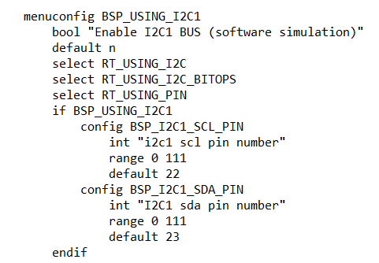

# 课程记录

1. Kconfig中可以看到rt-thread settings里面的一些设置情况，通过与Sconscript脚本的使用可以在我们在rt-thread settings里面打开或关闭一些开关后帮助我们添加或者移除一些文件（ENV将这些开关可视化）
2. 在Kconfig中可以配置rt-thrad settings里面的一些选项的默认设置，比如board里面的Kconfig可以设置i2c的默认端口

###### static void date(int argc, char **argv)传参形式

这种传参方式argc表示传入了几个参数，argv则是具体的指令内容

例：date（date 22 23 24 28 29 30）

argc = 7，date[1] = 22------------date[6]=30

