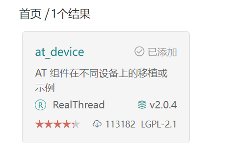
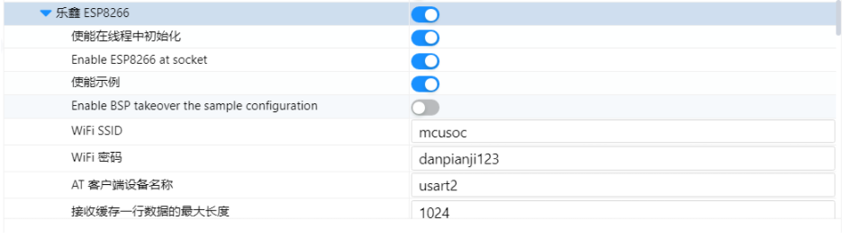
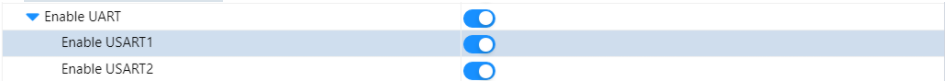
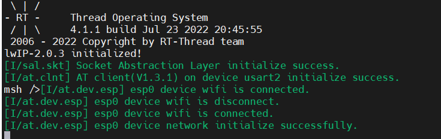
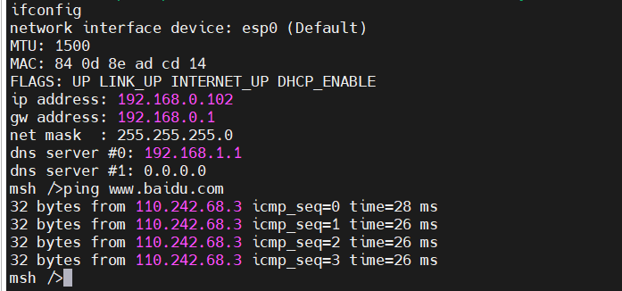

# 第5天作业

## esp8266软件包的使用

#### 使用步骤：

1. 在rt-thread settings里面添加at_device软件包



2. 使能esp8266模块并完成对wifi的相应设置



3. 使能usart2



效果展示：



此处可能会出现某些AT命令不支持的情况，对esp8266进行烧录新版固件即可解决


#### esp8266功能测试



#### webclient测试：

1. 打开软件包


2. 将串口接受数组开大一点，否则可能出现问题


测试：

```
msh />web_get_test
[D/web] host address: www.rt-thread.com , port: 80
[D/web] request header:
[D/web] GET /service/rt-thread.txt HTTP/1.1
[D/web] Host: www.rt-thread.com
[D/web] User-Agent: RT-Thread HTTP Agent

[D/web] response header:
[D/web] HTTP/1.1 200 OK
[D/web] Server: nginx/1.10.3 (Ubuntu)
[D/web] Date: Sat, 23 Jul 2022 13:19:11 GMT
[D/web] Content-Type: text/plain
[D/web] Content-Length: 267
[D/web] Connection: keep-alive
[D/web] Vary: Accept-Encoding
[D/web] Last-Modified: Tue, 18 Sep 2018 03:55:48 GMT
[D/web] ETag: "10b-5761d43d95900"
[D/web] Accept-Ranges: bytes
[D/web] Vary: Accept-Encoding
[D/web] get position handle response(200).
webclient get response data:
RT-Thread is an open source IoT operating system from China, which has strong scalability: from a tiny kernel running on a tiny core, for example ARM Cortex-M0, or Cortex-M3/4/7, to a rich feature system running on MIPS32, ARM Cortex-A8, ARM Cortex-A9 DualCore etc.

msh />

```

测试成功