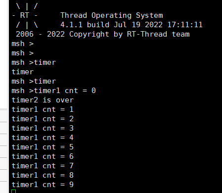

##### 1.动态静态创建定时器 单次，循环定时

```c

static rt_timer_t  timer1;
static struct rt_timer timer2;
static int cnt = 0;

void timer1_entry(void)
{
    rt_kprintf("timer1 cnt = %d\n",cnt);

    if(cnt >= 9)
        rt_timer_stop(timer1);
    cnt ++;
}

void timer2_entry(void)
{
    rt_kprintf("timer2 is over\n");
}

void timer(void)
{
    //动态创建定时器 周期性定时
    timer1 = rt_timer_create("t1",timer1_entry, RT_NULL,10 , RT_TIMER_FLAG_PERIODIC);

    //静态创建定时器 单次定时
    rt_timer_init(&timer2,"t2",timer2_entry,RT_NULL,20,RT_TIMER_FLAG_ONE_SHOT);

    rt_timer_start(timer1);
    rt_timer_start(&timer2);

}
MSH_CMD_EXPORT(timer,timer start);

```

运行输出




启动流程：


