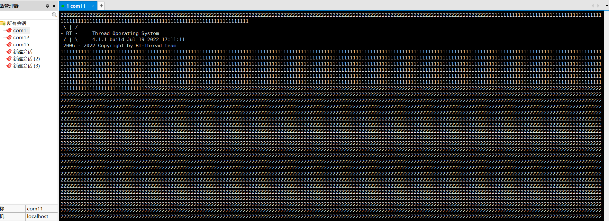

### **课堂实践/经验**


#### 1.创建动态线程与静态线程

```c
ALIGN(8)
static char thread_init_stack[2048];
static struct rt_thread thread_init;


void Thread1_entry(void)
{

    while(1)
    {
        rt_kprintf("1");
//        rt_thread_mdelay(1000);
    }
}

void Thread2_entry(void)
{
    while(1)
    {
        rt_kprintf("2");
//        rt_thread_mdelay(5000);
    }

}

void thread_Test(void)
{
//创建静态线程
    rt_thread_init(&thread_init,
            "thread1",
            Thread1_entry,
            RT_NULL,
            &thread_init_stack[0],
            sizeof(thread_init_stack),
            15,
            100);

    rt_thread_startup(&thread_init);//启动线程

    rt_thread_t tid = RT_NULL;
//创建动态线程
    tid = rt_thread_create("thread2",
            Thread2_entry,
            RT_NULL,
            2048,
            15,
            500);

    rt_thread_startup(tid);//启动线程

}
INIT_APP_EXPORT(thread_Test);//将该函数加入到FinSH
//MSH_CMD_EXPORT(thread_Test,Thread Creat);

int main(void)
{
    /* set LED3 pin mode to output */
    rt_pin_mode(LED3_PIN, PIN_MODE_OUTPUT);
    while (1)
    {
        rt_pin_write(LED3_PIN, PIN_HIGH);
        rt_thread_mdelay(500);
        rt_pin_write(LED3_PIN, PIN_LOW);
        rt_thread_mdelay(500);
    }
}
```

运行效果




