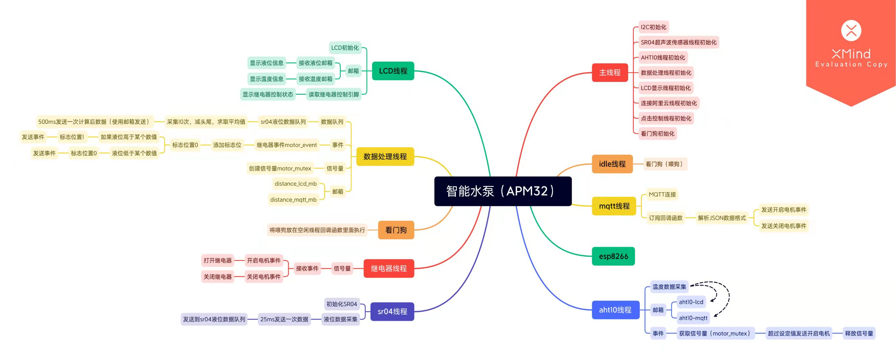

# xuhonghao作品提交（智能水泵）

## 使用场景
- 使用2200w以下功率电机的蓄水池、鱼缸等，解放双手，还能远程查看液位，控制电机

## 软硬件架构

## 硬件情况
- LCD:用来观察本地信息
- AHT10:代替测试液体温度（暂时没有可以防水的温度传感器）
- SR04:用来检测液位（后期如果换成光学液位传感器使用年限会更久更稳定）

## 软件说明
- 移植了0.96寸LCD显示屏
- 连接阿里云，并且可以使用云智能平台对水泵进行控制和观测
- 读取温度，液位等信息，显示在LCD和发布到云平台
- 使用看门狗，死机超时则自动重启
- 自己使用了6个线程
- 当液位低于设定的最低值时，自动抽水才会启动，且只有抽水到检测到最高值时才会自动关闭。过程中可以进行人工干预，只要液位不低于最低液位，自动抽水不会启动（防止多次启动、停止降低电机寿命）。同理只要检测到有一次超过最高液位，电机都会停止。所以说，即便你手动打开水泵也不会出现溢出的风险。
- 使用的ipc包括
    - 数据队列
    - 邮箱
    - 互斥量
    - 事件

## 示例视频
- 1.mp4
- 2.mp4

