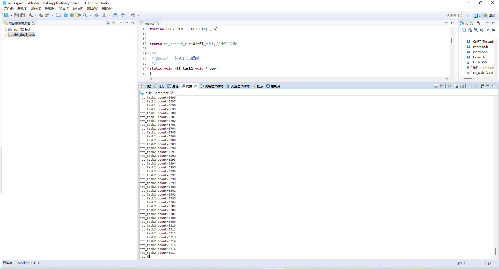

1、 代码在code文件夹中
    调试图片在picture文件夹中

2、
rt_thread_init 和 rt_thread_create 最后都是调用 _thread_init函数实现的
rt_thread_create  ： 动态创建 就是根据所需空间大小自动分配空间
rt_thread_init    ： 静态创建 就是提前申请好一点的空间，

3、
硬件定时器： 需要开启硬件定时器如systick、timx、等，需要在定时器中断中管理
软件定时器： 超时函数只需要在线程中管理即可。
硬件定时器相对来说会更加精准。

4、第二天
主要学习了：
    1）线程的创建与使用包括动态和静态创建
    2）软件定时器的使用
    3）RTT的启动流程

