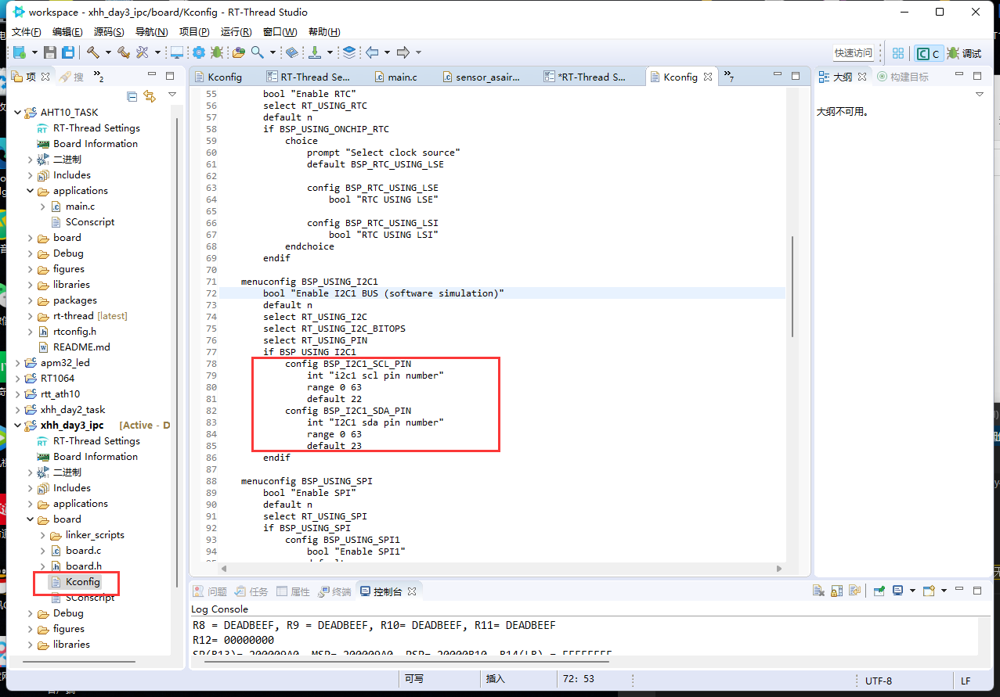
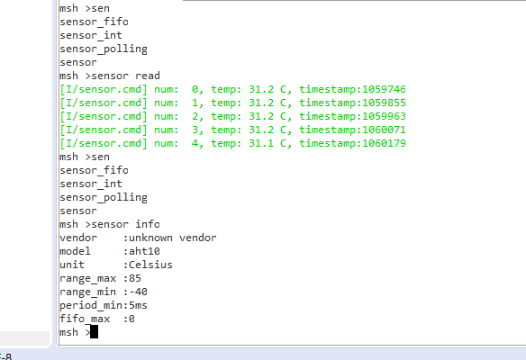

# xuhonghao 第四天总结

1、上午主要学习了一些链表相关的知识
2、下午主要学习IIC通信协议，以及AHT10的驱动


学习IIC驱动过程中，主要发现RT_Thread setting设置中无法更改63以上的管脚于是问过刘老师之后再如图配置文件中更改

更改最高时63改为最高引脚就可以在RT_Thread setting中设置了


下午AHT10传感器驱动需要添加以下代码
```c
#include "sensor_asair_aht10.h"
#define AHT10_I2C_BUS  "i2c1"

int rt_hw_aht10_port(void)
{
    struct rt_sensor_config cfg;

    cfg.intf.dev_name  = AHT10_I2C_BUS;
    cfg.intf.user_data = (void *)AHT10_I2C_ADDR;

    rt_hw_aht10_init("aht10", &cfg);

    return RT_EOK;
}
INIT_ENV_EXPORT(rt_hw_aht10_port);
```

再使用命令
sensor probe temp_aht10
sensor probe humi_aht10
最后使用
sensor read就可以读取数据了

```c++
msh >sensor probe temp_aht10
[I/sensor.cmd] device id: 0xff!
msh >se
sensor_fifo
sensor_int
sensor_polling
sensor
msh >sen
sensor_fifo
sensor_int
sensor_polling
sensor
msh >sensor read
[I/sensor.cmd] num:  0, temp: 31.6 C, timestamp:163590
[I/sensor.cmd] num:  1, temp: 31.6 C, timestamp:163698
[I/sensor.cmd] num:  2, temp: 31.6 C, timestamp:163806
[I/sensor.cmd] num:  3, temp: 31.6 C, timestamp:163914
[I/sensor.cmd] num:  4, temp: 31.5 C, timestamp:164022
msh >
```


