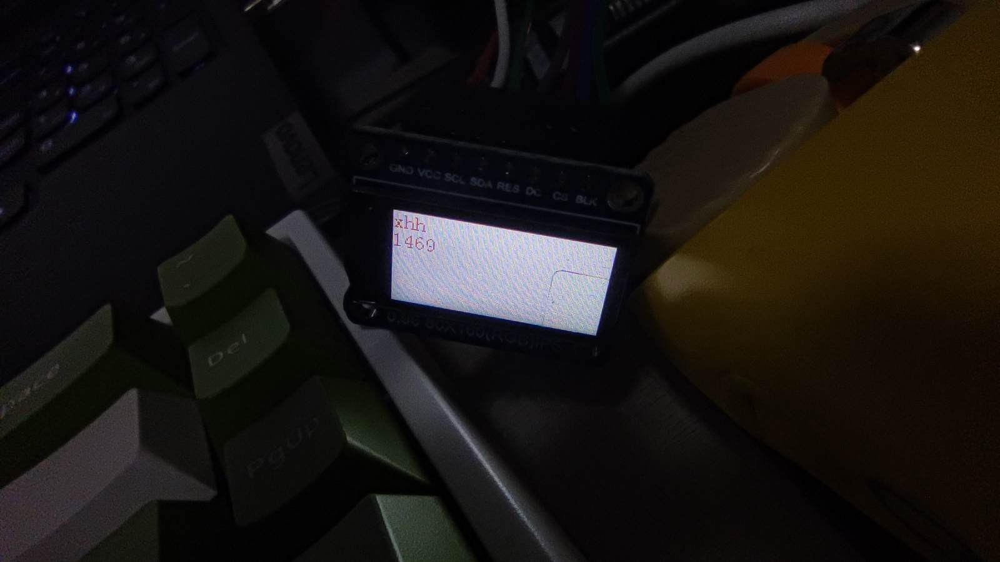

# xuhonghao 第五天总结

## 1、主要学习了一些Kconfig、SConscript配置文件的相关用法


添加所有文件
src = Glob('*.c')


添加board.c
src = Split('''
board.c
''')

需要添加其它文件时可以加在board.c之后


使用ulog打印信息


## 2、SPI总线



移植了一个小屏幕，后面准备用上RTT的SPI框架


刚好用上了SConscript配置文件的相关用法，其实我也不知道对不对，只是在工程中添加了一个文件夹，不参与编译，乱改一通，就好了，具体不是很明白，本来想去看文档的，结果一编译却好了，后面需要用到在看吧


```c++
# add LCD code files
group = SConscript(os.path.join('LCD', 'SConscript'))
```


## 3、RTC

打开RTC设备框架

```c++
msh >date
local time: Thu Jan  1 08:00:00 1970
timestamps: 0
timezone: UTC+8
msh >date 2022 07 22 21 41 59
old: Thu Jan  1 08:00:28 1970
now: Fri Jul 22 21:41:59 2022
msh >date
local time: Fri Jul 22 21:42:05 2022
timestamps: 1658497325
timezone: UTC+8
msh >
```

## 4、看门狗
```c
int main(void)
{
    time_t timeout_count=5;

    /* set LED2 pin mode to output */
    rt_pin_mode(LED2_PIN, PIN_MODE_OUTPUT);

    rt_device_t wdt =RT_NULL;
    wdt =rt_device_find("wdt");

    rt_device_init(wdt);

    rt_device_control(wdt,RT_DEVICE_CTRL_WDT_SET_TIMEOUT,(void*)timeout_count);
    rt_device_control(wdt,RT_DEVICE_CTRL_WDT_START,RT_NULL);

    while (1)
    {
        rt_pin_write(LED2_PIN, PIN_HIGH);
        rt_thread_mdelay(500);
        rt_pin_write(LED2_PIN, PIN_LOW);
        rt_thread_mdelay(500);


//        rt_device_control(wdt,RT_DEVICE_CTRL_WDT_KEEPALIVE,RT_NULL);
    }
}
```

## 5、串口默认配置
移植了屏幕，今天没什么事件看了，明天有时间看看吧
```c
#define RT_SERIAL_CONFIG_DEFAULT           \
{                                          \
    BAUD_RATE_115200, /* 115200 bits/s */  \
    DATA_BITS_8,      /* 8 databits */     \
    STOP_BITS_1,      /* 1 stopbit */      \
    PARITY_NONE,      /* No parity  */     \
    BIT_ORDER_LSB,    /* LSB first sent */ \
    NRZ_NORMAL,       /* Normal mode */    \
    RT_SERIAL_RB_BUFSZ, /* Buffer size */  \
    RT_SERIAL_FLOWCONTROL_NONE, /* Off flowcontrol */ \
    0                                      \
}
```


## 6、常用的一些函数

```c

        rt_sem_create(name, value, flag)
        rt_sem_release(sem)
        rt_event_recv(event,set, option, timeout, recved)
        
        rt_mb_recv(mb, value, timeout)
        
        rt_device_find(name)
        rt_device_init(wdt)
        rt_device_open(dev, oflag)
        rt_device_write(dev, pos, buffer, size)
        rt_device_read(dev, pos, buffer, size)
        
        void serial_rx_ind(rt_device_t dev ,)
        {
            rt_sem_release();
        }
        rt_device_set_rx_indicate(dev, serial_rx_ind)

        //串口回调函数里面可以加上信号量来控制是否

```


串口为例梳理串口驱动对象


