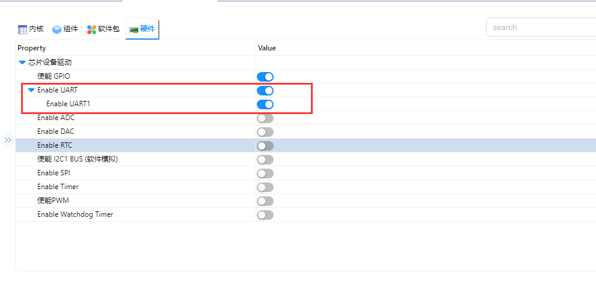
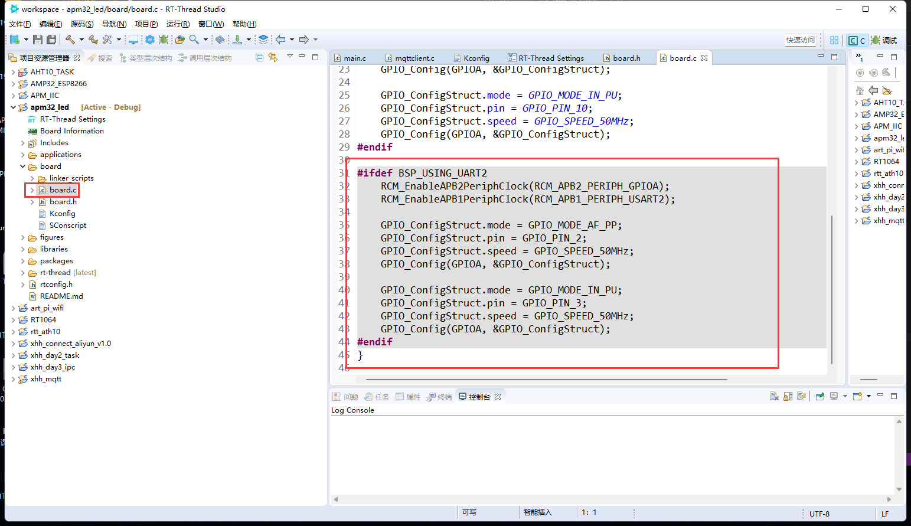
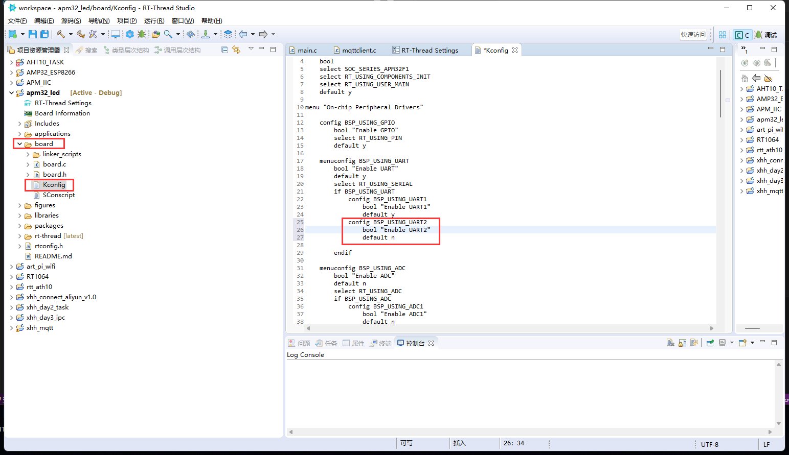
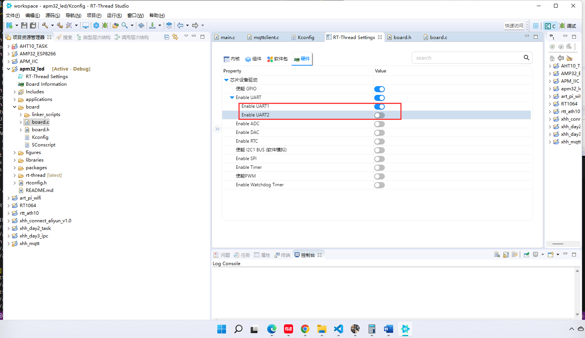
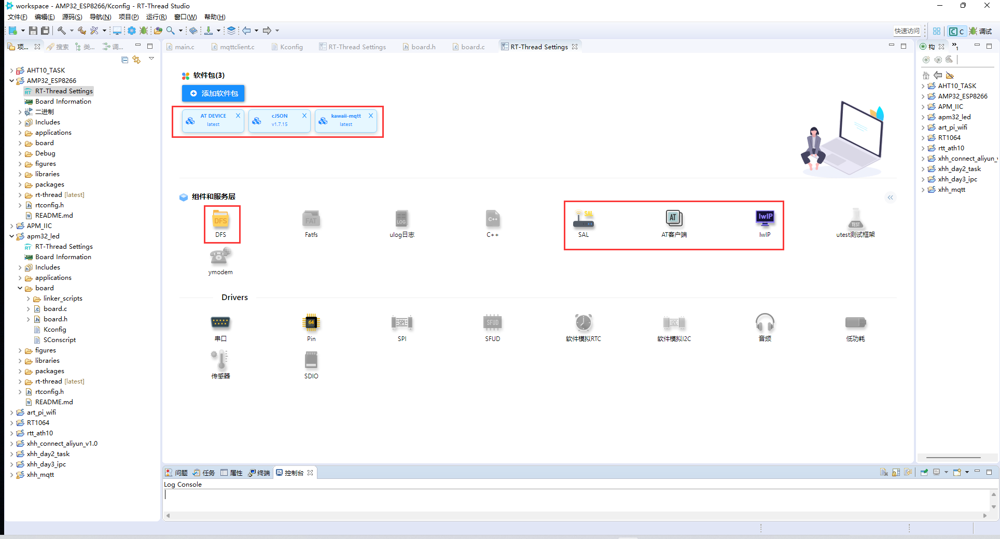
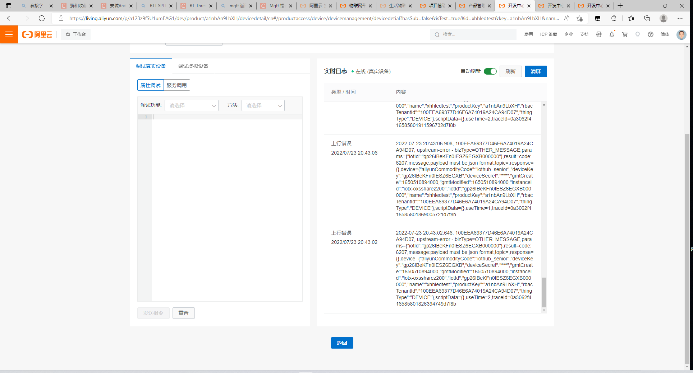

# xuhonghao 第五天总结

## 1、串口总线
使用的过程中发现APM32包里面只有串口1





于是我去查看相关文件，发现在board.c中有关于串口2的相关定义





于是想到了那天IIC引脚相关的问题，更改了一下kconfig文件





添加了两行代码后就可以显示串口2的配置了



## 2、使用esp8266连接网络
配置好相关设置输入以下命令就好了，


```c++
msh >ping
Please input: ping [netdev name] <host address>
msh >ping www.baidu.com
32 bytes from 14.215.177.39 icmp_seq=0 time=30 ms
32 bytes from 14.215.177.39 icmp_seq=1 time=28 ms
32 bytes from 14.215.177.39 icmp_seq=2 time=29 ms
32 bytes from 14.215.177.39 icmp_seq=3 time=27 ms
msh >ifcon
ifconfig
msh >ifconfig
network interface device: esp0 (Default)
MTU: 1500
MAC: d8 bf c0 10 f2 32
FLAGS: UP LINK_UP INTERNET_UP DHCP_DISABLE
ip address: 192.168.3.47
gw address: 192.168.3.1
net mask  : 255.255.255.0
dns server #0: 0.0.0.0
dns server #1: 0.0.0.0
```

## 连接阿里云
之前其实已经上过阿里云了，用过ART_PI（不过现在坏了），ESP8266,ESP32，所以对阿里云算是比较熟悉，也用cjson解析过数据其实对于RTT上云很简单，基本上点一点就差不多了，要自己写的东西很少





因为没有找到之前详细的文件，今天就写到这，测试一下简单的订阅与发布
```c
#include <rtthread.h>
#include <rtdevice.h>
#include <board.h>

#include "mqttclient.h"
//#include "cJSON.h"
#include "stdio.h"

/* defined the LED2 pin: PE6 */
#define LED2_PIN    GET_PIN(E, 6)


static void topic1_handler(void* client, message_data_t* msg)
{
    (void) client;
//    rt_kprintf("nmessage:%s\r\n", (char*)msg->message->payload);


//    KAWAII_MQTT_LOG_D("%s:%d %s()...\ntopic: %s\nmessage:%s", __FILE__, __LINE__, __FUNCTION__, msg->topic_name, (char*)msg->message->payload);

}


void *mqtt_publish_thread(void *arg)
{
    mqtt_client_t *client = (mqtt_client_t *)arg;
    char buf[256] = { 0 };
    mqtt_message_t msg;
    memset(&msg, 0, sizeof(msg));
    sprintf(buf, "welcome to mqttclient, this is a publish test...");
    mqtt_list_subscribe_topic(client);
    msg.payload = (void *) buf;
    msg.qos = 0;

//    sprintf(buf,"{\"method\":\"/sys/a1nbAn9LbXH/xhhledtest/thing/event/property/post\",\"id\":\"444903072\",\"params\":{\"brightness\":%d,\"powerstate\":%d},\"version\":\"1.0.0\"}",datajdfg%100,datajdfg%2);
    mqtt_publish(client,"/sys/a1nbAn9LbXH/xhhledtest/thing/event/property/post", &msg);
//    rt_kputs(buf);
    return 0;
}

int main(void)
{

    mqtt_client_t *client = NULL;

    rt_thread_mdelay(5000);

    mqtt_log_init();
    client = mqtt_lease();
    mqtt_set_port(client, "1883");
    mqtt_set_host(client, "a1nbAn9LbXH.iot-as-mqtt.cn-shanghai.aliyuncs.com");
    mqtt_set_client_id(client, "a1nbAn9LbXH.xhhledtest|securemode=2,signmethod=hmacsha256,timestamp=1658567497409|");
    mqtt_set_user_name(client, "xhhledtest&a1nbAn9LbXH");
    mqtt_set_password(client, "a874e1863d21d279a082cb2f0fbd3402ebde6058a9bf2cc263654c859ccabd28");
    mqtt_set_clean_session(client, 1);
    rt_kprintf("mqtt_connect:%d\r\n",mqtt_connect(client));
    rt_thread_delay(10);


    mqtt_subscribe(client, "/sys/a1nbAn9LbXH/xhhledtest/thing/service/property/set", QOS0, topic1_handler);


    /* set LED2 pin mode to output */
    rt_pin_mode(LED2_PIN, PIN_MODE_OUTPUT);

    while (1)
    {
        rt_pin_write(LED2_PIN, PIN_HIGH);
        rt_thread_mdelay(2000);
        rt_pin_write(LED2_PIN, PIN_LOW);
        rt_thread_mdelay(2000);

        mqtt_publish_thread(client);//发布消息
    }
}

```


下面是一些输出信息


```c++
 \ | /
- RT -     Thread Operating System
 / | \     4.1.1 build Jul 23 2022 19:57:54
lwIP-2.0.3 initialized!
[I/sal.skt] Socket Abstraction Layer initialize success.
[I/at.clnt] AT client(V1.3.1) on device uart2 initialize success.
msh />[I/at.dev.esp] esp0 device wifi is disconnect.
[I/at.dev.esp] esp0 device wifi is connected.
[I/at.dev.esp] esp0 device network initialize successfully.

[I] >> ../packages/kawaii-mqtt-latest/mqttclient/mqttclient.c:991 mqtt_connect_with_results()... mqtt connect success...[E/at.clnt] execute command (AT+CIPDNS_CUR?) failed!
[W/at.dev.esp] please check and update esp0 device firmware to support the "AT+CIPDNS_CUR?" cmd.
mqtt_connect:0
[E/at.clnt] execute command (AT+CIPDNS_CUR?) failed!
[W/at.dev.esp] please check and update esp0 device firmware to support the "AT+CIPDNS_CUR?" cmd.

[I] >> ../packages/kawaii-mqtt-latest/mqttclient/mqttclient.c:1435 mqtt_list_subscribe_topic()...[1] subscribe topic: /sys/a1nbAn9LbXH/xhhledtest/thing/service/property/set
[I] >> ../packages/kawaii-mqtt-latest/mqttclient/mqttclient.c:1435 mqtt_list_subscribe_topic()...[1] subscribe topic: /sys/a1nbAn9LbXH/xhhledtest/thing/service/property/set
[I] >> ../packages/kawaii-mqtt-latest/mqttclient/mqttclient.c:1435 mqtt_list_subscribe_topic()...[1] subscribe topic: /sys/a1nbAn9LbXH/xhhledtest/thing/service/property/set
[I] >> ../packages/kawaii-mqtt-latest/mqttclient/mqttclient.c:1435 mqtt_list_subscribe_topic()...[1] subscribe topic: /sys/a1nbAn9LbXH/xhhledtest/thing/service/property/set
[I] >> ../packages/kawaii-mqtt-latest/mqttclient/mqttclient.c:1435 mqtt_list_subscribe_topic()...[1] subscribe topic: /sys/a1nbAn9LbXH/xhhledtest/thing/service/property/set
```

因为没有仔细写发布的东西，所以和阿里云上的数据不匹配，但是已经有数据上来了



