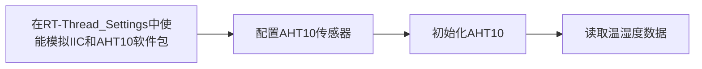

# RTT 夏令营第四天总结

## 点亮一个 LED 灯

### 流程


### 代码

```c
void LED_Toggle(void *args)
{
    rt_pin_mode(LED0_PIN, PIN_MODE_OUTPUT);//配置引脚为输出模式
    if (rt_pin_read(LED0_PIN) == 0)//读取引脚状态并判断
    {
        rt_pin_write(LED0_PIN, 1);//引脚置高
        rt_kprintf("LED OFF\r\n");
    }
    else
    {
        rt_pin_write(LED0_PIN, 0);//引脚置低
        rt_kprintf("LED ON\r\n");
    }
}

MSH_CMD_EXPORT(LED_Toggle,  use to toggle led_pin);//导出命令到 MSH 列表
```

代码逻辑：在 Finsh 控制台输入 LED_Toggle 命令，之后读取 LED 电平状态，进行电平翻转，实现 LED 亮灭控制。

### 效果


## 使用 AHT10 读取温湿度

### 流程



### 代码

```c
#define AHT10_I2C_BUS  "i2c1"
struct aht10_device *temp_humi_dev;//aht10设备句柄
float hum, tem;
int rt_hw_aht10_port(void)//AHT10 传感器配置
{
    struct rt_sensor_config cfg;
    cfg.intf.dev_name  = AHT10_I2C_BUS;//通信设备名称
    cfg.intf.user_data = (void *)AHT10_I2C_ADDR;//传感器私有数据 （在此为iic通信地址）
    rt_hw_aht10_init("aht10", &cfg);
    return RT_EOK;
}

static void aht10_thread_entry(void *args)//温湿度读取线程入口函数
{
    aht10_device_t dev;

    rt_hw_aht10_port();//配置 AHT10
    dev = aht10_init(AHT10_I2C_BUS);//初始化 AHT10

    if(dev == RT_NULL)
    {
        rt_kprintf("The sensor init fail!\r\n");
        return;
    }
    else
    {
        rt_kprintf("The sensor init ok\r\n");
    }

    while(1)
    {
        hum = aht10_read_humidity(dev);//读取湿度
        rt_kprintf("humidity : %d.%d \r\n",(int)hum,(int)(hum * 10) % 10);
        tem = aht10_read_temperature(dev);//读取温度
        rt_kprintf("temperature: %d.%d \r\n",(int)tem,(int)(tem * 10) % 10);

        rt_thread_mdelay(5000);
    }
}

static int app_aht10_init(void)//创建温湿度读取线程
{
    rt_err_t err;
    rt_thread_t aht10_thread;
    aht10_thread = rt_thread_create("aht10",
                                     aht10_thread_entry,
                                     RT_NULL,
                                     1024,
                                     25,
                                     10);

    if(aht10_thread != RT_NULL)
    {
        err = rt_thread_startup(aht10_thread);
    }
    else
    {
        rt_kprintf("aht10 thread create fault \r\n");
    }

    if(err != RT_EOK)
    {
        rt_kprintf("aht10 thread start fault \r\n");
    }

    return RT_EOK;
}
INIT_APP_EXPORT(app_aht10_init);//应用程序初始化
```

### 效果


## 总结

### RT-Thread I/O 设备框架

RT-Thread 提供了一套 I/O 设备模型框架，它位于硬件和应用程序之间，共分成三层，从上到下分别是 I/O 设备管理层、设备驱动框架层、设备驱动层。


应用程序通过 I/O 设备管理接口获得正确的设备驱动，然后通过这个设备驱动与底层 I/O 硬件设备进行数据（或控制）交互。

I/O 设备管理层实现了对设备驱动程序的封装。应用程序通过 I/O 设备层提供的标准接口访问底层设备。

设备驱动框架层是对同类硬件设备驱动的抽象，将不同厂家的同类硬件设备驱动中相同的部分抽取出来，将不同部分留出接口，由驱动程序实现。

**这种方式使得设备的硬件操作相关的代码能够独立于应用程序而存在，双方只需关注各自的功能实现，从而降低了代码的耦合性、复杂性，提高了系统的可靠性。**

