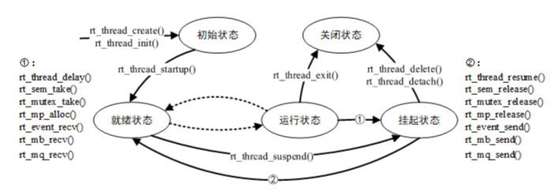
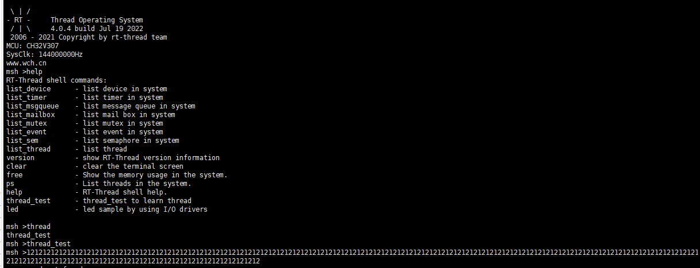

# RTT 夏令营第二天总结

## RT-Thread 的线程及调度方法的自我理解

线程可以理解为一个又一个的任务，在传统嵌入式裸机开发中，系统只能处理完一个任务再接着处理另一个任务，因此对时许和任务顺序的要求十分严格。但在 RT-Thread 中，我们可以创建一个又一个任务线程，通过调度算法在各个任务中快速切换，达到实时操作的效果。

在 RT-Thread 中，线程是调度的最小单位，通过线程的设置可以看出任务的重要程度和运行环境。线程执行时的运行环境，也就是开辟的栈空间，通常称为上下文，具体来说就是各个变量和数据，比如该线程中的局部变量、寄存器状态等。

RT-Thread 中的线程有：初始状态、就绪状态、运行状态、挂起状态、关闭状态这五种状态，所谓的线程调度，就是通过调度器和 RT-Thread 提供的一些接口函数，使得线程在这五种状态中切换。



在 RT-Thread 中，线程的调度方式有时间片轮转法和高优先级抢占法，在不同优先级线程中使用高优先级抢占法，同优先级时使用时间片轮转法。

* 时间片轮转法：为每个线程分配一个时间片，即执行时间，当时间耗尽，则切换到下一个线程，比较类似于传统裸机的任务运行方式，但有所不同。
* 高优先级抢占：调度器从就绪线程列表中找出最高优先级的线程并使其进入运行状态，保证最高优先级的线程总能被运行，每当高优先级线程进入就绪状态，就会让出当前低优先级的线程的 CPU 使用权，确保优先级高的线程被优先运行。

## 创建一个线程

一个线程要成为可执行的对象，就必须由操作系统的内核来为它创建一个线程,线程的初始化分为静态初始化和动态初始化。


* 动态初始化："rt_thread_t rt_thread_create(const char* name,          				//线程名称                 

  ​																			 void (*entry)(void* parameter),        //线程入口函数                     

  ​																			 void* parameter,                           //线程入口函数参数

  ​																			 rt_uint32_t stack_size,                   //线程栈大小         

  ​																			 rt_uint8_t priority,                          //线程优先级  

  ​																			 rt_uint32_t tick);"                            //线程时间片大小 

  

* 静态初始化："rt_err_t rt_thread_init(struct rt_thread* thread,                           //线程句柄（指向对应线程控制块内存地址的指针）                      

  ​																const char* name,									  //线程名称                        

  ​																void (*entry)(void* parameter),                     //线程入口函数

  ​															    void* parameter,                                        //线程入口函数参数

  ​																void* stack_start,                                        //线程起始栈地址

  ​																rt_uint32_t stack_size,                                //线程栈大小

  ​																rt_uint8_t priority,                                       //线程优先级

  ​																rt_uint32_t tick);"                                         //线程时间片大小

以上两种线程初始化的区别在于，静态初始化线程需要提前分配好栈空间，而动态初始化线程在创建线程时才分配空间。

线程启动："rt_err_t rt_thread_startup(rt_thread_t thread);" 调用该函数接口可让初始状态的线程进入就绪状态，从而被调度器调度。

课上实现的线程创建：

```
/*static*/
ALIGN(8)
struct rt_thread static_thread;
rt_uint8_t static_stack[2048];

void thread_static (void *args)
{
    while(1)
    {
        rt_kprintf("1");
        rt_thread_mdelay(100);
    }
}

void thread_dynamic (void *args)
{
    while(1)
    {
        rt_kprintf("2");
        rt_thread_mdelay(100);
    }
}

int thread_test(void)
{
    /* init thread */
    rt_thread_init(&static_thread,
                    "static",
                    thread_static,
                    RT_NULL,
                    &static_stack[0],
                    2048,
                    16,
                    100);

    /* statrt thread */
    rt_thread_startup(&static_thread);

    /* create thread */
    rt_thread_t dynamic_thrad = RT_NULL;

    dynamic_thrad = rt_thread_create("dynamic",
                                     thread_dynamic,
                                     RT_NULL,
                                     2048,
                                     15,
                                     500);

    /* start thread */
    rt_thread_startup(dynamic_thrad);
}

MSH_CMD_EXPORT(thread_test,  thread_test to learn thread);
```


效果如下：




## RT-Thread 启动流程

RT-Thread 的一般执行顺序是：启动文件 -->  rtthread_startup() --> 用户入口函数 main();

## 关于主线程

在系统启动时，系统会创建 main 线程，它的入口函数为 main_thread_entry()，用户的应用入口函数 main() 就是从这里真正开始的，系统调度器启动后，main 线程就开始运行。

## 关于空闲线程

空闲线程（idle）是系统创建的最低优先级的线程，线程状态永远为就绪态。当系统中无其他就绪线程存在时，调度器将调度到空闲线程，它通常是一个死循环，且永远不能被挂起。

空闲线程提供了接口来运行用户设置的钩子函数，在空闲线程运行时会调用该钩子函数，适合钩入功耗管理、看门狗喂狗等工作。

## 关于 FinSH 控制台

FinSH 是 RT-Thread 的命令行组件，提供一套供用户在命令行调用的操作接口，主要用于调试或查看系统信息。

