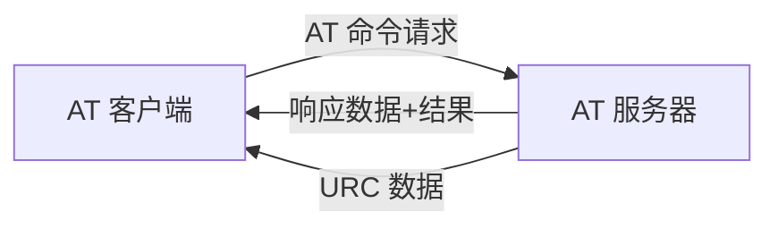

# RTT 夏令营第六天总结

## RT-Thread 的网络框架结构

RT-Thread 网络框架最顶层是**网络应用层**，提供一套**标准 BSD Socket APl** ,.如 socket、connect 等函数，用于系统中大部分网络开发应用。

往下第二部分为**SAL套接字抽象层**，通过它 RT-Thread 系统能够适配下层不同的网络协议栈，并**提供给上层统一的网络编程接口**,方便不同协议栈的接入。套接字抽象层为上层应甬层提供接口有: accept、connect、send、recv 等。

第三部分为 **netdev 网卡层**，主要作用是解决多网卡情况设备网络连接和网络管理相关问题，通过 netdev 网卡层，用户可以统一管理客个网卡信息和网络连接状态，并且可以使用统一的网卡调试命令接口。

第四部分为**协议栈层**，该层包括几种常用的 **TCP/IP 协议栈**，例如嵌入式开发中常用的轻型 TCP/IP协议栈lwlP 以及 RT-Thread 自主研发的 AT Socket 网络功能实现等。这些协议栈或网络功能实现直接和硬件接触，完成数据从网络层到传输层的转化。

RT-Thread 的网络应用层提供的接口主要以标准 **BSD Socket API 为主**，这样能确保程序可以在 PC 上编写、调试，然后再移植到 RT-Thread 操作系统上。

## AT 指令

AT 命令（AT Commands）最早是由发明拨号调制解调器（MODEM）的贺氏公司（Hayes）为了控制 MODEM 而发明的控制协议。后来随着网络带宽的升级，速度很低的拨号 MODEM 基本退出一般使用市场，但是 AT 命令保留下来。当时主要的移动电话生产厂家共同为 GSM 研制了一整套 AT 命令，用于控制手机的 GSM 模块。AT 命令在此基础上演化并加入 GSM 07.05 标准以及后来的 GSM 07.07 标准，实现比较健全的标准化。

在随后的 GPRS 控制、3G 模块等方面，均采用的 AT 命令来控制，AT 命令逐渐在产品开发中成为实际的标准。如今，AT 命令也广泛的应用于嵌入式开发领域，AT 命令作为主芯片和通讯模块的协议接口，硬件接口一般为串口，这样主控设备可以通过简单的命令和硬件设计完成多种操作。

**AT 命令集是一种应用于 AT 服务器（AT Server）与 AT 客户端（AT Client）间的设备连接与数据通信的方式**。

AT 组件是基于 RT-Thread 系统的 **AT Server** 和 **AT Client** 的实现，组件完成 AT 命令的发送、命令格式及参数判断、命令的响应、响应数据的接收、响应数据的解析、URC 数据处理等整个 AT 命令数据交互流程。

通过 AT 组件，设备可以作为 AT Client 使用串口连接其他设备发送并接收解析数据，可以作为 AT Server 让其他设备甚至电脑端连接完成发送数据的响应，也可以在本地 shell 启动 CLI 模式使设备同时支持 AT Server 和 AT Client 功能，该模式多用于设备开发调试。

## 作业截图

