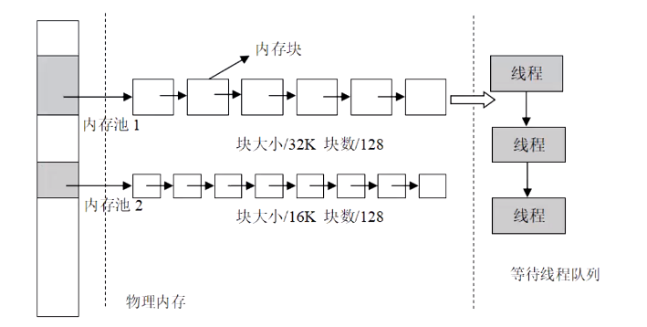

# RTT 夏令营第三天总结

[TOC]

## RT-Thread IPC 基本概念

IPC 是保证多线程之间协助关系和数据传递的一种机制。当系统里有多个任务运行时，经常需要互相无冲突地访问同一个共享资源，比如一些全局变量之类，这时操作系统必须具有对任务运行进行协调的能力，也就是 IPC 机制。

RT-Thread 支持的基础 IPC 有：信号量（sem）、互斥锁（mutex）、事件组（event）、邮箱（mailbox）、消息队列（messagequeue）。

## 信号量（sem）

信号量是一种轻型的用于解决线程间同步问题的内核对象，线程可以获取或释放它，从而达到同步或互斥的目的。

### 使用场景：

* 线程与线程之间的同步
* 中断与线程之间的同步
* 资源计数（适合于线程间工作处理速度不匹配的场合）

### 相关 API：

* 创建/初始化信号量

  ```c
  /* 创建动态信号量 */
  rt_sem_t rt_sem_create(const char *name,					//信号量名称
                          rt_uint32_t value,					//信号量初始值
                          rt_uint8_t flag);					//信号量标志 
  /*  
  						信号量标志可以取如下数值： RT_IPC_FLAG_FIFO 或 RT_IPC_FLAG_PRIO
  						RT_IPC_FLAG_FIFO 属于非实时调度方式,先进先出
  						RT_IPC_FLAG_PRIO 属于实时调度方式，优先级等待
  */
  ```

  当调用该接口创建一个信号量时，内核需要先创建一个信号量控制块，当调用上述初始化函数接口时，系统将先从对象管理器中分配一个 **semaphore** 对象，并初始化这个对象，然后初始化父类 **IPC** 对象以及与 **semaphore** 相关的部分。

  ```c
  /* 初始化静态信号量 */
  rt_err_t rt_sem_init(rt_sem_t       sem,					//信号量对象的句柄
                      const char     *name,					//信号量名称
                      rt_uint32_t    value,					//信号量初始值
                      rt_uint8_t     flag)					//信号量标志
  /*  
  						信号量标志可以取如下数值： RT_IPC_FLAG_FIFO 或 RT_IPC_FLAG_PRIO
  						RT_IPC_FLAG_FIFO 属于非实时调度方式,先进先出
  						RT_IPC_FLAG_PRIO 属于实时调度方式，优先级等待
  */
  ```

  对于静态信号量对象，它的内存空间在编译时期就被编译器分配出来，放在读写数据段或未初始化数据段上，此时使用信号量就不再需要使用 **rt_sem_create** 接口来创建它，而只需在使用前对它进行初始化即可。当调用这个函数时，系统将对这个 **semaphore** 对象进行初始化，然后初始化 **IPC** 对象以及与 **semaphore** 相关的部分。

* 删除/脱离信号量

  ```c
  /* 删除动态信号量 */
  rt_err_t rt_sem_delete(rt_sem_t sem);                      //rt_sem_create() 创建的信号量对象
  /* 脱离静态信号量 */
  rt_err_t rt_sem_detach(rt_sem_t sem);                      //静态信号量对象的句柄
  ```

  系统不再使用信号量时，可通过删除信号量以释放系统资源，适用于动态创建的信号量。值得注意的是，如果删除该信号量时，有线程正在等待该信号量，那么线程会先唤醒等待在该信号量上的线程，然后再释放信号量的内存资源，原来挂起在信号量上的等待线程将获得 **- RT_ERROR** 的返回值。

* 获取/释放信号量

  ```c
  /* 获取信号量 */
  rt_err_t rt_sem_take (rt_sem_t sem, rt_int32_t time); 		//信号量对象的句柄
  ```

  线程通过获取信号量来获得信号量资源，当信号量值大于零时，线程将获得信号量，并且相应的信号量值会减一。在调用上述接口函数获取资源时，如果信号量的值等于零，则说明当前信号量资源不可用，申请信号量的线程将根据创建 / 初始化时设置的 **time** 参数的情况选择直接返回、挂起一段时间或永久等待。如果在参数 **time** 指定的时间内依然得不到信号量，线程将超时返回，返回值是      **- RT_ETIMEOUT**。

  ```c
  /* 释放信号量 */
  rt_err_t rt_sem_release(rt_sem_t sem);  					//信号量对象的句柄
  ```

  释放信号量可以唤醒挂起在该信号量上的线程。当信号量的值等于零，并且有线程等待这个信号量时，释放信号量后将唤醒等待在该信号量线程队列中的第一个线程，由它获取信号量；否则将把信号量的值加 一。

* 尝试获取信号量

  ```c
  /* 无等待获取信号量 */
  rt_err_t rt_sem_trytake(rt_sem_t sem);						//信号量对象的句柄
  ```

  当用户不想在申请的信号量上挂起线程进行等待时，可以使用上述函数接口，进行无等待方式获取信号量，该函数与**rt_sem_take(sem, RT_WAITING_NO)** 的作用相同，即当线程申请的信号量资源实例不可用的时候，它不会等待在该信号量上，而是直接返回 **- RT_ETIMEOUT**。

## 互斥锁（mutex）

互斥量又叫相互排斥的信号量，是一种特殊的二值信号量。互斥量和信号量不同的是：拥有互斥量的线程拥有**互斥量的所有权**，互斥量支持递归访问且能**防止线程优先级翻转**；并且互斥量**只能由持有线程释放**，而信号量则可以由任何线程释放。

互斥量的状态只有两种，**开锁或闭锁**（两种状态值）。当有线程持有它时，互斥量处于闭锁状态，由这个线程获得它的所有权。相反，当这个线程释放它时，将对互斥量进行开锁，失去它的所有权。

### 使用场景

* 临界资源保护锁（临界资源保护）
* 具有优先级继承的机制
* 可防止优先级翻转，避免导致系统死锁

### 相关 API：

* 创建/初始化互斥量

  ```c
  /* 创建动态互斥量 */
  rt_mutex_t rt_mutex_create (const char* name, 		//互斥量的名称
                              rt_uint8_t flag);		//默认为 RT_IPC_FLAG_PRIO ，无法修改
  /* flag can only be RT_IPC_FLAG_PRIO. RT_IPC_FLAG_FIFO cannot solve the unbounded priority inversion problem */
  ```

  可以调用  **rt_mutex_create**  函数接口动态创建一个互斥量。当调用这个函数时，系统将先从对象管理器中分配一个 mutex 对象，并初始化这个对象，然后初始化父类 **IPC** 对象以及与 **mutex** 相关的部分。

  ```c
  /* 创建静态互斥量 */
  rt_err_t rt_mutex_init (rt_mutex_t mutex,			//互斥量对象的句柄
                          const char* name, 			//互斥量的名称
                          rt_uint8_t flag);			//默认为 RT_IPC_FLAG_PRIO ，无法修改
  /* flag can only be RT_IPC_FLAG_PRIO. RT_IPC_FLAG_FIFO cannot solve the unbounded priority inversion problem */
  ```

  静态互斥量对象的内存是在系统编译时由编译器分配的，一般放于读写数据段或未初始化数据段中。使用该函数接口时，需指定互斥量对象的句柄（即指向互斥量控制块的指针）。

* 删除/脱离互斥量

  ```c
  /* 删除动态互斥量 */
  rt_err_t rt_mutex_delete (rt_mutex_t mutex);		//互斥量对象的句柄
  ```

  当不再使用互斥量时，通过该函数接口删除互斥量以释放系统资源，适用于动态创建的互斥量。当删除一个互斥量时，所有等待此互斥量的线程都将被唤醒，等待线程获得的返回值是 **- RT_ERROR**。

  ```c
  /* 脱离静态互斥量 */
  rt_err_t rt_mutex_detach (rt_mutex_t mutex);      	//互斥量对象的句柄
  ```

  调用该函数接口将把互斥量对象从内核对象管理器中脱离，适用于静态初始化的互斥量。使用该函数接口后，内核先唤醒所有挂在该互斥量上的线程（线程的返回值是 **-RT_ERROR**），然后系统将该互斥量从内核对象管理器中脱离。

* 获取/释放互斥量

  ```c
  /* 获取互斥量 */
  rt_err_t rt_mutex_take (rt_mutex_t mutex, 			//互斥量对象的句柄
                          rt_int32_t time);			//指定等待的时间
  ```

  如果互斥量没有被其他线程控制，那么申请该互斥量的线程将成功获得该互斥量。如果互斥量已经被当前线程线程控制，则该互斥量的持有计数加一，当前线程也不会挂起等待。如果互斥量已经被其他线程占有，则当前线程在该互斥量上挂起等待，直到其他线程释放它或者等待时间超过指定的超时时间。当线程获取了互斥量，那么线程就有了对该互斥量的所有权，即某一个时刻一个互斥量只能被一个线程持有。

  ```c
  /* 释放互斥量 */
  rt_err_t rt_mutex_release(rt_mutex_t mutex);		//互斥量对象的句柄
  ```

  当线程完成互斥资源的访问后，应尽快释放它占据的互斥量，使得其他线程能及时获取该互斥量。使用该函数接口时，只有已经拥有互斥量控制权的线程才能释放它，每释放一次该互斥量，它的持有计数就减一。当该互斥量的持有计数为零时（即持有线程已经释放所有的持有操作），它变为可用，等待在该信号量上的线程将被唤醒。如果线程的运行优先级被互斥量提升，那么当互斥量被释放后，线程恢复为持有互斥量前的优先级。

* 尝试获取互斥量

  ```c
  /* 无等待获取互斥量 */
  rt_err_t rt_mutex_trytake(rt_mutex_t mutex);		//互斥量对象的句柄
  ```

  当用户不想在申请的互斥量上挂起线程进行等待时，可以使用无等待方式获取互斥量。这个函数与 **rt_mutex_take(mutex, RT_WAITING_NO)** 的作用相同，即当线程申请的互斥量资源实例不可用的时候，它不会等待在该互斥量上，而是直接返回                 **- RT_ETIMEOUT**。

## 事件组（event）

事件集也是线程间同步的机制之一，一个事件集可以包含多个事件，利用事件集可以完成一对多，多对多的线程间同步。事件集主要用于线程间的同步，与信号量不同，它的特点是可以实现一对多，多对多的同步。即一个线程与多个事件的关系可设置为：其中任意一个事件唤醒线程，或几个事件都到达后才唤醒线程进行后续的处理；同样，事件也可以是多个线程同步多个事件。

### 相关 API：

* 创建/初始化事件集

  ```c
  /* 创建动态事件集 */
  rt_event_t rt_event_create(const char* name,		//事件集的名称 
                             rt_uint8_t flag);		//事件集的标志
  /*
  						事件集的标志可以取如下数值： RT_IPC_FLAG_FIFO 或 RT_IPC_FLAG_PRIO
  						RT_IPC_FLAG_FIFO 属于非实时调度方式,先进先出
  						RT_IPC_FLAG_PRIO 属于实时调度方式，优先级等待
  */
  ```

  当创建一个事件集时，内核首先创建一个事件集控制块，然后对该事件集控制块进行基本的初始化。调用该函数接口时，系统会从对象管理器中分配事件集对象，并初始化这个对象，然后初始化父类 IPC 对象。

  ```c
  /* 初始化静态事件集 */
  rt_err_t rt_event_init(rt_event_t event, 			//事件集对象的句柄
                         const char* name, 			//事件集的名称 
                         rt_uint8_t flag);			//事件集的标志
  /*
  						事件集的标志可以取如下数值： RT_IPC_FLAG_FIFO 或 RT_IPC_FLAG_PRIO
  						RT_IPC_FLAG_FIFO 属于非实时调度方式,先进先出
  						RT_IPC_FLAG_PRIO 属于实时调度方式，优先级等待
  */
  ```

  静态事件集对象的内存是在系统编译时由编译器分配的，一般放于读写数据段或未初始化数据段中。在使用静态事件集对象前，需要先行对它进行初始化操作。调用该接口时，需指定静态事件集对象的句柄（即指向事件集控制块的指针），然后系统会初始化事件集对象，并加入到系统对象容器中进行管理。

* 删除/脱离事件集

  ```c
  /* 删除动态事件集 */
  rt_err_t rt_event_delete(rt_event_t event);			//事件集对象的句柄
  ```

  系统不再使用 **rt_event_create()** 创建的事件集对象时，通过删除事件集对象控制块来释放系统资源。在调用该函数删除一个事件集对象时，应该确保该事件集不再被使用。在删除前会唤醒所有挂起在该事件集上的线程（线程的返回值是 **- RT_ERROR**），然后释放事件集对象占用的内存块。

  ```c
  /* 脱离静态事件集 */
  rt_err_t rt_event_detach(rt_event_t event);			//事件集对象的句柄
  ```

  系统不再使用 **rt_event_init()** 初始化的事件集对象时，通过脱离事件集对象控制块来释放系统资源。脱离事件集是将事件集对象从内核对象管理器中脱离。用户调用这个函数时，系统首先唤醒所有挂在该事件集等待队列上的线程（线程的返回值是 				           **- RT_ERROR**），然后将该事件集从内核对象管理器中脱离。

* 发送事件

  ```c
  /* 发送事件 */
  rt_err_t rt_event_send(rt_event_t event, 			//事件集对象的句柄
                         rt_uint32_t set);			//发送的一个或多个事件的标志值
  ```

  发送事件函数可以发送事件集中的一个或多个事件。使用该函数接口时，通过参数 **set** 指定的事件标志来设定 **event** 事件集对象的事件标志值，然后遍历等待在 **event** 事件集对象上的等待线程链表，判断是否有线程的事件激活要求与当前 **event** 对象事件标志值匹配，如果有，则唤醒该线程。

* 接收事件

  ```c
  /* 接收事件 */
  rt_err_t rt_event_recv(rt_event_t event,			//事件集对象的句柄
                         rt_uint32_t set,				//接收线程感兴趣的事件
                         rt_uint8_t option,			//接收选项
                         rt_int32_t timeout,			//指定超时时间
                         rt_uint32_t* recved);		//指向接收到的事件
  ```

  内核使用 **32** 位的无符号整数来标识事件集，它的每一位代表一个事件，因此一个事件集对象可同时等待接收 **32** 个事件，内核可以通过指定选择参数 “**逻辑与**” 或“**逻辑或**”来选择如何激活线程，使用 “**逻辑与**” 参数表示只有当**所有等待的事件都发生时才激活线程**，而使用 “**逻辑或**” 参数则表示**只要有一个等待的事件发生就激活线程**。

  当用户调用这个接口时，系统首先根据 **set** 参数和接收选项 **option** 来判断它要接收的事件是否发生，如果已经发生，则根据参数 **option** 上是否设置有 **RT_EVENT_FLAG_CLEAR** 来决定是否重置事件的相应标志位，然后返回（其中 **recved** 参数返回接收到的事件）；如果没有发生，则把等待的 **set** 和 **option** 参数填入线程本身的结构中，然后把线程挂起在此事件上，直到其等待的事件满足条件或等待时间超过指定的超时时间。如果超时时间设置为零，则表示当线程要接受的事件没有满足其要求时就不等待，而直接返回 **- RT_ETIMEOUT**。

## 邮箱（mailbox）

邮箱服务是实时操作系统中一种典型的线程间通信方法。RT-Thread 操作系统的邮箱用于线程间通信，特点是**开销比较低**，**效率较高**。邮箱中的每一封邮件只能容纳**固定的 4 字节内容**（针对 32 位处理系统，指针的大小即为 4 个字节，所以一封邮件**恰好能够容纳一个指针**）。非阻塞方式的邮件发送过程能够安全的应用于中断服务中，是线程、中断服务、定时器向线程发送消息的有效手段。

### 相关API

* 创建/初始化邮箱

  ```c
  /* 创建动态邮箱 */
  rt_mailbox_t rt_mb_create (const char* name,			//邮箱名称 
                             rt_size_t size, 				//邮箱容量
                             rt_uint8_t flag);			//邮箱标志
  /*
  						邮箱的标志可以取如下数值： RT_IPC_FLAG_FIFO 或 RT_IPC_FLAG_PRIO
  						RT_IPC_FLAG_FIFO 属于非实时调度方式,先进先出
  						RT_IPC_FLAG_PRIO 属于实时调度方式，优先级等待
  */
  ```

  创建邮箱对象时会先从对象管理器中分配一个邮箱对象，然后给邮箱动态分配一块内存空间用来存放邮件，这块内存的大小等于邮件大小（4 字节）与邮箱容量的乘积，接着初始化接收邮件数目和发送邮件在邮箱中的偏移量。

  ```c
  /* 初始化静态邮箱 */
   rt_err_t rt_mb_init(rt_mailbox_t mb,					//邮箱对象的句柄
                       const char* name,					//邮箱名称
                       void* msgpool,						//缓冲区指针
                       rt_size_t size,					//邮箱容量
                       rt_uint8_t flag)					//邮箱标志
  /*
  					邮箱的标志可以取如下数值： RT_IPC_FLAG_FIFO 或 RT_IPC_FLAG_PRIO
  					RT_IPC_FLAG_FIFO 属于非实时调度方式,先进先出
  					RT_IPC_FLAG_PRIO 属于实时调度方式，优先级等待
  */
  ```

  初始化邮箱跟创建邮箱类似，只是初始化邮箱用于静态邮箱对象的初始化。与创建邮箱不同的是，静态邮箱对象的内存是在系统编译时由编译器分配的，一般放于读写数据段或未初始化数据段中，其余的初始化工作与创建邮箱时相同。初始化邮箱时，该函数接口需要获得用户已经申请获得的邮箱对象控制块，缓冲区的指针，以及邮箱名称和邮箱容量（能够存储的邮件数）。

  **size** 参数指定的是邮箱的容量，即如果 **msgpool** 指向的缓冲区的字节数是 **N**，那么邮箱容量应该是 **N/4**。

* 删除/脱离邮箱

  ```c
  /* 删除动态邮箱 */
  rt_err_t rt_mb_delete (rt_mailbox_t mb);			//邮箱对象的句柄
  ```

  当用 **rt_mb_create()** 创建的邮箱不再被使用时，应该删除它来释放相应的系统资源，一旦操作完成，邮箱将被永久性的删除。删除邮箱时，如果有线程被挂起在该邮箱对象上，内核先唤醒挂起在该邮箱上的所有线程（线程返回值是 **-RT_ERROR**），然后再释放邮箱使用的内存，最后删除邮箱对象。

  ```c
  /* 脱离静态邮箱 */
  rt_err_t rt_mb_detach(rt_mailbox_t mb);				//邮箱对象的句柄
  ```

  脱离邮箱将把静态初始化的邮箱对象从内核对象管理器中脱离。使用该函数接口后，内核先唤醒所有挂在该邮箱上的线程（线程获得返回值是 **- RT_ERROR**），然后将该邮箱对象从内核对象管理器中脱离。

* 发送邮件

  ```c
  /* 发送邮件 */
  rt_err_t rt_mb_send (rt_mailbox_t mb, 				//邮箱对象的句柄
                       rt_uint32_t value);			//邮件内容
  ```

  线程或者中断服务程序可以通过邮箱给其他线程发送邮件，发送的邮件可以是 **32 位**任意格式的数据，一个整型值或者一个指向缓冲区的指针。当邮箱中的邮件已经满时，发送邮件的线程或者中断程序会收到 **-RT_EFULL** 的返回值。

  ```c
  /* 等待方式发送邮件 */
  rt_err_t rt_mb_send_wait (rt_mailbox_t mb,			//邮箱对象的句柄
                        	  rt_uint32_t value,		//邮件内容
                        	  rt_int32_t timeout);		//超时时间
  ```

  **rt_mb_send_wait()** 与 **rt_mb_send()** 的区别在于有等待时间，如果邮箱已经满了，那么发送线程将根据设定的 **timeout** 参数等待邮箱中因为收取邮件而空出空间。如果设置的超时时间到达依然没有空出空间，这时发送线程将被唤醒并返回错误码。

  ```c
  /* 发送紧急邮件 */
  rt_err_t rt_mb_urgent (rt_mailbox_t mb, 			//邮箱对象的句柄
                         rt_ubase_t value);			//邮件内容
  ```

  发送紧急邮件的过程与发送邮件几乎一样，唯一的不同是，当发送紧急邮件时，邮件被直接插队放入了邮件队首，这样，接收者就能够优先接收到紧急邮件，从而及时进行处理。

* 接收邮件

  ```c
  /* 接收邮件 */
  rt_err_t rt_mb_recv (rt_mailbox_t mb, 				//邮箱对象的句柄
                       rt_uint32_t* value, 			//邮件内容
                       rt_int32_t timeout);			//超时时间
  ```

  只有当接收者接收的邮箱中有邮件时，接收者才能立即取到邮件并返回 **RT_EOK** 的返回值，否则接收线程会根据超时时间设置，或挂起在邮箱的等待线程队列上，或直接返回。

  接收邮件时，接收者需指定接收邮件的邮箱句柄，并指定接收到的邮件存放位置以及最多能够等待的超时时间。如果接收时设定了超时，当指定的时间内依然未收到邮件时，将返回 **- RT_ETIMEOUT**。

## 消息队列（messagequeue）

消息队列是另一种常用的线程间通讯方式，是**邮箱的扩展**。消息队列能够接收来自线程或中断服务例程中**不固定长度的消息**，并把消息缓存在自己的内存空间中。其他线程也能够从消息队列中读取相应的消息，而当消息队列是空的时候，可以挂起读取线程。当有新的消息到达时，挂起的线程将被唤醒以接收并处理消息。是一种**异步的通信方式**。

### 相关API

* 创建/初始化消息队列

  ```c
  /* 创建动态消息队列 */
  rt_mq_t rt_mq_create(const char* name,				//消息队列的名称
                       rt_size_t msg_size,			//消息队列中一条消息的最大长度，单位字节
              		 rt_size_t max_msgs, 			//消息队列的最大个数
                       rt_uint8_t flag);				//消息队列标志
  /*
  					消息队列的标志可以取如下数值： RT_IPC_FLAG_FIFO 或 RT_IPC_FLAG_PRIO
  					RT_IPC_FLAG_FIFO 属于非实时调度方式,先进先出
  					RT_IPC_FLAG_PRIO 属于实时调度方式，优先级等待
  */
  ```

  消息队列在使用前，应该被创建出来，或对已有的静态消息队列对象进行初始化。创建消息队列时先从对象管理器中分配一个消息队列对象，然后给消息队列对象分配一块内存空间，组织成空闲消息链表，这块内存的**大小 =[消息大小 + 消息头（用于链表连接）的大小]X 消息队列最大个数**，接着再初始化消息队列，此时消息队列为空。

  ```c
  /* 初始化静态消息队列 */
  rt_err_t rt_mq_init(rt_mq_t mq,						//消息队列对象的句柄 
                      const char* name,				//消息队列的名称
                      void *msgpool, 					//指向存放消息的缓冲区的指针
                      rt_size_t msg_size,				//消息队列中一条消息的最大长度，单位字节
                      rt_size_t pool_size, 			//存放消息的缓冲区大小
                      rt_uint8_t flag);				//消息队列标志
  /*
  					消息队列的标志可以取如下数值： RT_IPC_FLAG_FIFO 或 RT_IPC_FLAG_PRIO
  					RT_IPC_FLAG_FIFO 属于非实时调度方式,先进先出
  					RT_IPC_FLAG_PRIO 属于实时调度方式，优先级等待
  */
  ```

  初始化静态消息队列对象跟创建消息队列对象类似，只是静态消息队列对象的内存是在系统编译时由编译器分配的，一般放于读数据段或未初始化数据段中。在使用这类静态消息队列对象前，需要进行初始化。

  初始化消息队列时，该接口需要用户已经申请获得的消息队列对象的句柄（即指向消息队列对象控制块的指针）、消息队列名、消息缓冲区指针、消息大小以及消息队列缓冲区大小。消息队列初始化后所有消息都挂在空闲消息链表上，消息队列为空。

* 删除/脱离消息队列

  ```c
  /* 删除动态消息队列 */
  rt_err_t rt_mq_delete(rt_mq_t mq);					//消息队列对象的句柄
  ```

  当消息队列不再被使用时，应该删除它以释放系统资源，一旦操作完成，消息队列将被永久性地删除。删除消息队列时，如果有线程被挂起在该消息队列等待队列上，则内核先**唤醒挂起在该消息等待队列上的所有线程**（线程返回值是 **- RT_ERROR**），然后再释放消息队列使用的内存，最后删除消息队列对象。

  ```c
  /* 脱离静态消息队列 */
  rt_err_t rt_mq_detach(rt_mq_t mq);					//消息队列对象的句柄
  ```

  脱离消息队列将使消息队列对象被从内核对象管理器中脱离。使用该函数接口后，内核先**唤醒所有挂在该消息等待队列对象上的线程**（线程返回值是 **-RT_ERROR**），然后将该消息队列对象从内核对象管理器中脱离。

* 发送消息

  ```c
  /* 发送消息 */
  rt_err_t rt_mq_send (rt_mq_t mq, 					//消息队列对象的句柄
                       void* buffer, 					//消息内容
                       rt_size_t size);				//消息大小
  ```

  线程或者中断服务程序都可以给消息队列发送消息。当发送消息时，消息队列对象先从空闲消息链表上取下一个空闲消息块，把线程或者中断服务程序发送的消息内容复制到消息块上，然后把该消息块**挂到消息队列的尾部**。当且仅当空闲消息链表上**有可用的空闲消息块时，发送者才能成功发送消息**；当空闲消息链表上无可用消息块，说明消息队列已满，此时，发送消息的的线程或者中断程序会收到一个错误码（**-RT_EFULL**）。

  ```c
  /* 等待方式发送消息 */
  rt_err_t rt_mq_send_wait(rt_mq_t     mq,			//消息队列对象的句柄
                           const void *buffer,		//消息内容
                           rt_size_t   size,			//消息大小
                           rt_int32_t  timeout);		//超时时间
  ```

  **rt_mq_send_wait()** 与 **rt_mq_send()** 的区别在于有等待时间，如果消息队列已经满了，那么发送线程将根据设定的 **timeout** 参数进行等待。如果设置的超时时间到达依然**没有空出空间**，这时**发送线程将被唤醒并返回错误码**。

  ```c
  /* 发送紧急消息 */
  rt_err_t rt_mq_urgent(rt_mq_t mq,					//消息队列对象的句柄 
                        void* buffer, 				//消息内容
                        rt_size_t size);				//消息大小
  ```

  发送紧急消息的过程与发送消息几乎一样，唯一的不同是，当发送紧急消息时，从空闲消息链表上取下来的消息块**不是挂到消息队列的队尾，而是挂到队首**，这样，接收者就能够**优先接收到紧急消息**，从而及时进行消息处理。

* 接收消息

  ```c
  rt_err_t rt_mq_recv (rt_mq_t mq,					//消息队列对象的句柄 
                       void* buffer,					//消息内容
                       rt_size_t size, 				//消息大小
                       rt_int32_t timeout);			//指定的超时时间
  ```

  当消息队列中有消息时，接收者才能接收消息，否则接收者会根据超时时间设置，或挂起在消息队列的等待线程队列上，或直接返回。接收消息时，接收者需指定存储消息的消息队列对象句柄，并且指定一个内存缓冲区，接收到的消息内容将被复制到该缓冲区里。此外，还需指定未能及时取到消息时的超时时间。

## 内存

在计算系统中，通常存储空间可以分为两种：内部存储空间和外部存储空间。内部存储空间通常访问速度比较快，能够按照变量地址随机地访问，也就是我们通常所说的 RAM（随机存储器），可以把它理解为电脑的内存；而外部存储空间内所保存的内容相对来说比较固定，即使掉电后数据也不会丢失，这就是通常所讲的 ROM（只读存储器），可以把它理解为电脑的硬盘。

内存是与 CPU 直接交换数据的内部存储器。可随时读写，且速度很快，作为操作系统或其他正在运行中的程序的临时数据存储介质。

内存用来加载各式各样的程序与数据，以供 CPU 直接运行与运用。由于 DRAM 的性价比高且扩展性好，是现今一般计算机主存的最主要部分。

### 动态内存

所谓动态内存(Dynamic Memory)就是指在程序**执行的过程中动态地分配或者回收**的存储空间。动态内存分配不像数组等静态内存分配方法那样需要预先分配存储空间，而是由操作系统管理，根据程序的需要**即时分配**，且分配的大小就是程序要求的大小。**使用非常灵活**。

### 静态内存

静态内存是指在程序**开始运行时由编译器分配的内存**，它的分配是在程序开始**编译时完成**的，**不占用CPU**资源。程序中的**各种变量**，在编译时系统已经为其分配了所需的内存空间，当该变量在作用域内使用完毕时，系统会**自动释放**所占用的内存空间。变量的分配与释放，都无须程序员自行考虑。如：基本类型，数组等。

### 静态与动态内存比较

* 静态内存分配在编译时完成，不占用CPU资源;动态内存分配在运行时，分配与释放都占用CPU资源。
* 静态内存在**栈(stack)**上分配;动态内存在**堆(heap)**上分配。
* 静态内存分配是按计划分配，由编译器负责;动态内存分配是按需分配，由程序员负责。
* 动态内存在使用上更为灵活，静态内存不会产生碎片更稳定。

### 内存管理算法（mem、SLAB、memheap）

RT-Thread操作系统在内存管理上，根据上层应用及系统资源的不同，有针对性地提供了不同的内存分配管理算法。总体上可分为两类:内存堆管理与内存池管理，而内存堆管理又根据具体内存设备划分为三种情况:

* **针对小内存块的分配管理（小内存(mem)管理算法）**

  小内存管理算法是一个简单的内存分配算法。初始时，它是一块大的内存。当需要分配内存块时，将从这个大的内存块上分割出相匹配的内存块，然后把分割出来的空闲内存块还回给堆管理系统中。每个内存块都包含一个管理用的数据头，通过这个头把使用块与空闲块用**双向链表**的方式链接起来。

  **mem管理算法:对齐到RT_ALIGN_SIZE(默认8字节)。**

  

* **针对大内存块的分配管理(SLAB管理算法）**

  RT-Thread 的 slab分配器是在 DragonFly BSD 创始人 MatthewDillon 实现的 slab 分配器基础上，针对嵌入式系统优化的内存分配算法。最原始的 slab 算法是 Jeff Bonwick 为 Solaris 操作系统而引入的一种高效内核内存分配算法。
  RT-Thread 的 slab 分配器实现主要是去掉了其中的对象构造及析构过程，只保留了纯粹的缓冲型的内存池算法。 slab 分配器会根据对象的大小分成多个区  ( zone ），也可以看成每类对象有一个**内存池**。

  系统中的 zone 最多包括 72 种对象，每种 zone 上分配的内存块大小是固定的，一次最大能够分配 16K 的内存空间。能够分配相同大小内存块的 zone 会链接在一个链表中。

  **SLAB内存管理算法:对齐到RT_MM_PAGE_SIZE(默认4K)**。

  

* **针对多内存堆的分配情况(memheap管理算法）**

  memheap 管理算法适用于系统**含有多个地址可不连续的内存堆**。使用memheap 内存管理可以**简化系统存在多个内存堆时的使用**。
  开启 memheap 功能就可以很方便地把多个 memheap（地址可不连续) 粘合起来用于系统的 heap 分配。

  **memheap内存管理算法:对齐到RT_ALIGN_SIZE(默认8字节)。**

#### 内存管理算法对比

* mem 管理算法
  1. 占用资源少。
* SLAB管理算法
  1. 分配时间固定可靠，对于带 cache 系统友好。
  2. 比较消耗内存。
* memheap内存管理算法
  1. 可以支持多块不连续地址的内存管理。
  2. 占用资源比 slab 算法少。

### 静态内存池（mempool）

内存堆管理器可以分配任意大小的内存块，非常灵活和方便。但其也存在明显的缺点:一是分配效率不高，在每次分配时，都要空闲内存块查找;二是容易产生内存碎片。为了提高内存分配的效率，并且避免内存碎片，RT-Thread提供了另外一种内存管理方法:内存池（Memory Pool) 。

内存池是一种内存分配方式，用于分配大量大小相同的小内存块，它可以极大地加快内存分配与释放的速度，且能尽量避免内存碎片化。

内存池的线程挂起功能非常适合需要通过内存资源进行同步的场景。

内存池在创建时先向系统申请一大块内存，然后分成同样大小的多个小内存块，小内存块直接通过链表连接起来（此链表也称为空闲链表)。每次分配的时候，从空闲链表中取出链头上第一个内存块，提供给申请者。从下图中可以看到，物理内存中允许存在多个大小不同的内存池，每一个内存池又由多个空闲内存块组成，内核用它们来进行内存管理。当一个内存池对象被创建时，内存池对象就被分配给了一个内存池控制块，内存控制块的参数包括内存池名，内存缓冲区，内存块大小，块数以及一个等待线程队列。



#### 静态内存池与内存管理接口对比

**静态内存池:**

* 只能分配指定大小的内存块，无法分配任意大小的内存块。
* 静态内存池具有IPC特性，当没有内存块时时会挂起分配的线程，有内存块的时候会唤醒挂起线程，挂起线程按照FIFO机制，无优先级机制。
* 静态内存池不会产生内存碎片。
* 分配和释放的速度比动态内存接口快。
* 静态内存池的释放并不会真正的释放内存。只是在数据的机制上提供的类似malloc的接口，方便开发。

### 相关 API

* 分配和释放内存块

  ```c
  /* 分配内存块 */
  void *rt_malloc(rt_size_t nbytes);			//需要分配的内存块的大小，单位为字节
  ```

  该函数接口可从内存堆上分配用户指定大小的内存块。**rt_malloc** 函数会从系统堆空间中找到合适大小的内存块，然后把内存块可用地址返回给用户。值得注意的是，对 rt_malloc 的返回值进行判空是非常有必要的。应用程序使用完从内存分配器中申请的内存后，必须及时释放，否则会造成内存泄漏。

  ```c
  /* 释放内存块 */
  void rt_free (void *ptr);					//待释放的内存块指针
  ```

  **rt_free** 函数会把待释放的内存还回给堆管理器中。在调用这个函数时用户需传递待释放的内存块指针，如果是空指针直接返回。注意：**rt_free** 的参数必须是以下其一：**NULL** 或是一个先前从 **rt_malloc**、 **rt_calloc** 或 **rt_realloc** 返回的值。

* 重分配内存块

  ```c
  /* 重分配内存块 */
  void *rt_realloc(void *rmem, 				//指向已分配的内存块
                   rt_size_t newsize);		//重新分配的内存大小
  ```

  可通过该接口在已分配内存块的基础上**重新分配**内存块的大小（增加或缩小）。在进行重新分配内存块时，原来的内存块数据保持不变（缩小的情况下，后面的数据被**自动截断**）。

  如果它用于扩大一个内存块，那么这块内存**原先的内容依然保留**，新增加的内存添加到原先内存块的后面，新内存并未以任何方式进行初始化。如果它用于缩小一个内存块，该内存尾部的部分内存便被拿掉，剩余部分内存的**原先内容依然保留**。

  如果原先的内存块无法改变大小，rt_realloc 将**分配另一块正确大小的内存**，并把原先那块内存的内容**复制到新的块上**。所以在使用 rt_realloc 之后，你就不能再使用指向旧内存块的指针，而是应该**改用 rt_realloc 所返回的新指针**。

* 创建和删除内存池

  ```c
  /* 创建内存池 */
  rt_mp_t rt_mp_create(const char* name,			//内存池名
                       rt_size_t block_count,		//内存块数量
                       rt_size_t block_size);		//内存块容量
  ```

  创建内存池操作将会创建一个内存池对象并从堆上分配一个内存池。创建内存池是从对应内存池中分配和释放内存块的先决条件，创建内存池后，线程便可以从内存池中执行申请、释放等操作。

  使用该函数接口可以创建一个与需求的内存块大小、数目相匹配的内存池，前提当然是在系统资源允许的情况下（最主要的是**内存堆内存资源**）才能创建成功。创建内存池时，需要给内存池指定一个名称。然后内核从系统中申请一个内存池对象，然后从内存堆中分配一块由块数目和块大小计算得来的内存缓冲区，接着初始化内存池对象，并将申请成功的内存缓冲区组织成可用于分配的空闲块链表。

  ```c
  /* 删除内存池 */
  rt_err_t rt_mp_delete(rt_mp_t mp);				//rt_mp_create 返回的内存池对象句柄
  ```

  删除内存池将删除内存池对象并释放申请的内存。删除内存池时，会首先唤醒等待在该内存池对象上的所有线程（返回                        **-RT_ERROR**），然后再**释放已从内存堆上分配的内存池数据存放区域**，然后删除内存池对象。

* 初始化和脱离内存池

  ```c
  /* 初始化内存池 */
  rt_err_t rt_mp_init(rt_mp_t mp,					//内存池对象
                      const char* name,			//内存池名
                      void *start, 				//内存池的起始位置
                      rt_size_t size,				//内存池数据区域大小
                      rt_size_t block_size);		//内存块容量
  ```

  初始化内存池跟创建内存池类似，只是初始化内存池用于**静态内存管理模式**，内存池控制块来源于用户在系统中申请的静态对象。另外与创建内存池不同的是，此处内存池对象所使用的内存空间是**由用户指定的一个缓冲区空间**，用户把缓冲区的指针传递给内存池控制块，其余的初始化工作与创建内存池相同。

  初始化内存池时，把需要进行初始化的内存池对象传递给内核，同时需要传递的还有内存池用到的内存空间，以及内存池管理的内存块数目和块大小，并且给内存池指定一个名称。这样，内核就可以对该内存池进行初始化，将内存池用到的内存空间组织成可用于分配的空闲块链表。

  注：内存池块个数 = size / (block_size + 4 链表指针大小)，计算结果取整数。

  ```c
  /* 脱离内存池 */
  rt_err_t rt_mp_detach(rt_mp_t mp);				//内存池对象
  ```

  脱离内存池将把内存池对象从内核对象管理器中脱离。使用该函数接口后，内核先唤醒所有等待在该内存池对象上的线程，然后将内存池对象从内核对象管理器中脱离。

* 从内存池分配和释放内存块

  ```c
  /* 从内存池分配内存块 */
  void *rt_mp_alloc (rt_mp_t mp,					//内存池对象
                     rt_int32_t time);			//超时时间
  ```

  使用该接口可从指定的内存池中分配一个内存块。其中 **time** 参数的含义是申请分配内存块的超时时间。如果内存池中有可用的内存块，则从内存池的空闲块链表上取下一个内存块，减少空闲块数目**并返回这个内存块**；如果内存池中已经没有空闲内存块，则判断超时时间设置：若超时时间设置为零，则立刻**返回空内存块**；若等待时间大于零，则把当前线程**挂起在该内存池对象**上，直到内存池中有可用的自由内存块，或等待时间到达。

  ```c
  /* 释放内存块 */
  void rt_mp_free (void *block);					//内存块指针
  ```

  任何内存块使用完后都必须被释放，否则会造成内存泄露。使用该函数接口时，首先通过需要被释放的内存块指针**计算出该内存块所在的（或所属于的）内存池对象**，然后增加内存池对象的可用内存块数目，并把该被释放的内存块**加入空闲内存块链表**上。接着判断该内存池对象上是否有挂起的线程，如果有，则**唤醒挂起线程链表上的首线程**。

### 内存泄漏与内存碎片

1. 随着内存不断被分配和释放，整个内存区域会产生越来越多的碎片（因为在使用过程中，申请了一些内存，其中一些释放了，导致内存空间中存在一些小的内存块，它们地址不连续，不能够作为一整块的大内存分配出去），系统中还有足够的空闲内存，但因为它们**地址并非连续**，不能组成一块连续的完整内存块，会使得程序**不能申请到大的内存**。这就叫**内存碎片**。

2. 内存泄露问题是 c 语言很容易出现的问题，小程序可以很容易的发现，但是大程序就比较难发现了。内存泄露是由于**动态分配的内存没有被释放**。

3. 日常项目中碰到的内存泄露大部分是**堆内存泄漏( Heap leak )**。

   堆内存指的是程序运行中根据需要分配通过 malloc,realloc new 等从堆中分配的一块内存，再是完成后必须通过调用对应的 free 或者 delete 删掉。如果程序的设计的错误导致这部分内存没有被释放，那么此后这块内存将不会被使用，就会产生 Heap Leak 。 这是最常见的内存泄露。

   

## 作业

1. **总结 IPC 能够唤醒，挂起线程的原因**

   从源码中翻阅 IPC 相关代码后，可找到 IPC 对象的基础结构：

   ```c
   /**
    * Base structure of IPC object
    */
   struct rt_ipc_object
   {
       struct rt_object parent;                            /**< inherit from rt_object */
   
       rt_list_t        suspend_thread;                    /**< threads pended on this resource */
   };
   ```

   从 rt_ipc_object 的定义结构可知其派生自rt_object结构，即内核对象的定义，而其它IPC，如信号量、互斥锁，事件，邮箱，消息队列都是从rt_ipc_object派生。

   源码如下：

   ```c
   /**
    * Semaphore structure
    */
   struct rt_semaphore
   {
       struct rt_ipc_object parent;                        /**< inherit from ipc_object */
   
       rt_uint16_t          value;                         /**< value of semaphore. */
       rt_uint16_t          reserved;                      /**< reserved field */
   };
   /**
    * Mutual exclusion (mutex) structure
    */
   struct rt_mutex
   {
       struct rt_ipc_object parent;                        /**< inherit from ipc_object */
   
       rt_uint16_t          value;                         /**< value of mutex */
   
       rt_uint8_t           original_priority;             /**< priority of last thread hold the mutex */
       rt_uint8_t           hold;                          /**< numbers of thread hold the mutex */
   
       struct rt_thread    *owner;                         /**< current owner of mutex */
   };
   ```

   由此可知，这些 IPC 都派生自 rt_ipc_object ，且具有线程挂起链表,用来保存因此 IPC 对象而挂起的线程。

   以下用信号量的源码做分析：

   ```c
   rt_err_t rt_sem_init(rt_sem_t    sem,
                        const char *name,
                        rt_uint32_t value,
                        rt_uint8_t  flag)
   {
       RT_ASSERT(sem != RT_NULL);
       RT_ASSERT(value < 0x10000U);
   
       /* initialize object */
       rt_object_init(&(sem->parent.parent), RT_Object_Class_Semaphore, name);//初始化信号量的内核对象
   
       /* initialize ipc object */
       rt_ipc_object_init(&(sem->parent));//初始化信号量的IPC对象
   
       /* set initial value */
       sem->value = (rt_uint16_t)value;//设置信号量计数器的值 
   
       /* set parent */
       sem->parent.parent.flag = flag;//设置信号量的内核对象的标志
   
       return RT_EOK;
   }
   ```

   跳入 ”初始化信号量的 IPC 对象“ 这一步，也就是 rt_ipc_object_init 这个接口函数，如下：

   ```c
   rt_inline rt_err_t rt_ipc_object_init(struct rt_ipc_object *ipc)
   {
       /* initialize ipc object */
       rt_list_init(&(ipc->suspend_thread));//初始化线程挂起链表  
   
       return RT_EOK;
   }
   ```

   在这一步进行了线程挂起链表的初始化。

   已知信号量被删除或脱离时会将挂起链表中的所有线程都唤醒。所以跳入 rt_sem_detach 函数接口查看源码：

   ```c
   rt_err_t rt_sem_detach(rt_sem_t sem)
   {
       /* parameter check */
       RT_ASSERT(sem != RT_NULL);
       RT_ASSERT(rt_object_get_type(&sem->parent.parent) == RT_Object_Class_Semaphore);
       RT_ASSERT(rt_object_is_systemobject(&sem->parent.parent));
   
       /* wakeup all suspended threads */
       rt_ipc_list_resume_all(&(sem->parent.suspend_thread));//唤醒所有信号量内挂起的线程
   
       /* detach semaphore object */
       rt_object_detach(&(sem->parent.parent));//脱离信号量的内核对象
   
       return RT_EOK;
   }
   ```

   跳入 rt_ipc_list_resume_all ：

   ```c
   /**
    * @brief   This function will resume all suspended threads in the IPC object list,
    *          including the suspended list of IPC object, and private list of mailbox etc.
    *
    * @note    This function will resume all threads in the IPC object list.
    *          By contrast, the rt_ipc_list_resume() function will resume a suspended thread in the list of a IPC object.
    *
    * @param   list is a pointer to a suspended thread list of the IPC object.
    *
    * @return   Return the operation status. When the return value is RT_EOK, the function is successfully executed.
    *           When the return value is any other values, it means this operation failed.
    *
    */
   rt_inline rt_err_t rt_ipc_list_resume_all(rt_list_t *list)
   {
       struct rt_thread *thread;
       register rt_ubase_t temp;
   
       /* wakeup all suspended threads */
       while (!rt_list_isempty(list))//遍历线程挂起链表
       {
           /* disable interrupt */
           temp = rt_hw_interrupt_disable();
   
           /* get next suspended thread */
           thread = rt_list_entry(list->next, struct rt_thread, tlist);//获得线程
           /* set error code to RT_ERROR */
           thread->error = -RT_ERROR;//设置线程的错误码为-RT_ERROR
   
           /*
            * resume thread
            * In rt_thread_resume function, it will remove current thread from
            * suspended list
            */
           rt_thread_resume(thread);//唤醒此线程
   
           /* enable interrupt */
           rt_hw_interrupt_enable(temp);
       }
   
       return RT_EOK;
   }
   ```

   可知，在信号量脱离或删除时，会遍历这个信号量属性中的线程链表，将其中的线程全部唤醒并设置错误码为 -RT_ERROR 。由此可类推其他 IPC 被删除时的线程唤醒操作流程。

   再跳入 rt_sem_take 信号量获取接口查看源码：

   ```c
   rt_err_t rt_sem_take(rt_sem_t sem, rt_int32_t time)
   {
       register rt_base_t temp;
       struct rt_thread *thread;
   
       /* parameter check */
       RT_ASSERT(sem != RT_NULL);
       RT_ASSERT(rt_object_get_type(&sem->parent.parent) == RT_Object_Class_Semaphore);
   
       RT_OBJECT_HOOK_CALL(rt_object_trytake_hook, (&(sem->parent.parent)));
   
       /* disable interrupt */
       temp = rt_hw_interrupt_disable();
   
       RT_DEBUG_LOG(RT_DEBUG_IPC, ("thread %s take sem:%s, which value is: %d\n",
                                   rt_thread_self()->name,
                                   ((struct rt_object *)sem)->name,
                                   sem->value));
   
       if (sem->value > 0)
       {
           /* semaphore is available */
           sem->value --;
   
           /* enable interrupt */
           rt_hw_interrupt_enable(temp);
       }
       else
       {
           /* no waiting, return with timeout */
           if (time == 0)
           {
               rt_hw_interrupt_enable(temp);
   
               return -RT_ETIMEOUT;
           }
           else
           {
               /* current context checking */
               RT_DEBUG_IN_THREAD_CONTEXT;
   
               /* semaphore is unavailable, push to suspend list */
               /* get current thread */
               thread = rt_thread_self();//获取当前正在运行的线程  
   
               /* reset thread error number */
               thread->error = RT_EOK;//设置当前线程的错误代码为RT_EOK
   
               RT_DEBUG_LOG(RT_DEBUG_IPC, ("sem take: suspend thread - %s\n",
                                           thread->name));
   
               /* suspend thread */
               rt_ipc_list_suspend(&(sem->parent.suspend_thread),//挂起当前线程到信号量中的断起线程链表
                                   thread,
                                   sem->parent.parent.flag);
   
               /* has waiting time, start thread timer */
               if (time > 0)
               {
                   RT_DEBUG_LOG(RT_DEBUG_IPC, ("set thread:%s to timer list\n",
                                               thread->name));
   
                   /* reset the timeout of thread timer and start it */
                   rt_timer_control(&(thread->thread_timer),
                                    RT_TIMER_CTRL_SET_TIME,
                                    &time);
                   rt_timer_start(&(thread->thread_timer));
               }
   
               /* enable interrupt */
               rt_hw_interrupt_enable(temp);
   
               /* do schedule */
               rt_schedule();//调用线程调度器
   
               if (thread->error != RT_EOK)
               {
                   return thread->error;
               }
           }
       }
   
       RT_OBJECT_HOOK_CALL(rt_object_take_hook, (&(sem->parent.parent)));
   
       return RT_EOK;
   }
   ```

   跳入 rt_ipc_list_suspend 接口函数：

   ```c
   rt_inline rt_err_t rt_ipc_list_suspend(rt_list_t        *list,
                                          struct rt_thread *thread,
                                          rt_uint8_t        flag)
   {
       /* suspend thread */
       rt_thread_suspend(thread);//挂起线程
   
       switch (flag)
       {
       case RT_IPC_FLAG_FIFO://FIFO方式
           rt_list_insert_before(list, &(thread->tlist));//直接放入队列末尾
           break; /* RT_IPC_FLAG_FIFO */
   
       case RT_IPC_FLAG_PRIO://按线程优先级方式
           {
               struct rt_list_node *n;
               struct rt_thread *sthread;
   
               /* find a suitable position */
               for (n = list->next; n != list; n = n->next)//遍历信号量的挂起链表
               {
                   sthread = rt_list_entry(n, struct rt_thread, tlist);
   
                   /* find out */
                   if (thread->current_priority < sthread->current_priority)//按优先级找到合适位置
                   {
                       /* insert this thread before the sthread */
                       rt_list_insert_before(&(sthread->tlist), &(thread->tlist));//将线程加入到链表中
                       break;
                   }
               }
   
               /*
                * not found a suitable position,
                * append to the end of suspend_thread list
                */
               if (n == list)
                   rt_list_insert_before(list, &(thread->tlist));//没有找到合适位置，则放到末尾
           }
           break;/* RT_IPC_FLAG_PRIO */
   
       default:
           RT_ASSERT(0);
           break;
       }
   
       return RT_EOK;
   }
   ```

   由此可见，当信号量获取到时，会通过 rt_ipc_list_suspend 函数将线程插入到合适位置，再调用线程调度器重新调度线程。

   再分析信号量释放函数：

   ```c
   rt_err_t rt_sem_release(rt_sem_t sem)
   {
       register rt_base_t temp;
       register rt_bool_t need_schedule;
   
       /* parameter check */
       RT_ASSERT(sem != RT_NULL);
       RT_ASSERT(rt_object_get_type(&sem->parent.parent) == RT_Object_Class_Semaphore);
   
       RT_OBJECT_HOOK_CALL(rt_object_put_hook, (&(sem->parent.parent)));
   
       need_schedule = RT_FALSE;//默认情况下设置不需要重新调度标记
   
       /* disable interrupt */
       temp = rt_hw_interrupt_disable();
   
       RT_DEBUG_LOG(RT_DEBUG_IPC, ("thread %s releases sem:%s, which value is: %d\n",
                                   rt_thread_self()->name,
                                   ((struct rt_object *)sem)->name,
                                   sem->value));
   
       if (!rt_list_isempty(&sem->parent.suspend_thread))//挂起线程不为空
       {
           /* resume the suspended thread */
           rt_ipc_list_resume(&(sem->parent.suspend_thread));//唤醒第一个挂起的线程 
           need_schedule = RT_TRUE;//需要重新调度
       }
       else
       {
           if(sem->value < RT_SEM_VALUE_MAX)
           {
               sem->value ++; /* increase value */
           }
           else
           {
               rt_hw_interrupt_enable(temp); /* enable interrupt */
               return -RT_EFULL; /* value overflowed */
           }
       }
   
       /* enable interrupt */
       rt_hw_interrupt_enable(temp);
   
       /* resume a thread, re-schedule */
       if (need_schedule == RT_TRUE)//如果需要重新调度线程,则重新调度
           rt_schedule();
   
       return RT_EOK;
   }
   ```

   再跳入 rt_ipc_list_resume 函数接口：

   ```c
   rt_inline rt_err_t rt_ipc_list_resume(rt_list_t *list)
   {
       struct rt_thread *thread;
   
       /* get thread entry */
       thread = rt_list_entry(list->next, struct rt_thread, tlist);//获取线程
   
       RT_DEBUG_LOG(RT_DEBUG_IPC, ("resume thread:%s\n", thread->name));
   
       /* resume it */
       rt_thread_resume(thread);//唤醒此线程
   
       return RT_EOK;
   }
   ```

   可知释放信号量后在此处进行了挂起链表中线程的唤醒和调度。

   》》》》》》》》》》》》》》》》》》》》》》》》》》》》》》》》》》》》》》》》》》》》》》》》》》》》》》》》》》

   **总结：IPC 唤醒线程主要使用 rt_ipc_list_resume 和 rt_ipc_list_resume_all 两个接口函数。**

   ​			**挂起线程主要使用 rt_ipc_list_suspend 接口函数。**

   ​			**在每个 IPC 初始化或创建时，会从父类继承一个线程挂起列表，然后将该 IPC 有关的线程注册到这个链表，再使用上述几个接			口函数实现线程的挂起和唤醒。**

   

2. **线程切换的概念，libcpu 下的内容**

   **线程切换是在中断中进行的，当线程被调度，则会进入触发一个中断进行线程的上下文保存和切换。如我使用的 RISC-V 架构的芯片就是触发 SW_handler 这个中断来进行线程切换的。**

   **在嵌入式领域有很多种不同的CPU架构（例如Cortex-M / MIPS32 / RISC-V等），为了使RT-Thread能够在不同CPU架构的芯片上运行，RT-Thread提供了一个libcpu抽象层来适配不同的CPU架构，libcpu向上对内核提供统一的接口，包括全局中断开关、线程栈初始化、上下文切换等。**

   

3. **内存常见错误产生原因**

   * 内存泄漏

     内存泄露问题是 c 语言很容易出现的问题，小程序可以很容易的发现，但是大程序就比较难发现了。内存泄露是由于**动态分配的内存没有被释放**。

   * 内存碎片

     随着内存不断被分配和释放，整个内存区域会产生越来越多的碎片（因为在使用过程中，申请了一些内存，其中一些释放了，导致内存空间中存在一些小的内存块，它们地址不连续，不能够作为一整块的大内存分配出去），系统中还有足够的空闲内存，但因为它们**地址并非连续**，不能组成一块连续的完整内存块，会使得程序**不能申请到大的内存**。这就叫**内存碎片**。

   * 内存写穿（待补充......）

     
