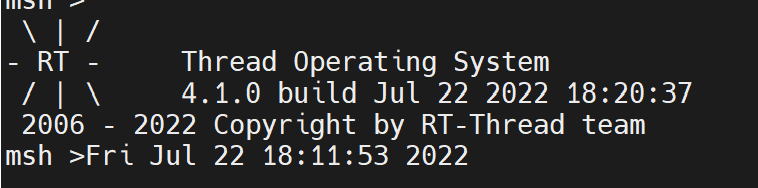

RTC设备使用

自己进行了RTC时钟设备的使用。

1.首先在软件包设置里打开软件模拟RTC，这样就不用配置硬件RTC了。

                rt_err_t ret = RT_EOK;
                rt_uint32_t now;
    
                /* 设置日期 */
                ret = set_date(2022, 7, 22);
                if (ret != RT_EOK)
                {
                    rt_kprintf("set RTC date failed\n");
                    return ret;
                }
    
                /* 设置时间 */
                ret = set_time(18, 11, 50);
                if (ret != RT_EOK)
                {
                    rt_kprintf("set RTC time failed\n");
                    return ret;
                }
    
                /* 延时3秒 */
                rt_thread_mdelay(3000);
    
                /* 获取时间 */
                now = time(RT_NULL);
                rt_kprintf("%s\n", ctime(&now));

大概流程为先行设置当前日期和时间，然后延时3秒后查看当前时间。

由于引用time_t的话会报错，所以设置成了下午老师设置的rt_uint32_t，问题成功解决。

打开串口查看执行情况：

设置时间为18:11:50秒。延时3秒后时间为18:11:53秒。

