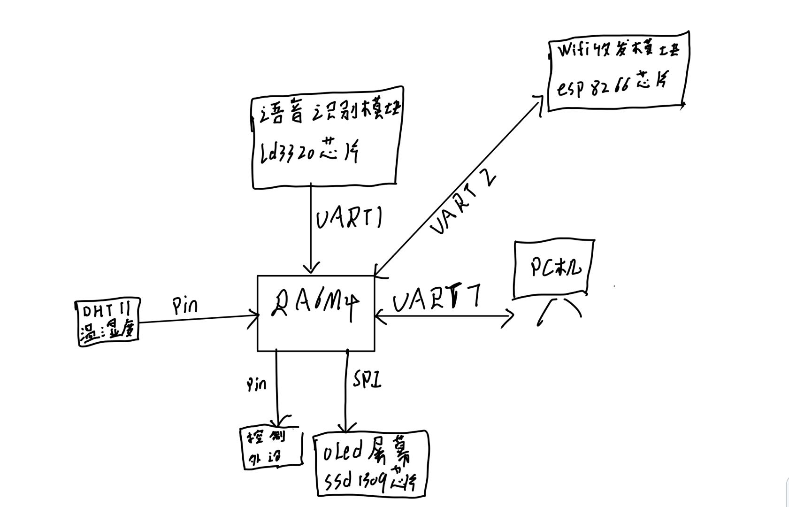

基于语音控制的智能家电系统

视频地址：B站BV1He4y1D764

1.作品主控为瑞萨RA6M4评估板。所用模块有ld3320语音识别模块，0.96寸OLED屏幕，直流电机，esp8266，dht11温湿度传感器。

2.作品实现功能：通过喊出“开灯”，“关灯”，“打开风扇”等指令，系统会自动对应执行操作，同时在oled屏幕上显示对应信息变化。OLED屏幕上显示当前时间，温度，湿度，灯的状态，风扇的状态，同时系统会根据当前的温度值自动调节风扇转速。（屏幕出了点问题，还没修好，暂时割掉了）

3.rt_thread使用情况：

   创建了三个线程。其中，数据接收线程对外部的语音信息进行接收，并通过释放信号量唤醒控制线程。控制线程被唤醒后根据指令，执行相应的动作，并在需要时与OLED线程通信，用来更新OLED屏幕。而OLED屏幕进行实时时间，温湿度的显示。同时运用了软件包中的驱动程序来快捷的驱动外设，如u8g2,dht11等。

4.程序代码

#include "hal_data.h"
#include "rtdevice.h"
#include "rtthread.h"
#include <rthw.h>
#include "u8g2_port.h"

/*变量申明区+++++++++++++++++++++++++++++++++++++++++++++++++++++++++++*/
 static rt_thread_t ld3320;   //语言数据接收线程的句柄
 static rt_thread_t control;  //用于指令控制线程的句柄
 static rt_thread_t oled;     //用于屏幕控制线程的句柄
 rt_size_t rx_size=0;
 static struct rt_semaphore rx_sem;
 static struct rt_semaphore go_sem;
 char cmd='0';
 static rt_device_t serial;

#define OLED_SPI_PIN_RES                     BSP_IO_PORT_00_PIN_07  // j4 23
#define OLED_SPI_PIN_DC                      BSP_IO_PORT_00_PIN_09 // j4  26
#define OLED_SPI_PIN_CS                      BSP_IO_PORT_01_PIN_02  // j2 6

#ifndef rt_hw_us_delay
RT_WEAK void rt_hw_us_delay(rt_uint32_t us)
{
    rt_uint32_t delta;

    us = us * (SysTick->LOAD / (1000000 / RT_TICK_PER_SECOND));
    delta = SysTick->VAL;
    
    while (delta - SysTick->VAL < us) continue;

}
#endif

 /*00000000000000000000000000000000000000000000000000000000000000000000000000000000*/
/*串口中断回调函数，通知线程有数据到达*/
static rt_err_t uart_input(rt_device_t dev, rt_size_t size)
{
    rx_size=size;
    rt_sem_release(&rx_sem);
    return RT_EOK;
}
/*数据接收线程（用于接收语音指令）*/
static void ld3320_serial_entry(void *parameter)
{
  char buff[512]={0};

    while (1)
    {
        rt_sem_take(&rx_sem, RT_WAITING_FOREVER);//信号量到达时进入该线程
        rt_device_read(serial, 0, &buff, rx_size);
        cmd=buff[0];
        rt_kprintf("%c",cmd);
        rt_sem_release(&go_sem);
    
    }

}
/*oled线程，用于接收数据并显示*/
static void data_oled_entry(void *parameter)
{
    u8g2_t u8g2;
    // Initialization
    u8g2_Setup_ssd1306_128x64_noname_f( &u8g2, U8G2_R0, u8x8_byte_rtthread_4wire_hw_spi, u8x8_gpio_and_delay_rtthread);
    u8x8_SetPin(u8g2_GetU8x8(&u8g2), U8X8_PIN_CS, OLED_SPI_PIN_CS);
    u8x8_SetPin(u8g2_GetU8x8(&u8g2), U8X8_PIN_DC, OLED_SPI_PIN_DC);
    u8x8_SetPin(u8g2_GetU8x8(&u8g2), U8X8_PIN_RESET, OLED_SPI_PIN_RES);

        u8g2_InitDisplay(&u8g2);
    u8g2_SetPowerSave(&u8g2, 0);
    
    // Draw Graphics
    /* full buffer example, setup procedure ends in _f */
    u8g2_ClearBuffer(&u8g2);
    u8g2_SetFont(&u8g2, u8g2_font_ncenB08_tr);
    u8g2_DrawStr(&u8g2, 1, 18, "U8g2 on RT-Thread");
    u8g2_SendBuffer(&u8g2);
    
    u8g2_SetFont(&u8g2, u8g2_font_unifont_t_symbols);
    u8g2_DrawGlyph(&u8g2, 112, 56, 0x2603 );
    u8g2_SendBuffer(&u8g2);

}
static void control_entry(void *parameter)
{
    while(1)
    {
        rt_sem_take(&go_sem, RT_WAITING_FOREVER);
        if(cmd=='K')
        {
            rt_pin_write(BSP_IO_PORT_01_PIN_06, PIN_HIGH);//开灯
        }
        if(cmd=='G')
        {
            rt_pin_write(BSP_IO_PORT_01_PIN_06, PIN_LOW);//关灯
        }
        if(cmd=='C')
        {
           rt_pin_write(BSP_IO_PORT_01_PIN_04,PIN_HIGH);
        }
        if(cmd=='M')
        {
            rt_pin_write(BSP_IO_PORT_01_PIN_04,PIN_LOW);
        }
    }

}
int main(void)
{
  ld3320=rt_thread_create("ld3320", ld3320_serial_entry, RT_NULL, 2048, 20, 100);
  control=rt_thread_create("control",control_entry,RT_NULL,2048,22,100);
  oled=rt_thread_create("oled",data_oled_entry,RT_NULL,2048,25,100);
  rt_sem_init(&rx_sem, "rx_sem", 0, RT_IPC_FLAG_FIFO);
  rt_sem_init(&go_sem, "go_sem", 0, RT_IPC_FLAG_FIFO);
  if(ld3320!=RT_NULL)
  {
      rt_thread_startup(ld3320);
  }
  if(control!=RT_NULL)
  {
      rt_thread_startup(control);
  }
  if(oled!=RT_NULL)
  {
      rt_thread_startup(oled);
  }
  serial= rt_device_find("uart1");
  rt_device_open(serial, RT_DEVICE_FLAG_DMA_RX);
  rt_device_set_rx_indicate(serial, uart_input);

  //hal_entry();
  return 0;
}

