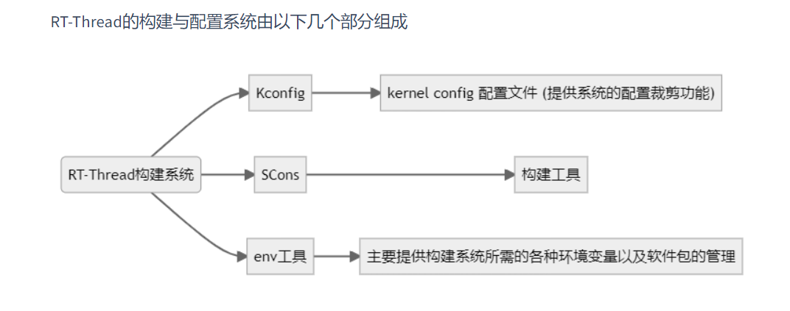
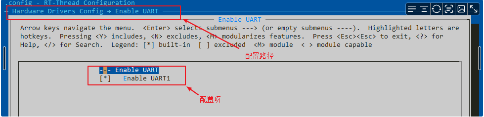
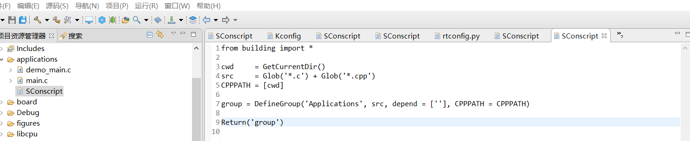
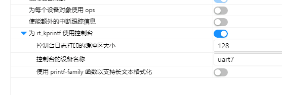
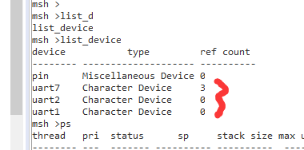
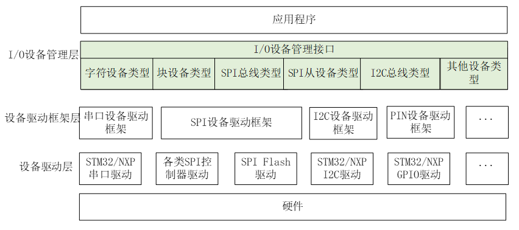
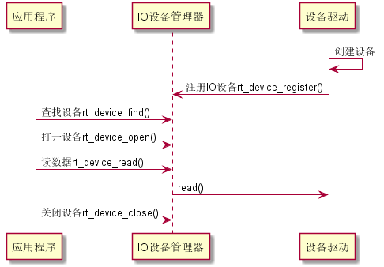
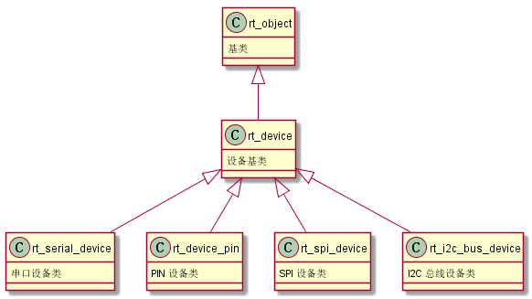

# 7.22学习记录

上午的学习内容

1、解决github提交请求冲突的问题

2、ulog日志打印信息的使用

**日志的定义**：日志是将软件运行的状态、过程等信息，输出到不同的介质中（例如：文件、控制台、显示屏等），并进行显示和保存。为软件调试、维护过程中的问题追溯、性能分析、系统监控、故障预警等功能，提供参考依据。可以说，日志的使用，几乎占用的软件生命周期的至少 80% 的时间。

**日志的重要性**：对于操作系统而言，由于其软件的复杂度非常大，单步调试在一些场景下并不适合，所以日志组件在操作系统上几乎都是标配。完善的日志系统也能让操作系统的调试事半功倍

##### 配置选项


**日志级别代表了日志的重要性**，在 ulog 中由高到低，有如下几个日志级别：

**LOG_LVL_ASSERT**    断言    发生无法处理、致命性的的错误，以至于系统无法继续运行的断言日志
**LOG_LVL_ERROR**    错误    发生严重的、不可修复的错误时输出的日志属于错误级别日志
**LOG_LVL_WARNING**    警告    出现一些不太重要的、具有可修复性的错误时，会输出这些警告日志
**LOG_LVL_INFO**    信息    给本模块上层使用人员查看的重要提示信息日志，例如：初始化成功，当前工作状态等。该级别日志一般在量产时依旧保留
**LOG_LVL_DBG**    调试    给本模块开发人员查看的调试日志，该级别日志一般在量产时关闭

**ulog 支持的日志格式可以配置**

分别可以配置：浮点型数字的支持（传统的 rtdbg/rt_kprintf 均不支持浮点数日志）、带颜色的日志、时间信息（包括时间戳）、级别信息、标签信息、线程信息。

具体情况具体学习使用。

3、i2c软件模拟，调试信息打印

不懂这个sensor对I2C的函数对接以及使用，所以我看不懂调试信息以及出处！，**待修改**

4、Kconfig和SCons的学习



**Kconfig 采用 `#` 作为注释标记符**

```c
# This is a comment
```

#### config语句

config 定义了一组新的配置选项

以下为 RT-Thread 系统中 config 语句的示例

```markdown
config BSP_USING_GPIO   #BSP_USING_GPIO 是配置选项的名称
    bool "Enable GPIO"  #表示配置选项的类型,有5种
    select RT_USING_PIN #是反向依赖关系的意思即当前配置选项被选中则
                        #RT_USING_PIN 就会被选中
    default y           # 表示配置选项的默认值，bool 类型的默认值可以是 y/n
    help                #帮助信息
    config gpio         #帮助信息
```

config 表示一个配置选项的开始，紧跟着的 BSP_USING_GPIO 是配置选项的名称，config 下面几行定义了该配置选项的属性。属性可以是该配置选项的。

配置界面的选项后，最终可在 rtconfig.h 文件中生成如下两个宏

```c
#define RT_USING_PIN
#define BSP_USING_GPIO
```

**menu/endmenu语句**，menu 语句用于生成菜单。

以下为 RT-Thread 系统中 menu/endmenu 语句的示例

```c
menu "Hardware Drivers Config"
    menuconfig BSP_USING_UART
        bool "Enable UART"
        default y
        select RT_USING_SERIAL
        if BSP_USING_UART
            config BSP_USING_UART1
                bool "Enable UART1"
                default y

            config BSP_UART1_RX_USING_DMA
                bool "Enable UART1 RX DMA"
                depends on BSP_USING_UART1 && RT_SERIAL_USING_DMA
                default n
        endif
endmenu
```

if/endif 语句是一个条件判断，定义了一个 if 结构

depends on 表示依赖某个配置选项，depends on BSP_USING_UART1 && RT_SERIAL_USING_DMA 表示只有当 BSP_USING_UART1 和 RT_SERIAL_USING_DMA 配置选项同时被选中时，当前配置选项的提示信息才会出现，才能设置当前配置选项.



#### SCons语法

SCons 是一套由 Python 语言编写的开源构建系统，类似于 GNU Make。它采用不同于通常 Makefile 文件的方式，而是使用 SConstruct 和 SConscript 文件来替代。这些文件也是 Python 脚本，能够使用标准的 Python 语法来编写。所以在 SConstruct、SConscript 文件中可以调用 Python 标准库进行各类复杂的处理，而不局限于 Makefile 设定的规则

RT-Thread中Scons的脚本结构

SCons 使用 SConscript 和 SConstruct 文件来组织源码结构并进行构建，SConstruct是scons构建的主脚本，SConscript存放在源代码的子目录下，通常放在项目的子目录，以达到分层构建的目的。一个项目 (BSP) 只有一 SConstruct，但是会有多个 SConscript。一般情况下，每个存放有源代码的子目录下都会放置一个 SConscript。

```c
/
  -- rtconfig.py    ---- 控制SCons构建的配置文件，存放了如工具链，构建参数等配置。
  -- SConscript       //SConscript存放在源代码的子目录
  -- SConstruct    ---- SCons的入口脚本，初始化了SCons构建rt-thread所需的必要环境
  -- Kconfig        ---- 顶层Kconfig文件，menuconfig的入口Kconfig文件
  -- rt-thread/
  --- src/
  ---- SConscript   ---- 各级源码的scons子脚本，控制当前级别下的源码构建行为
  ---- Kconfig      ---- 各级源码的Kconfig子脚本，存放当前级别下的配置项
  ---- **.c
```

RT-Thread搭建了如图所示的构建框架，其中包括了一份SCons的入口脚本（SConstruct），以及分散在各级源码的SCons子脚本（SConscript），还有一份便于配置构建行为的配置脚本（rtconfig.py）同时，RT-Thread也在SCons标准接口的基础上，提供了一组用于组织源码工程的扩展接口。开发者在使用时，可以借助RT-Thread提供的扩展接口，更方便的完成源码的组织与配置

SCons基本命令

**scons --dist**
搭建项目框架，使用此命令会在 BSP 目录下生成 dist 目录，这便是开发项目的目录结构，包含了RT-Thread源码及BSP相关工程，不相关的BSP文件夹及libcpu都会被移除，并且可以随意拷贝此工程到任何目录下使用

SConscript(scripts, [exports, variant_dir, duplicate])

读取新的 SConscript 文件，SConscript() 函数的参数描述如下所示：

| **参数**      | **描述**                         |
| ----------- | ------------------------------ |
| dirs        | 导入的SConscript，路径+名称            |
| exports     | 导出一个变量（可选）                     |
| variant_dir | 指定生成的目标文件的存放路径（可选）             |
| duiplicate  | 设定是否拷贝或链接源文件到 variant_dir （可选） |

**GetCurrentDir()**

获取当前脚本所在路径，例如：

```c
cwd     = GetCurrentDir() # 获取当前脚本的路径
```

**Glob(pattern)**

返回参与构建的对象，对象满足pattern模式匹配的列表。例如，获取当前Sconscript所在路径下的所有 .c 文件：

```c
src = Glob('*.c')
```

**GlobSubDir(sub_dir, ext_name)**
对目录下所有文件（包含子目录）进行Glob

**GetDepend(depend)**
查看是否定义了宏依赖，例如：

```c
if GetDepend('MSH_USING_BUILT_IN_COMMANDS'): # 判断是否启用MSH的内建命令
    src += ['cmd.c']                         #添加C文件
```

Scons 函数在 SConscript 中的经典示例学习

**一个基本的Group解析**

```c
# 导入RT-Thread的自定义构建函数，几乎每一个RT-Thread的Sconscript都需要这么做。
# 只有导入了building模块，才可以使用2.2.2介绍的RT-Thread自定义Scons函数
from building import * 

cwd     = GetCurrentDir() # 获取当前脚本的路径
CPPPATH = [cwd]           # 将当前路径加入构建搜索的头文件路径
src     = Split('''       
shell.c
msh.c
''')          
       #也可以等效成：src = ['shell.c', 'msh.c']

if GetDepend('MSH_USING_BUILT_IN_COMMANDS'): # 判断是否启用MSH的内建命令
    src += ['cmd.c']

if GetDepend('DFS_USING_POSIX'): # 判断是否启用文件系统的POSIX接口
    src += ['msh_file.c']

# 使用DefineGroup创建一个名为Finsh的组
# 该Group是否被添加到工程中，参与编译，取决于depend的宏是否在Kconfig中被使能。
# 即上述的头文件路径和C文件是否被编译，取决于用户在Kconfig中是否使能了RT_USING_FINSH
group = DefineGroup('Finsh', src, depend = ['RT_USING_FINSH'], CPPPATH = CPPPATH) 

Return('group') # 将当前脚本指定的构建对象返回上级SCons脚本
```

src 和 depends参数是必选项，即便你不想添加任何C文件，也需要定义一个空的列表

```c
src = []
group = DefineGroup('Finsh', src, depend = [''], CPPPATH = CPPATH) 
//例子 applications文件夹的
src     = Glob('*.c') + Glob('*.cpp')    //添加头文件
CPPPATH = [cwd]
group = DefineGroup('Applications', src, depend = [''], CPPPATH = CPPPATH)
```

**DefineGroup** 创建一个名为 Finsh 的组，这个组也就对应 MDK 或者 IAR 中的分组。这个组的源代码文件为 src 指定的文件，如果depend 为空表示该组不依赖任何 rtconfig.h 的宏

**CPPPATH =CPPPATH** 表示将当前路径添加到系统的头文件路径中。左边的 CPPPATH 是 DefineGroup 中内置参数，表示头文件路径。右边的 CPPPATH 是本文件上面一行定义的。这样我们就可以在其他源码中引用 drivers 目录下的头文件了

**案例分析二**



```c
cwd = GetCurrentDir()  # 获取当前脚本的路径**

src = Glob('*.c')          #添加C文件

CPPPATH =[cwd]      #表示将当前路径添加到系统的头文件路径中
#使用DefineGroup创建一个名为Applications的组
#depend 为空表示该组不依赖任何 rtconfig.h 的宏
group = DefineGroup('Applications', src, depend = [''], CPPPATH = CPPPATH)

Return('group')        # 将当前脚本指定的构建对象返回上级SCons脚本
```

src = Glob('*.c') 这个语句就可以添加任意的x.c头文件，不用修改

## 下午的作业

1、WDT看门狗使用起来

```c
msh >list_device   //查看看门狗设备的名称
device           type         ref count
-------- -------------------- ----------
humi_aht Sensor Device        0
temp_aht Sensor Device        0
wdt      Miscellaneous Device 0
i2c1     I2C Bus              0
pin      Miscellaneous Device 0
uart1    Character Device     2
/**************************************************************/
//案例程序
#include "ch32v30x.h"
#include <rtthread.h>
#include <rthw.h>
#include "drivers/pin.h"
#include <board.h>
#include <drivers/watchdog.h>

//看门狗设备名称
#define WDT_DEVICE_NAME "wdt"

//创建看门狗句柄
static rt_device_t wdg_dev = RT_NULL;

//看门狗线程
static rt_thread_t watchdog_thread = RT_NULL;
static void watchdog_thread_entry(void* parameter);
//看门狗喂狗的钩子函数
static void wdg_idle_hook(void* paramter);

//创建看门狗线程
void watchdog_test(void* parameter)
{
    watchdog_thread = rt_thread_create("watchdog",
                    watchdog_thread_entry,
                    RT_NULL,
                    512,
                    16,
                    20);
    if (watchdog_thread != RT_EOK)
    {
        rt_thread_startup(watchdog_thread);

    }
}

static void watchdog_thread_entry(void* parameter)
{
    rt_uint32_t timer_count = 5;  //看门溢出时间
    //查找看门狗设备是否存在
    wdg_dev = rt_device_find(WDT_DEVICE_NAME);
    if (wdg_dev != RT_NULL)
    {
        rt_kprintf("find wdg device %s\n", WDT_DEVICE_NAME);
    }
    //初始化看门狗 成功返回rt_eok
    rt_device_init(wdg_dev);
    //设置看门狗溢出时间 5s
    rt_device_control(wdg_dev, RT_DEVICE_CTRL_WDT_SET_TIMEOUT, &timer_count); //(void*)会引起中断
    //启动看门狗
    rt_device_control(wdg_dev, RT_DEVICE_CTRL_WDT_START, RT_NULL);
    //设置空闲线程回调函数
    rt_thread_idle_sethook(wdg_idle_hook);

}

static void wdg_idle_hook(void* paramter)
{
    //在空闲线程的回调函数里面喂狗
    rt_device_control(wdg_dev, RT_DEVICE_CTRL_WDT_KEEPALIVE, RT_NULL);
    rt_kprintf("wdg keepalive\n");
    rt_thread_mdelay(1980);
}

MSH_CMD_EXPORT(watchdog_test, wdg_demo);
```

命令行输入watchdog_test之后

```c
wdg keepalive   //喂狗 2s喂一次
wdg keepalive
wdg keepalive
wdg keepalive
wdg keepalive
```

2、RTC使用起来

RTC （Real-Time Clock）实时时钟可以提供精确的实时时间，它可以用于产生年、月、日、时、分、秒等信息。目前实时时钟芯片大多采用精度较高的晶体振荡器作为时钟源。有些时钟芯片为了在主电源掉电时还可以工作，会外加电池供电，使时间信息一直保持有效。

访问rtc时间

应用程序通过 RTC 设备管理接口来访问 RTC 硬件，相关接口如下所示：

| **函数**     | **描述**           |
| ---------- | ---------------- |
| set_date() | 设置日期，年、月、日（当地时区） |
| set_time() | 设置时间，时、分、秒（当地时区） |
| time()     | 获取时间戳（格林威治时间）    |
| stime()    | 设置时间戳（格林威治时间）    |

设置日期

通过如下函数设置 RTC 设备当前当地时区日期值：

```c
rt_err_t set_date(rt_uint32_t year, rt_uint32_t month, rt_uint32_t day)
```

| **参数**    | **描述**         |
| --------- | -------------- |
| year      | 待设置生效的年份       |
| month     | 待设置生效的月份       |
| day       | 待设置生效的日        |
| **返回**    | ——             |
| RT_EOK    | 设置成功           |
| -RT_ERROR | 失败，没有找到 rtc 设备 |
| 其他错误码     | 失败             |

设置时间

通过如下函数设置 RTC 设备当前当地时区时间值：

```c
rt_err_t set_time(rt_uint32_t hour, rt_uint32_t minute, rt_uint32_t second)
```

| **参数**    | **描述**         |
| --------- | -------------- |
| hour      | 待设置生效的时        |
| minute    | 待设置生效的分        |
| second    | 待设置生效的秒        |
| **返回**    | ——             |
| RT_EOK    | 设置成功           |
| -RT_ERROR | 失败，没有找到 rtc 设备 |
| 其他错误码     | 失败             |

获取时间

使用到 C 标准库中的时间 API 获取时间戳（格林威治时间）：

```c
time_t time(time_t *t)
```

| **参数** | **描述** |
| ------ | ------ |
| t      | 时间数据指针 |
| **返回** | ——     |
| 当前时间值  |        |

使用示例如下所示：

```c
static int rtc_sample(int argc, char *argv[])
{
    rt_err_t ret = RT_EOK;
    time_t now;

    rt_device_t rtc_dev = RT_NULL;

    rtc_dev = rt_device_find("rtc");
    if (rtc_dev != RT_NULL)
    {
        rt_kprintf("find soft rtc device soft rtc\n");
    }

    now = time(RT_NULL);
    //ctime()获取此时时间以字符串的形式获取
    rt_kprintf("no set  date %s\n", ctime(&now));

    ret = set_date(2022, 7, 22);
    if (ret != RT_EOK)
    {
        rt_kprintf("set date filed\n");
        return ret;   //设置失败之后查看错误代码

    }

    ret = set_time(19, 48, 0);

    if (ret != RT_EOK)
    {
        rt_kprintf("set time filed\n");
        return ret;
    }
    now = time(RT_NULL);
    //ctime()获取此时时间以字符串的形式获取
    rt_kprintf("seted  date %s\n", ctime(&now));


    return ret;
}

MSH_CMD_EXPORT(rtc_sample, soft_rtc);
```

3、有条件的同学，可以尝试切换rt_kprintf输出终端





4、以serial.c为例，梳理串口的驱动对接

RT-Thread 提供了一套简单的 I/O 设备模型框架，如下图所示，它位于硬件和应用程序之间，共分成三层，从上到下分别是 I/O 设备管理层、设备驱动框架层、设备驱动层



应用程序通过 I/O 设备管理接口获得正确的设备驱动，然后通过这个设备驱动与底层 I/O 硬件设备进行数据（或控制）交互

设备驱动框架层是对同类硬件设备驱动的抽象，将不同厂家的同类硬件设备驱动中相同的部分抽取出来，将不同部分留出接口，由驱动程序实现。

设备驱动层是一组驱使硬件设备工作的程序，实现访问硬件设备的功能。它负责创建和注册 I/O 设备，对于操作逻辑简单的设备，可以不经过设备驱动框架层，直接将设备注册到 I/O 设备管理器中，使用序列图如下图所示，主要有以下 2 点：

- 设备驱动根据设备模型定义，创建出具备硬件访问能力的设备实例，将该设备通过 `rt_device_register()` 接口注册到 I/O 设备管理器中。

- 应用程序通过 `rt_device_find()` 接口查找到设备，然后使用 I/O 设备管理接口来访问硬件。



I/O 设备模型
RT-Thread 的设备模型是建立在内核对象模型基础之上的，设备被认为是一类对象，被纳入对象管理器的范畴。每个设备对象都是由基对象派生而来，每个具体设备都可以继承其父类对象的属性，并派生出其私有属性，下图是设备对象的继承和派生关系示意图。



# **未完待续补全！**
