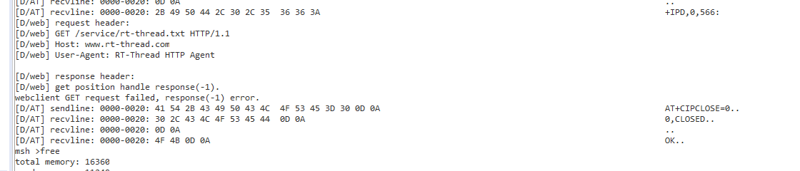
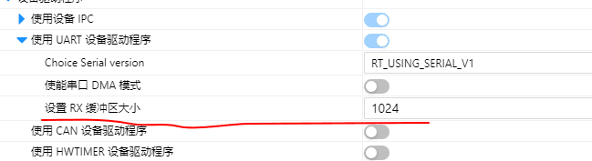

# 今天的作业

## 1. ESP8266 在自己板子中跑起来

CH32V307VCT6的板子基础

串口7 ,esp8266的rx接pc2,tx接pc3

串口2  TX PA2,RX PA3

打开的AT_DEBUG宏定义和AT_PRINT_RAW_CMD之后打印调试日志

```c
\ | /
- RT -     Thread Operating System
 / | \     4.0.4 build Jul 24 2022
 2006 - 2021 Copyright by rt-thread team
msh >[D/AT] recvline: 0000-0020: 0D 0A                                                                                                 ..
[D/AT] recvline: 0000-0020: 4F 4B 0D 0A                                                                                           OK..
[D/AT] sendline: 0000-0020: 41 54 2B 52 53 54 0D 0A                                                                               AT+RST..
[D/AT] recvline: 0000-0020: 0D 0A                                                                                                 ..
[D/AT] recvline: 0000-0020: 4F 4B 0D 0A                                                                                           OK..
[D/AT] recvline: 0000-0020: 57 49 46 49 20 44 49 53  43 4F 4E 4E 45 43 54 0D  0A                                                  WIFI DISCONNECT..
[D/AT] recvline: 0000-0020: 0D 0A                                                                                                 ..
[D/AT] recvline: 0000-0020: 20 65 74 73 20 4A 61 6E  20 20 38 20 32 30 31 33  2C 72 73 74 20 63 61 75  73 65 3A 32 2C 20 62 6F     ets Jan  8 2013,rst cause:2, bo
[D/AT] recvline: 0020-0040: 6F 74 20 6D 6F 64 65 3A  28 33 2C 36 29 0D 0A                                                         ot mode:(3,6)..
[D/AT] recvline: 0000-0020: 0D 0A                                                                                                 ..
[D/AT] recvline: 0000-0020: 6C 6F 61 64 20 30 78 34  30 31 30 30 30 30 30 2C  20 6C 65 6E 20 31 38 35  36 2C 20 72 6F 6F 6D 20    load 0x40100000, len 1856, room
[D/AT] recvline: 0020-0040: 31 36 20 0D 0A                                                                                        16 ..
[D/AT] recvline: 0000-0020: 74 61 69 6C 20 30 0D 0A                                                                               tail 0..
[D/AT] recvline: 0000-0020: 63 68 6B 73 75 6D 20 30  78 36 33 0D 0A                                                               chksum 0x63..
[D/AT] recvline: 0000-0020: 6C 6F 61 64 20 30 78 33  66 66 65 38 30 30 30 2C  20 6C 65 6E 20 37 37 36  2C 20 72 6F 6F 6D 20 38    load 0x3ffe8000, len 776, room 8
[D/AT] recvline: 0020-0040: 20 0D 0A                                                                                               ..
[D/AT] recvline: 0000-0020: 74 61 69 6C 20 30 0D 0A                                                                               tail 0..
[D/AT] recvline: 0000-0020: 63 68 6B 73 75 6D 20 30  78 30 32 0D 0A                                                               chksum 0x02..
[D/AT] recvline: 0000-0020: 6C 6F 61 64 20 30 78 33  66 66 65 38 33 31 30 2C  20 6C 65 6E 20 35 35 32  2C 20 72 6F 6F 6D 20 38    load 0x3ffe8310, len 552, room 8
[D/AT] recvline: 0020-0040: 20 0D 0A                                                                                               ..
[D/AT] recvline: 0000-0020: 74 61 69 6C 20 30 0D 0A                                                                               tail 0..
[D/AT] recvline: 0000-0020: 63 68 6B 73 75 6D 20 30  78 37 39 0D 0A                                                               chksum 0x79..
[D/AT] recvline: 0000-0020: 63 73 75 6D 20 30 78 37  39 0D 0A                                                                     csum 0x79..
[D/AT] recvline: 0000-0020: 0D 0A                                                                                                 ..
[D/AT] recvline: 0000-0020: 32 6E 64 20 62 6F 6F 74  20 76 65 72 73 69 6F 6E  20 3A 20 31 2E 35 0D 0A                             2nd boot version : 1.5..
[D/AT] recvline: 0000-0020: 20 20 53 50 49 20 53 70  65 65 64 20 20 20 20 20  20 3A 20 34 30 4D 48 7A  0D 0A                        SPI Speed      : 40MHz..
[D/AT] recvline: 0000-0020: 20 20 53 50 49 20 4D 6F  64 65 20 20 20 20 20 20  20 3A 20 44 4F 55 54 0D  0A                           SPI Mode       : DOUT..
[D/AT] recvline: 0000-0020: 20 20 53 50 49 20 46 6C  61 73 68 20 53 69 7A 65  20 26 20 4D 61 70 3A 20  38 4D 62 69 74 28 35 31      SPI Flash Size & Map: 8Mbit(51
[D/AT] recvline: 0020-0040: 32 4B 42 2B 35 31 32 4B  42 29 0D 0A                                                                  2KB+512KB)..
[D/AT] recvline: 0000-0020: 6A 75 6D 70 20 74 6F 20  72 75 6E 20 75 73 65 72  31 20 40 20 31 30 30 30  0D 0A                      jump to run user1 @ 1000..
[D/AT] recvline: 0000-0020: 0D 0A                                                                                                 ..
[D/AT] recvline: 0000-0020: FFFFFF8C FFFFFFE2 02 FFFFFFEC 12 FFFFFF82 6F FFFFFFEC  FFFFFF93 73 FFFFFF83 FFFFFFF3 6E 7C FFFFFFEC 0C  FFFFFF8C 0C FFFFFF8F 7C 72 6C FFFFFF8C FFFFFFE2  73 FFFFFF92 6C FFFFFF8C 6C 13 FFFFFF8C 0C
......o..s..n|.....|rl..s.l.l...
[D/AT] recvline: 0020-0040: 0C 0C 6C 60 02 FFFFFF8C FFFFFFE2 73  FFFFFF92 6C FFFFFFEC 6C 13 FFFFFF8C 0C 0C  0C 6C 60 02 FFFFFF8C FFFFFFE2 73 FFFFFF92  6C 0C FFFFFF8E FFFFFF9E 00 FFFFFF8C 0C 0C    ..l`...s.l.l.....l`...s.l.....
..
[D/AT] recvline: 0040-0060: 6C 6C 60 02 73 6C FFFFFF8F FFFFFF83  73 6C FFFFFF8C FFFFFF9F FFFFFFE2 FFFFFF8C 62 0C  6C FFFFFF8C 63 73 7C 0C FFFFFF8E 63  70 60 FFFFFFEC 6C FFFFFFEC 62 12 6C    ll`.sl..sl....b.l.cs|..cp`.l.b.l
[D/AT] recvline: 0060-0080: 72 FFFFFF8C 6C 63 FFFFFFEC FFFFFFF3 6F FFFFFFEE  FFFFFF80 13 6E 6E FFFFFFE2 10 02 0C  02 FFFFFF8C 6C FFFFFFF3 70 03 0C 6C  0C FFFFFF8C 0C 6C FFFFFF8C FFFFFF8F FFFFFF8C 0C    r.lc..o...nn......l.p..l
...l....
[D/AT] recvline: 0080-00A0: FFFFFF8C 0C 0C FFFFFF8E 1F FFFFFF8F 6C FFFFFF8E  0E 6C FFFFFF80 02 6E FFFFFFFC 00 FFFFFF8C  FFFFFF9F FFFFFFE3 FFFFFF8C 62 0C 6C FFFFFFEC FFFFFF8E  1C 70 0C 0C 02 02 FFFFFF8C FFFFFF9F    ......l..l..
n......b.l...p......
[D/AT] recvline: 00A0-00C0: FFFFFFE3 FFFFFF8C 62 0C 6C 0C FFFFFF8C 63  70 72 6C 72 6C 0D 0A                                                         ..b.l..cprlrl..
[D/AT] recvline: 0000-0020: 41 69 2D 54 68 69 6E 6B  65 72 20 54 65 63 68 6E  6F 6C 6F 67 79 20 43 6F  2E 20 4C 74 64 2E 0D 0A    Ai-Thinker Technology Co. Ltd...
[D/AT] recvline: 0000-0020: 0D 0A                                                                                                 ..
[D/AT] recvline: 0000-0020: 72 65 61 64 79 0D 0A                                                                                  ready..
[D/AT] sendline: 0000-0020: 41 54 45 30 0D 0A                                                                                     ATE0..
[D/AT] recvline: 0000-0020: 41 54 45 30 0D 0D 0A                                                                                  ATE0...
[D/AT] recvline: 0000-0020: 0D 0A                                                                                                 ..
[D/AT] recvline: 0000-0020: 4F 4B 0D 0A                                                                                           OK..
[D/AT] sendline: 0000-0020: 41 54 2B 43 57 4D 4F 44  45 3D 31 0D 0A                                                               AT+CWMODE=1..
[D/AT] recvline: 0000-0020: 0D 0A                                                                                                 ..
[D/AT] recvline: 0000-0020: 4F 4B 0D 0A                                                                                           OK..
[D/AT] sendline: 0000-0020: 41 54 2B 47 4D 52 0D 0A                                                                               AT+GMR..
[D/AT] recvline: 0000-0020: 41 54 20 76 65 72 73 69  6F 6E 3A 31 2E 32 2E 30  2E 30 28 4A 75 6C 20 20  31 20 32 30 31 36 20 32    AT version:1.2.0.0(Jul  1 2016 2
[D/AT] recvline: 0020-0040: 30 3A 30 34 3A 34 35 29  0D 0A                                                                        0:04:45)..
[D/AT] recvline: 0000-0020: 53 44 4B 20 76 65 72 73  69 6F 6E 3A 31 2E 35 2E  34 2E 31 28 33 39 63 62  39 61 33 32 29 0D 0A       SDK version:1.5.4.1(39cb9a32)..
[D/AT] recvline: 0000-0020: 41 69 2D 54 68 69 6E 6B  65 72 20 54 65 63 68 6E  6F 6C 6F 67 79 20 43 6F  2E 20 4C 74 64 2E 0D 0A    Ai-Thinker Technology Co. Ltd...
[D/AT] recvline: 0000-0020: 76 31 2E 35 2E 34 2E 31  2D 61 20 4E 6F 76 20 33  30 20 32 30 31 37 20 31  35 3A 35 34 3A 32 39 0D    v1.5.4.1-a Nov 30 2017 15:54:29.
[D/AT] recvline: 0020-0040: 0A                                                                                                    .
[D/AT] recvline: 0000-0020: 4F 4B 0D 0A                                                                                           OK..
[D/AT] sendline: 0000-0020: 41 54 2B 43 49 50 4D 55  58 3D 31 0D 0A                                                               AT+CIPMUX=1..
[D/AT] recvline: 0000-0020: 0D 0A                                                                                                 ..
[D/AT] recvline: 0000-0020: 4F 4B 0D 0A                                                                                           OK..
[D/AT] sendline: 0000-0020: 41 54 2B 43 57 4A 41 50  3D 22 4D 49 38 22 2C 22  7A 68 73 31 32 33 34 35  36 3A 22 0D 0A             AT+CWJAP="MI8","zhs123456:"..
[D/AT] recvline: 0000-0020: 57 49 46 49 20 43 4F 4E  4E 45 43 54 45 44 0D 0A                                                      WIFI CONNECTED..
[D/AT] recvline: 0000-0020: 57 49 46 49 20 47 4F 54  20 49 50 0D 0A                                                               WIFI GOT IP..
[D/AT] recvline: 0000-0020: 0D 0A                                                                                                 ..
[D/AT] recvline: 0000-0020: 4F 4B 0D 0A                                                                                           OK..
MCU: CH32V307
SysClk: 144000000Hz
www.wch.cn
[D/AT] sendline: 0000-0020: 41 54 2B 43 49 46 53 52  0D 0A                                                                        AT+CIFSR..
[D/AT] recvline: 0000-0020: 2B 43 49 46 53 52 3A 53  54 41 49 50 2C 22 31 39  32 2E 31 36 38 2E 34 33  2E 37 30 22 0D 0A          +CIFSR:STAIP,"192.168.43.70"..
[D/AT] recvline: 0000-0020: 2B 43 49 46 53 52 3A 53  54 41 4D 41 43 2C 22 36  30 3A 30 31 3A 39 34 3A  34 61 3A 39 66 3A 36 38    +CIFSR:STAMAC,"60:01:94:4a:9f:68
[D/AT] recvline: 0020-0040: 22 0D 0A                                                                                              "..
[D/AT] recvline: 0000-0020: 0D 0A                                                                                                 ..
[D/AT] recvline: 0000-0020: 4F 4B 0D 0A                                                                                           OK..
[D/AT] sendline: 0000-0020: 41 54 2B 43 49 50 53 54  41 3F 0D 0A                                                                  AT+CIPSTA?..
[D/AT] recvline: 0000-0020: 2B 43 49 50 53 54 41 3A  69 70 3A 22 31 39 32 2E  31 36 38 2E 34 33 2E 37  30 22 0D 0A                +CIPSTA:ip:"192.168.43.70"..
[D/AT] recvline: 0000-0020: 2B 43 49 50 53 54 41 3A  67 61 74 65 77 61 79 3A  22 31 39 32 2E 31 36 38  2E 34 33 2E 31 22 0D 0A    +CIPSTA:gateway:"192.168.43.1"..
[D/AT] recvline: 0000-0020: 2B 43 49 50 53 54 41 3A  6E 65 74 6D 61 73 6B 3A  22 32 35 35 2E 32 35 35  2E 32 35 35 2E 30 22 0D    +CIPSTA:netmask:"255.255.255.0".
[D/AT] recvline: 0020-0040: 0A                                                                                                    .
[D/AT] recvline: 0000-0020: 0D 0A                                                                                                 ..
[D/AT] recvline: 0000-0020: 4F 4B 0D 0A                                                                                           OK..
[D/AT] sendline: 0000-0020: 41 54 2B 43 49 50 44 4E  53 5F 43 55 52 3F 0D 0A                                                      AT+CIPDNS_CUR?..
[D/AT] recvline: 0000-0020: 0D 0A                                                                                                 ..
[D/AT] recvline: 0000-0020: 45 52 52 4F 52 0D 0A                                                                                  ERROR..
[D/AT] sendline: 0000-0020: 41 54 2B 43 49 50 44 4F  4D 41 49 4E 3D 22 6C 69  6E 6B 2E 72 74 2D 74 68  72 65 61 64 2E 6F 72 67    AT+CIPDOMAIN="link.rt-thread.org
[D/AT] sendline: 0020-0040: 22 0D 0A                                                                                              "..
[D/AT] recvline: 0000-0020: 2B 43 49 50 44 4F 4D 41  49 4E 3A 31 31 38 2E 33  31 2E 31 35 2E 31 35 32  0D 0A                      +CIPDOMAIN:118.31.15.152..
[D/AT] recvline: 0000-0020: 0D 0A                                                                                                 ..
[D/AT] recvline: 0000-0020: 4F 4B 0D 0A                                                                                           OK..
[D/AT] sendline: 0000-0020: 41 54 2B 43 49 50 53 54  41 52 54 3D 30 2C 22 55  44 50 22 2C 22 31 31 38  2E 33 31 2E 31 35 2E 31    AT+CIPSTART=0,"UDP","118.31.15.1
[D/AT] sendline: 0020-0040: 35 32 22 2C 38 31 30 31  0D 0A                                                                        52",8101..
[D/AT] recvline: 0000-0020: 30 2C 43 4F 4E 4E 45 43  54 0D 0A                                                                     0,CONNECT..
[D/AT] recvline: 0000-0020: 0D 0A                                                                                                 ..
[D/AT] recvline: 0000-0020: 4F 4B 0D 0A                                                                                           OK..
[D/AT] sendline: 0000-0020: 41 54 2B 43 49 50 53 45  4E 44 3D 30 2C 31 32 0D  0A                                                  AT+CIPSEND=0,12..
[D/AT] recvline: 0000-0020: 0D 0A                                                                                                 ..
[D/AT] recvline: 0000-0020: 4F 4B 0D 0A                                                                                           OK..
[D/AT] recvline: 0000-0020: 3E                                                                                                    >
[D/AT] sendline: 0000-0020: 00 67 08 FFFFFF9B 51 FFFFFFA6 6F 00  00 04 00 04                                                                  .g..Q.o.....
[D/AT] recvline: 0000-0020: 20 0D 0A                                                                                               ..
[D/AT] recvline: 0000-0020: 52 65 63 76 20 31 32 20  62 79 74 65 73 0D 0A                                                         Recv 12 bytes..
[D/AT] recvline: 0000-0020: 0D 0A                                                                                                 ..
[D/AT] recvline: 0000-0020: 53 45 4E 44 20 4F 4B 0D  0A                                                                           SEND OK..
[D/AT] recvline: 0000-0020: 0D 0A                                                                                                 ..
[D/AT] recvline: 0000-0020: 2B 49 50 44 2C 30 2C 31  3A                                                                           +IPD,0,1:
[D/AT] urc_recv: 0000-0020: 01                                                                                                    .
[D/AT] sendline: 0000-0020: 41 54 2B 43 49 50 43 4C  4F 53 45 3D 30 0D 0A                                                         AT+CIPCLOSE=0..
[D/AT] recvline: 0000-0020: 30 2C 43 4C 4F 53 45 44  0D 0A                                                                        0,CLOSED..
[D/AT] recvline: 0000-0020: 0D 0A                                                                ..
[D/AT] recvline: 0000-0020: 4F 4B 0D 0A                                                                                       OK..

msh >ifconfig
network interface device: esp0 (Default)
MTU: 1500
MAC: 60 01 94 4a 9f 68
FLAGS: UP LINK_UP INTERNET_UP DHCP_DISABLE
ip address: 192.168.43.70
gw address: 192.168.43.1
net mask  : 255.255.255.0
dns server #0: 0.0.0.0
dns server #1: 0.0.0.0
```

## 2. 添加 Webclient 软件包并跑起来



解决方法



```c
msh >web_get_test
[16274] D/web: host address: www.rt-thread.com , port: 80
[D/AT] sendline: 0000-0020: 41 54 2B 43 49 50 44 4F  4D 41 49 4E 3D 22 77 77  77 2E 72 74 2D 74 68 72  65 61 64 2E 63 6F 6D 22    AT+CIPDOMAIN="www.rt-thread.com"
[D/AT] sendline: 0020-0040: 0D 0A                                                                                                 ..
[D/AT] recvline: 0000-0020: 2B 43 49 50 44 4F 4D 41  49 4E 3A 31 31 38 2E 33  31 2E 31 35 2E 31 35 32  0D 0A                      +CIPDOMAIN:118.31.15.152..
[D/AT] recvline: 0000-0020: 0D 0A                                                                                                 ..
[D/AT] recvline: 0000-0020: 4F 4B 0D 0A                                                                                           OK..
[D/AT] sendline: 0000-0020: 41 54 2B 43 49 50 53 54  41 52 54 3D 30 2C 22 54  43 50 22 2C 22 31 31 38  2E 33 31 2E 31 35 2E 31    AT+CIPSTART=0,"TCP","118.31.15.1
[D/AT] sendline: 0020-0040: 35 32 22 2C 38 30 2C 36  30 0D 0A                                                                     52",80,60..
[D/AT] recvline: 0000-0020: 30 2C 43 4F 4E 4E 45 43  54 0D 0A                                                                     0,CONNECT..
[D/AT] recvline: 0000-0020: 0D 0A                                                                                                 ..
[D/AT] recvline: 0000-0020: 4F 4B 0D 0A                                                                                           OK..
[D/AT] sendline: 0000-0020: 41 54 2B 43 49 50 53 45  4E 44 3D 30 2C 39 38 0D  0A                                                  AT+CIPSEND=0,98..
[D/AT] recvline: 0000-0020: 0D 0A                                                                                                 ..
[D/AT] recvline: 0000-0020: 4F 4B 0D 0A                                                                                           OK..
[D/AT] recvline: 0000-0020: 3E                                                                                                    >
[D/AT] sendline: 0000-0020: 47 45 54 20 2F 73 65 72  76 69 63 65 2F 72 74 2D  74 68 72 65 61 64 2E 74  78 74 20 48 54 54 50 2F    GET /service/rt-thread.txt HTTP/
[D/AT] sendline: 0020-0040: 31 2E 31 0D 0A 48 6F 73  74 3A 20 77 77 77 2E 72  74 2D 74 68 72 65 61 64  2E 63 6F 6D 0D 0A 55 73    1.1..Host: www.rt-thread.com..Us
[D/AT] sendline: 0040-0060: 65 72 2D 41 67 65 6E 74  3A 20 52 54 2D 54 68 72  65 61 64 20 48 54 54 50  20 41 67 65 6E 74 0D 0A    er-Agent: RT-Thread HTTP Agent..
[D/AT] sendline: 0060-0080: 0D 0A                                                                                                 ..
[D/AT] recvline: 0000-0020: 20 0D 0A                                                                                               ..
[D/AT] recvline: 0000-0020: 52 65 63 76 20 39 38 20  62 79 74 65 73 0D 0A                                                         Recv 98 bytes..
[D/AT] recvline: 0000-0020: 0D 0A                                                                                                 ..
[D/AT] recvline: 0000-0020: 53 45 4E 44 20 4F 4B 0D  0A                                                                           SEND OK..
[D/AT] recvline: 0000-0020: 0D 0A                                                                                                 ..
[D/AT] recvline: 0000-0020: 2B 49 50 44 2C 30 2C 35  36 36 3A                                                                     +IPD,0,566:
[D/AT] urc_recv: 0000-0020: 48 54 54 50 2F 31 2E 31  20 32 30 30 20 4F 4B 0D  0A 53 65 72 76 65 72 3A  20 6E 67 69 6E 78 2F 31    HTTP/1.1 200 OK..Server: nginx/1
[D/AT] urc_recv: 0020-0040: 2E 31 30 2E 33 20 28 55  62 75 6E 74 75 29 0D 0A  44 61 74 65 3A 20 53 75  6E 2C 20 32 34 20 4A 75    .10.3 (Ubuntu)..Date: Sun, 24 Ju
[D/AT] urc_recv: 0040-0060: 6C 20 32 30 32 32 20 30  31 3A 33 34 3A 35 33 20  47 4D 54 0D 0A 43 6F 6E  74 65 6E 74 2D 54 79 70    l 2022 01:34:53 GMT..Content-Typ
[D/AT] urc_recv: 0060-0080: 65 3A 20 74 65 78 74 2F  70 6C 61 69 6E 0D 0A 43  6F 6E 74 65 6E 74 2D 4C  65 6E 67 74 68 3A 20 32    e: text/plain..Content-Length: 2
[D/AT] urc_recv: 0080-00A0: 36 37 0D 0A 43 6F 6E 6E  65 63 74 69 6F 6E 3A 20  6B 65 65 70 2D 61 6C 69  76 65 0D 0A 56 61 72 79    67..Connection: keep-alive..Vary
[D/AT] urc_recv: 00A0-00C0: 3A 20 41 63 63 65 70 74  2D 45 6E 63 6F 64 69 6E  67 0D 0A 4C 61 73 74 2D  4D 6F 64 69 66 69 65 64    : Accept-Encoding..Last-Modified
[D/AT] urc_recv: 00C0-00E0: 3A 20 54 75 65 2C 20 31  38 20 53 65 70 20 32 30  31 38 20 30 33 3A 35 35  3A 34 38 20 47 4D 54 0D    : Tue, 18 Sep 2018 03:55:48 GMT.
[D/AT] urc_recv: 00E0-0100: 0A 45 54 61 67 3A 20 22  31 30 62 2D 35 37 36 31  64 34 33 64 39 35 39 30  30 22 0D 0A 41 63 63 65    .ETag: "10b-5761d43d95900"..Acce
[D/AT] urc_recv: 0100-0120: 70 74 2D 52 61 6E 67 65  73 3A 20 62 79 74 65 73  0D 0A 56 61 72 79 3A 20  41 63 63 65 70 74 2D 45    pt-Ranges: bytes..Vary: Accept-E
[D/AT] urc_recv: 0120-0140: 6E 63 6F 64 69 6E 67 0D  0A 0D 0A 52 54 2D 54 68  72 65 61 64 20 69 73 20  61 6E 20 6F 70 65 6E 20    ncoding....RT-Thread is an open
[D/AT] urc_recv: 0140-0160: 73 6F 75 72 63 65 20 49  6F 54 20 6F 70 65 72 61  74 69 6E 67 20 73 79 73  74 65 6D 20 66 72 6F 6D    source IoT operating system from
[D/AT] urc_recv: 0160-0180: 20 43 68 69 6E 61 2C 20  77 68 69 63 68 20 68 61  73 20 73 74 72 6F 6E 67  20 73 63 61 6C 61 62 69     China, which has strong scalabi
[D/AT] urc_recv: 0180-01A0: 6C 69 74 79 3A 20 66 72  6F 6D 20 61 20 74 69 6E  79 20 6B 65 72 6E 65 6C  20 72 75 6E 6E 69 6E 67    lity: from a tiny kernel running
[D/AT] urc_recv: 01A0-01C0: 20 6F 6E 20 61 20 74 69  6E 79 20 63 6F 72 65 2C  20 66 6F 72 20 65 78 61  6D 70 6C 65 20 41 52 4D     on a tiny core, for example ARM
[D/AT] urc_recv: 01C0-01E0: 20 43 6F 72 74 65 78 2D  4D 30 2C 20 6F 72 20 43  6F 72 74 65 78 2D 4D 33  2F 34 2F 37 2C 20 74 6F     Cortex-M0, or Cortex-M3/4/7, to
[D/AT] urc_recv: 01E0-0200: 20 61 20 72 69 63 68 20  66 65 61 74 75 72 65 20  73 79 73 74 65 6D 20 72  75 6E 6E 69 6E 67 20 6F     a rich feature system running o
[D/AT] urc_recv: 0200-0220: 6E 20 4D 49 50 53 33 32  2C 20 41 52 4D 20 43 6F  72 74 65 78 2D 41 38 2C  20 41 52 4D 20 43 6F 72    n MIPS32, ARM Cortex-A8, ARM Cor
[D/AT] urc_recv: 0220-0240: 74 65 78 2D 41 39 20 44  75 61 6C 43 6F 72 65 20  65 74 63 2E 0D 0A                                   tex-A9 DualCore etc...
[17308] D/web: request header:
[17311] D/web: GET /service/rt-thread.txt HTTP/1.1
[17316] D/web: Host: www.rt-thread.com
[17320] D/web: User-Agent: RT-Thread HTTP Agent

[17325] D/web: response header:
[17329] D/web: HTTP/1.1 200 OK
[17332] D/web: Server: nginx/1.10.3 (Ubuntu)
[17336] D/web: Date: Sun, 24 Jul 2022 01:34:53 GMT
[17341] D/web: Content-Type: text/plain
[17345] D/web: Content-Length: 267
[17349] D/web: Connection: keep-alive
[17353] D/web: Vary: Accept-Encoding
[17357] D/web: Last-Modified: Tue, 18 Sep 2018 03:55:48 GMT
[17363] D/web: ETag: "10b-5761d43d95900"
[17367] D/web: Accept-Ranges: bytes
[17370] D/web: Vary: Accept-Encoding
[17374] D/web: get position handle response(200).
webclient get response data:
RT-Thread is an open source IoT operating system from China, which has strong scalability: from a tiny kernel running on a tiny core, for example ARM Cortex-M0, or Cortex-M3/4/7, to a rich feature system running on MIPS32, ARM
 Cortex-A8, ARM Cortex-A9 DualCore etc.

[D/AT] sendline: 0000-0020: 41 54 2B 43 49 50 43 4C  4F 53 45 3D 30 0D 0A                                                         AT+CIPCLOSE=0..
[D/AT] recvline: 0000-0020: 30 2C 43 4C 4F 53 45 44  0D 0A                                                                        0,CLOSED..
[D/AT] recvline: 0000-0020: 0D 0A                                                                                                 ..
[D/AT] recvline: 0000-0020: 4F 4B 0D 0A                                                                                           OK..
msh >
```
