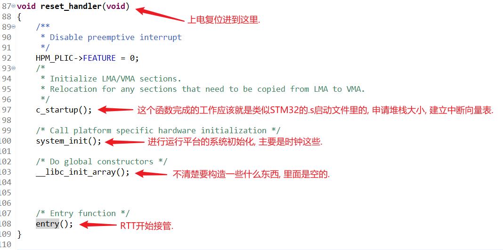
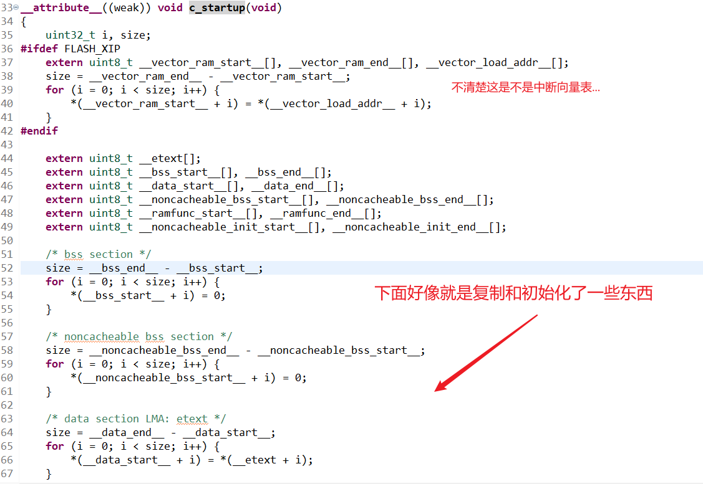
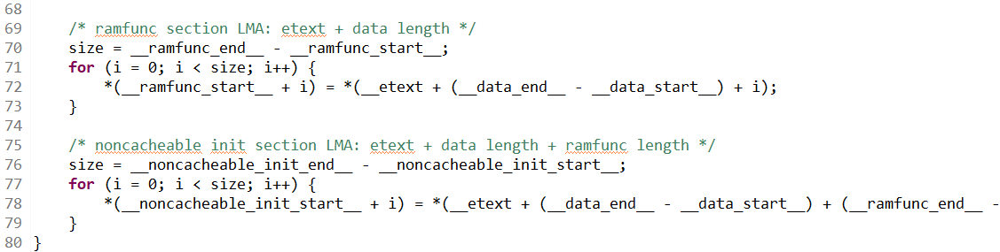
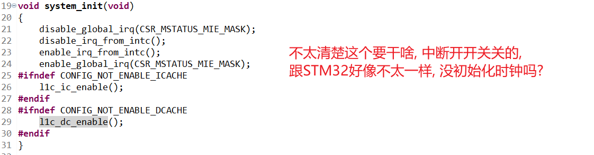
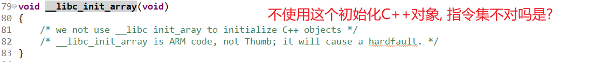
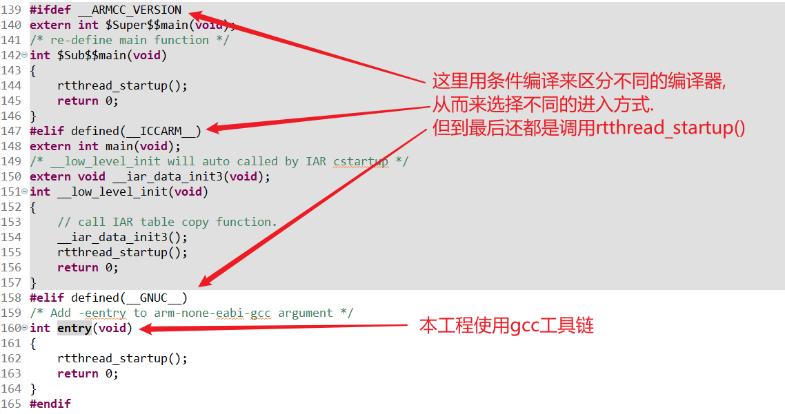
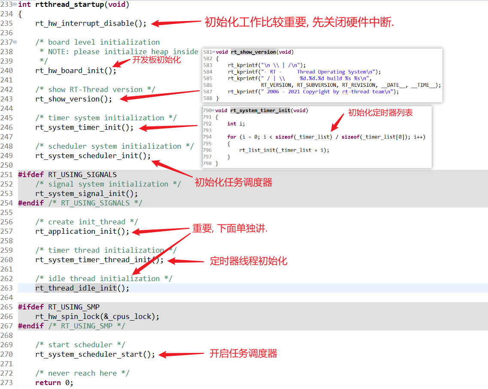
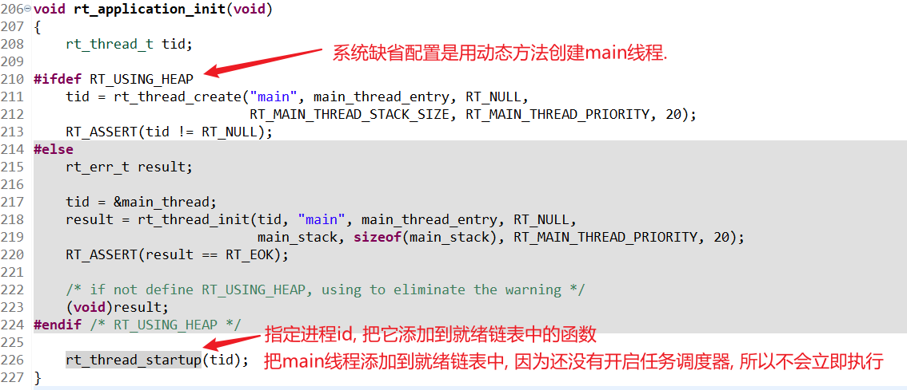
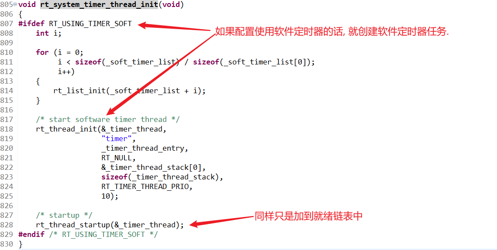
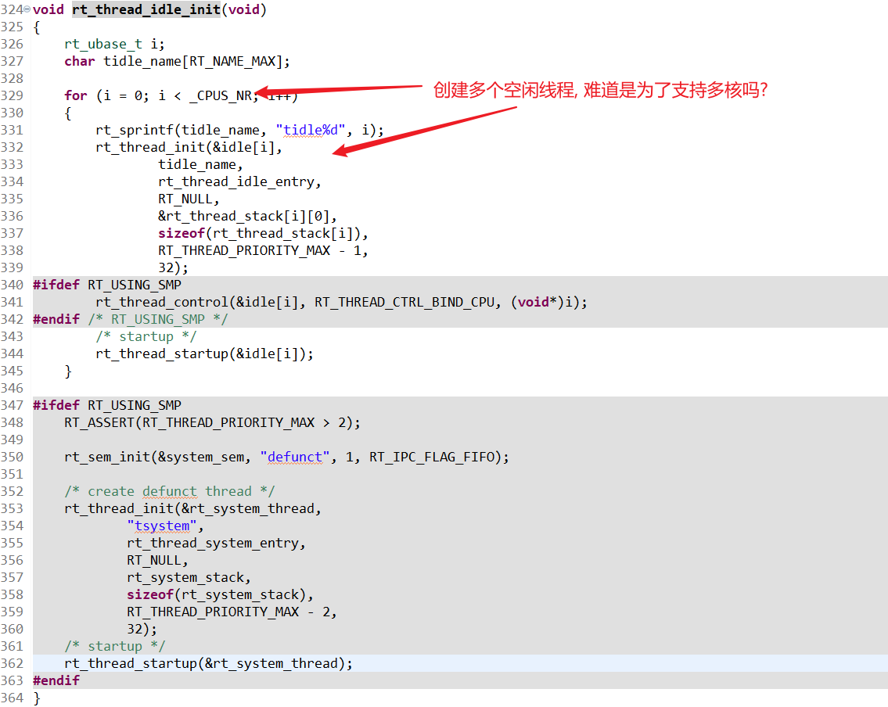

1. 我们一般习惯从`main()`开始阅读源码, 但是RTT的启动流程并不从`main()`开始.
2. 首先上电复位, 进入`reset_handler()`函数, 进行整个系统的初始化:
3. 下面挨个看里面的函数:
4. 
5. 
6. 
7. 调用`rtthread_startup()`之后就进入RTT的世界了:
8. 
9. 
10. 
11. 接下来就调用`rt_system_scheduler_start()`开启了任务调度器, 好戏开始!
12. 用户要创建自己的线程, 就可以在main线程里创建, 然后调用API添加到就绪链表里, 从而参与任务调度.
13. 因为main线程是一次性线程, 它执行到`return 0;`之后就会被系统回收掉.