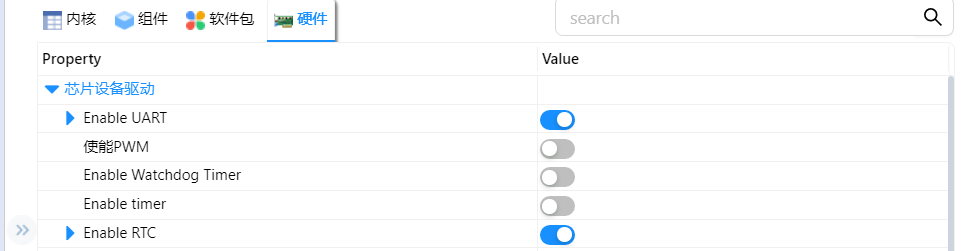

# 作业

## 1.dwt使用

- 在沁恒CH32V307芯片中，仅有一个看门狗定时器，所以在RT-Thread Settings中将Enable Watchdog Timer选项勾选

- 勾选上述选项后，组件中的使用WDT设备驱动程序也会被自动勾选

- 在main函数中写入下列代码。
  1. 定义一个看门狗设备句柄
  2. 定义看门狗溢出时间，为5s
  3. 获取设备句柄
  4. 设置看门狗溢出时间
  5. 开启看门狗

- 加入这几行命令后，可实现开发板在上电20s后自动复位

- 运行结果

## RTC使用

- 在RT-Thread Settings中将Enable RTC选项勾选

  

- 保存后可以在rt-thread/components/drives/rtc/rtc.c中看到函数

- 将程序下载进去，可以使用date命令读取、设置时间

## UART调试引脚改变

- 更改UART调试引脚原理很简单，在RT-Thread studio中有非常方便的配置方法，首先在内核中将控制台的设备名称改成UART7，其次在硬件里将UART7使能即可，但仍遇到一些问题，问题如下：

1. 最开始时我将UART8作为替换的串口，但没有并无输出数据，随后改用UART3，任然没有输出追查到rtconfig.h函数中，发现串口也已替换成功（下图为正常可使用代码截图），

随后追溯到drv_usart.c中，发现static rt_err_t ch32_configure(struct rt_serial_device *serial, struct serial_configure *cfg)函数如下（图为在硬件中勾选UART1 UART3 UART8时的函数），可以发现，             RT-Thread studio似乎只将UART1及UART7进行了初始化，于是我便将硬件中的UART7选项勾选，在内核中将控制台的设备名称改成UART7，此时，UART7可正常输出数据。这个问题至今仍未解决，个人认为可能是studio的一个小bug吧。

