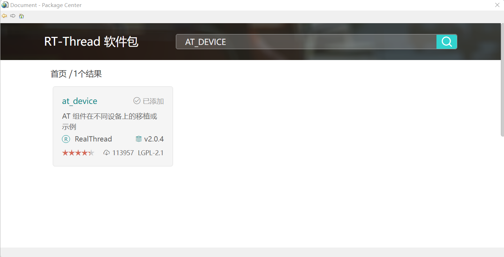
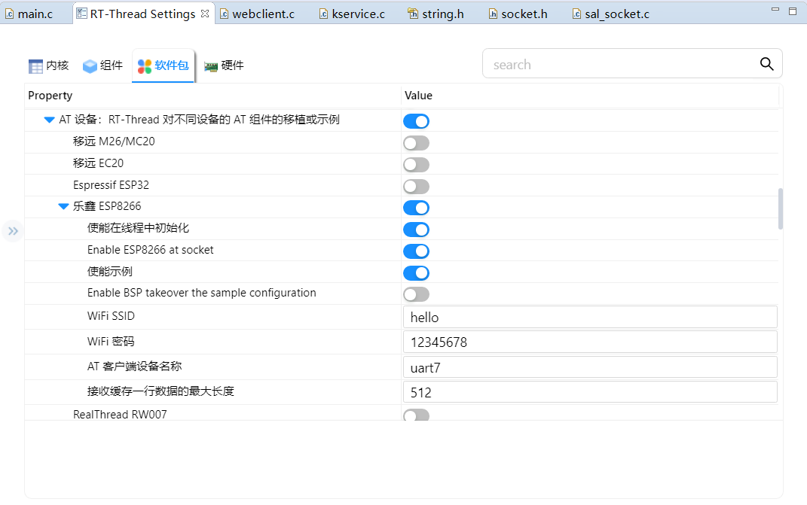
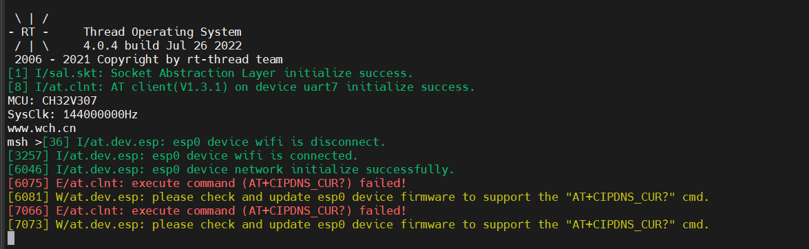
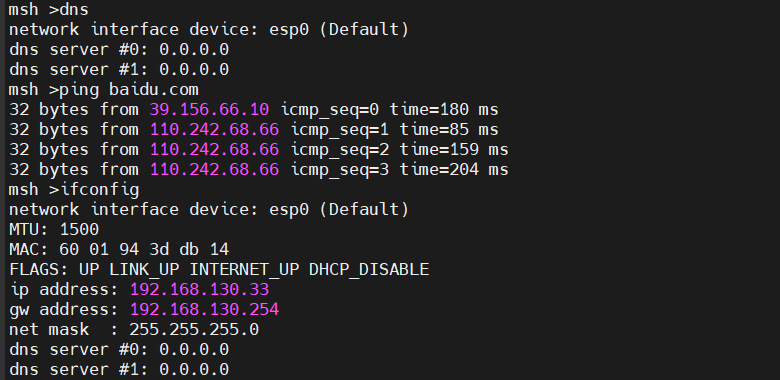
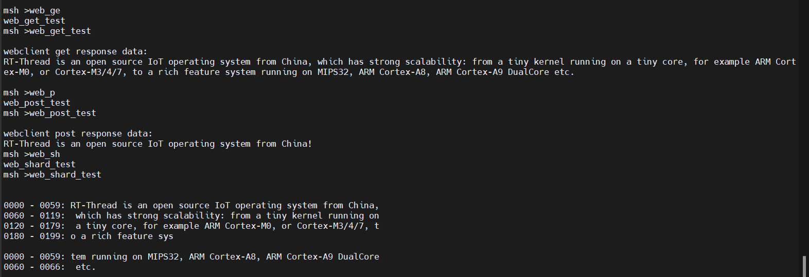

# esp8266模块使用

- 首先，在RT-Thread Setting中添加软件包，搜索at_device，点击添加。

  

- 老规矩，在组件中点亮相关选项，勾选AT设备及其下属选项乐鑫esp8266。将WiFi SSID设置为自己无线网的名字，这里使用的是手机热点名称，并选用uart7输出。此后硬件中的uart7选项也会自动被勾选。

- 但是在烧录过程序后，并不可以正常使用esp8266模块，其原因在于esp8266的固件版本太低，于是下载了满鉴霆老师在群内分享的固件包。根据网上寻找到的教程来看，我们需要先同时按住esp8266模块上的RST和flash键，随后松开RST，点击下载程序，完成后松开flash键。固件下载完成。此时串口输出如下，图中报错正常，不影响使用。

- 测试如下

