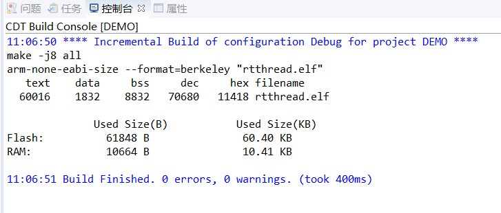

# 2022/7/19学习内容

### 任务调度方式主要为：

- 时间片轮询

- 抢占式（数字越小，优先级越高）

  

中断的优先级最高


### 调用任务的流程主要为：

1. 创建任务

2. 开始任务

3. 执行任务

4. 结束任务

   *（注：创建任务以后，任务并不会处于就绪态）*

   

**任务**是一个独立的函数，函数主体无限循环且不能返回。

每一个任务有一个对应的**任务控制块**，使得系统能够顺利的调度任务

**时间片**，就是同一个优先级下可以有多个任务，每个任务轮流享有相 的CPU时间，**享有CPU的时间**叫作时间片。在RTOS中，最小的时间单位为一个tick

一般情况下，_t结尾的变量表示指针。


上午学习的源码：

```c
/* static*/
ALIGN(8)
struct rt_thread static_thread;
rt_uint8_t static_stack[2048];

void thread_static(void){
    while(1){
        rt_kprintf("1");
    }

}


void thread_dynamic(void){
    while(1){
        rt_kprintf("2");
    }
}

void thread_test(void){
    /*init thread*/
    rt_thread_init(&static_thread,"static",thread_static,RT_NULL,static_stack,2048,15,100);

    /*starup thread*/
    rt_thread_startup(&static_thread);


    rt_thread_t dynamic_thread = RT_NULL;
    /*create thread*/
    dynamic_thread = rt_thread_create("dynaimic", thread_dynamic, RT_NULL, 2048, 16, 500);
    rt_thread_startup(dynamic_thread);
}
MSH_CMD_EXPORT(thread_test,static thread / dynamic thread test simple);
```

运行结果：



因为暂时还没拿到板子，所以无法进行下载和串口调试。


在钩子函数中，基本不允许调用系统API

