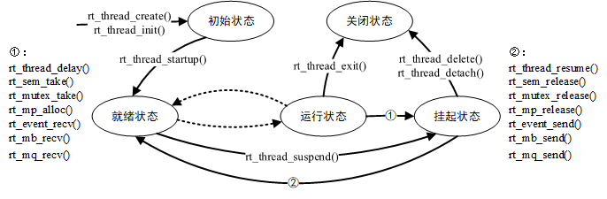

# 7/19 课后作业

### 1.创建一个线程，线程中启动一个定时器，定时器回调中输出自己的信息

```c

/* 定时器的控制块 */
static rt_timer_t timer1;
static int cnt = 0;

/* 定时器1超时函数 */
static void timeout1(void *parameter)
{
    rt_kprintf("ChuShicheng 2022/7/19\n");

    /* 运行第3次，停止周期定时器 */
    if (cnt++ >= 2)
    {
        rt_timer_stop(timer1);
        rt_kprintf("periodic timer was stopped! \n");
    }
}

void thread_dynamic(void){

    /* 创建定时器1  周期定时器 */
        timer1 = rt_timer_create("timer1", timeout1,
                                 RT_NULL, 5000,
                                 RT_TIMER_FLAG_PERIODIC);

        /* 启动定时器1 */
        if (timer1 != RT_NULL)
            rt_timer_start(timer1);

    while(1){
        rt_thread_mdelay(1000);
        rt_kprintf("2\n");
    }
}

void thread_test(void){
    rt_thread_t dynamic_thread = RT_NULL;
    /*create thread*/
    dynamic_thread = rt_thread_create("dynaimic", thread_dynamic, RT_NULL, 2048, 16, 500);
    rt_thread_startup(dynamic_thread);
}
MSH_CMD_EXPORT(thread_test,static dynamic thread test simple);

```

运行结果：


### 2.线程创建的函数调用关系图




### 3.定时器调用关系图


### 4.RT-thread的启动顺序

 从启动文件开始运行——entry()——$Super$$main()——rtthread_startup()——rt_application_init()——main_thread_entry(void)——main()