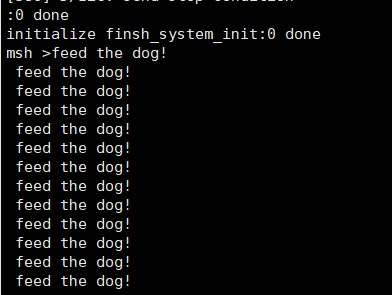
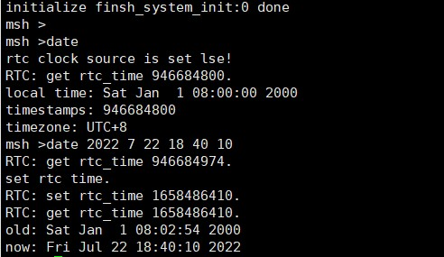

## 7月22日课后作业

### 1.WDT




### 2.RTC：

`RTC(Real-Time Clock)`实时时钟可以提供精确的实时时间，它可以用于产生年、月、日、时、分、秒等信息。目前实时时钟芯片大多采用精度较高的晶体振荡器作为时钟源。有些时钟芯片为了在主电源掉电时还可以工作，会外加电池供电，使时间信息一直保持有效。

**设置日期(set_date)**

```c
rt_err_t set_date(rt_uint32_t year, rt_uint32_t month, rt_uint32_t day)
```

**设置时间(set_time)**

```c
rt_err_t set_time(rt_uint32_t hour, rt_uint32_t minute, rt_uint32_t second)
```

 **获取时间(time)**

```c
time_t time(time_t *t)
```


在终端中输入date相关命令，可读取和设置RTC




